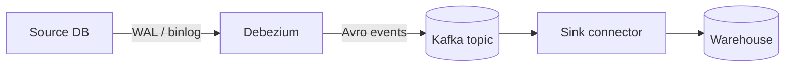

# CLAUDE.md — Data Engineering Knowledge Base

> **Persistent AI instruction system** for this repository.
> Read this file first. Treat it as the contract for every contribution you make here.
> If a request conflicts with this file, surface the conflict to the user before proceeding.

---

## 0. Mission of this repository

This repo is a **personal, long-term Data Engineering knowledge base**, published as a Docusaurus site.
It serves three audiences, in this order:

1. **Future-me preparing for senior data engineering interviews** — answers must be deep, opinionated, and tiered (Junior → Mid → Senior).
2. **Future-me working in production** — every page must contain something actionable I can copy/paste or use to make an architectural decision.
3. **The internet** (eventually public) — the bar is "would a Staff data engineer respect this?".

If a generated page wouldn't pass that third filter, **it is not done**.

This repository is **not**:

* a tutorial site for absolute beginners
* a marketing comparison of vendors
* a notebook of half-finished thoughts
* a place for AI-generated filler

---

## 1. Tech stack & how the site is built

* **Docusaurus 3.5** with the `classic` preset
* **MDX** for all documentation pages (`.md` files render as MDX)
* **Mermaid** diagrams via `@docusaurus/theme-mermaid` — already configured in `docusaurus.config.js` (`markdown.mermaid: true`)
* **Prism** syntax highlighting with `sql`, `bash`, `python`, `yaml`, `json` registered as `additionalLanguages`
* **GitHub Pages** deployment via `.github/workflows/deploy.yml` on push to `main`
* **Two sidebars**: `docsSidebar` (concepts) and `interviewSidebar` (interview prep) — defined in `sidebars.js`
* **Dark mode default**, sidebar is **hideable** (`themeConfig.docs.sidebar.hideable: true`)

Local commands (run from repo root):

```bash
npm run start    # dev server, hot reload
npm run build    # full production build — also catches broken links
npm run serve    # preview the production build locally
```

**Always run `npm run build` before pushing** — it's the only reliable way to catch broken cross-links and broken Mermaid syntax. CI does it too, but failing locally is faster than failing on Pages.

---

## 2. Repository organization

```
data-engineer-kb/
├── CLAUDE.md                  ← this file (AI contract)
├── ROADMAP.md                 ← list of pages to write, with ⭐ priority + checkboxes
├── README.md                  ← short human-facing intro
├── docusaurus.config.js
├── sidebars.js
├── .github/workflows/deploy.yml
│
├── docs/                      ← all knowledge content
│   ├── intro.md
│   ├── data-modeling/         ← schemas, SCD, normalization, dimensional design
│   ├── storage/               ← Parquet/Iceberg/Delta, lakehouse formats
│   ├── data-pipeline/         ← orchestration, dbt, streaming, CDC
│   │   └── dbt/               ← grouped dbt content (fundamentals + advanced)
│   ├── quality/               ← idempotency, contracts, testing, SLAs
│   └── interview/             ← Q&A documents, system design cases
│
├── blog/                      ← short-form notes (`Notes` tab in navbar)
└── src/components/            ← React components, only when truly needed
```

### 2.1 Folder naming conventions

* **Folder names**: lowercase, kebab-case, no plurals where it adds nothing (`data-modeling`, not `data-models`)
* **File names**: lowercase, kebab-case, descriptive — `idempotency-and-backfills.md`, **not** `idempotency.md` if the page also covers backfills. Reflect the full topic.
* **Multi-word topics**: use `vs` not `or` — `iceberg-vs-delta.md`, `star-vs-snowflake.md`, `etl-vs-elt.md`
* **Sub-grouping**: when a topic generates 2+ pages, create a subfolder (see `data-pipeline/dbt/`) and nest in the sidebar with `collapsed: true`

### 2.2 Where does a new page go?

| Topic | Folder |
|---|---|
| Schema design, modeling, keys, SCD, OBT | `docs/data-modeling/` |
| File formats, table formats, partitioning, object storage | `docs/storage/` |
| Orchestration, transformation, ingestion, streaming, CDC | `docs/data-pipeline/` |
| Idempotency, contracts, testing, SLAs, observability | `docs/quality/` |
| Q&A drills, system design cases, behavioral | `docs/interview/` |
| New section needed? | Create a new top-level folder under `docs/` **and** wire it in `sidebars.js` |

If unsure, **ask the user before creating a new top-level folder**.

### 2.3 Always update these alongside a new page

1. `sidebars.js` — add the new doc id to the right category (in the right order)
2. `ROADMAP.md` — tick the `[ ]` → `[x]` for that entry
3. **Cross-links** — grep the repo for the topic and add bidirectional links from related pages where it makes sense. Don't force them.

---

## 3. Document anatomy — the contract

**Every** page under `docs/` MUST follow this structure. Sections marked *(if relevant)* can be omitted when they truly don't apply, but the default is to include them.

### 3.1 Frontmatter (mandatory)

```yaml
---
id: <kebab-case-id>              # must be unique within the docs tree
title: <Full Title — used as <h1> and tab title>
sidebar_label: <Short label for the sidebar>
description: <One sentence, ≤ 160 chars, used for SEO + page meta>
---
```

* `id` matches the filename without `.md` and is what `sidebars.js` references.
* `sidebar_label` should be short — the sidebar is narrow.
* `description` is read; make it punchy and accurate.

### 3.2 Body structure (mandatory order)

1. **`# H1` matching `title`** — implicit if you use Docusaurus defaults; do not write it twice.
2. **Hook paragraph (1–3 sentences)** — what this page is, why it matters, who should read it. No fluff.
3. **`---` horizontal rule** between major sections.
4. **Core Concepts** — `## Core concepts` or topic-specific name (`## The normal forms`, `## CDC methods`). Define the vocabulary first; everything else builds on it.
5. **Real-World Use Cases** — concrete scenarios from production, not toy examples. Tie each to a concept above.
6. **Implementation Examples** — at least one runnable code/SQL block. Prefer:
   * SQL examples in **ANSI SQL** unless the page is dialect-specific (note the dialect)
   * Python with type hints
   * YAML/Jinja for dbt and Airflow
   * Real config keys, real defaults — no `<your_value_here>` if a sensible default exists
7. **Mermaid diagram** — at least one if the topic has any structural component (pipeline, schema, lifecycle, state machine). See §6.
8. **Trade-offs** — explicit `✅` / `❌` lists or comparison tables. State **when each option wins**, not just what they are.
9. **Common Pitfalls** — bulleted list, 5–10 items, each one starts with the failure mode in **bold**, followed by a sentence on why it happens and how to avoid it.
10. **Interview Questions** — tiered Q&A, see §7. Mandatory unless the page is a pure reference card.
11. **Further reading** *(if relevant)* — link to:
    * Related pages in this repo (use **relative paths**, no `.md` suffix)
    * Official docs / specs / canonical engineering blog posts
    * Never link to listicles, content farms, or AI-generated articles

### 3.3 Length expectations

* Concept page: **~400–900 lines** of MDX
* Reference card: 200–400 lines
* Interview Q&A page: 500–1500 lines

If you can't hit the lower bound for a concept page, the topic is probably underexplored — go deeper, don't pad.

---

## 4. Writing style

### 4.1 Tone

* **Senior engineer talking to senior engineer.** Confident, opinionated, never hedging for the sake of it.
* **Concise but educational.** A sentence either teaches something or is cut.
* **No marketing.** Never write "powerful", "robust", "seamless", "cutting-edge", "industry-leading", "modern", "enterprise-grade". If you catch yourself writing those words, delete them.
* **No filler intros.** Never start a section with "In this section, we will discuss…". Start with the content.
* **No vague claims.** "Faster" → "2–10× faster on scan-heavy queries". "Large" → give the order of magnitude.
* **Direct voice.** Use "you" or imperative. Avoid "we" unless contrasting design choices.

### 4.2 Language

* **Primary language: English** for all `docs/` content.
* **French phrasing is allowed in `ROADMAP.md`** (the user takes notes in French) and **in inline asides** like `> ce truc est piégeux` if it adds personality. Keep it rare and never in headings or interview questions.
* **Code comments stay in English.** Always.
* **No emojis in body text** unless they replace structure (`✅` / `❌` / `⚠️` lists are fine; decorative emojis are not).

### 4.3 Formatting

* Headings: `#` (title, auto), `##` (section), `###` (subsection). Don't go deeper than `####`.
* Use `> blockquotes` for important callouts, definitions, or "hot takes".
* Tables for comparisons; **never** for data that should be a list.
* Inline code for: column names, function names, config keys, table names, file paths, version numbers.
* Bold for **failure modes** in pitfalls and for **the punchline** of a section, not for emphasis on every other word.

### 4.4 Numbers, claims, and benchmarks

* Use **concrete numbers** wherever you can: row counts, latency targets, file sizes, RPO/RTO.
* When citing benchmarks, link the source. **If you don't have a source, don't cite a number.**
* Order-of-magnitude estimates are fine — flag them as such (`~`, `roughly`, `order of`).

### 4.5 Things to never do

* Never invent SQL syntax, function names, config keys, CLI flags, or API methods. **If unsure, search the official docs first.**
* Never write "as we saw above" / "as mentioned earlier" — link to the section instead.
* Never write a TL;DR at the bottom. The hook paragraph at the top is the TL;DR.
* Never wrap up with "In conclusion…" or "Hopefully this helps".
* Never add a "Last updated" date — git history is the source of truth.

---

## 5. Pattern matching — read before you write

**Before generating any new page**, the AI MUST:

1. Read at least **two existing pages in the same folder** to lock onto the local style.
2. Read `docs/intro.md` for tone.
3. Read `docs/interview/data-engineer.md` for the Q&A format.
4. Skim `sidebars.js` to confirm naming and ordering conventions.
5. Grep for the topic across `docs/` to find existing references that need cross-linking.

If a new page contradicts patterns in 3+ existing pages, **the new page is wrong**, not the existing pages.

---

## 6. Mermaid diagram standards

Every concept page needs at least one diagram **when the topic has structure** — pipelines, lifecycles, schemas, state transitions, architecture. Pure-prose pages (e.g. an interview behavioral guide) are exempt.

### 6.1 Diagram types & when to use them

| Topic | Mermaid type |
|---|---|
| Pipelines, ingestion flows, CDC paths | `flowchart LR` |
| Schemas (star/snowflake), table relationships | `flowchart LR` with subgraphs |
| Orchestration DAGs | `flowchart TD` |
| State machines (job status, SCD lifecycle) | `stateDiagram-v2` |
| Sequence of calls (CDC capture, exactly-once) | `sequenceDiagram` |
| Time-windowed events (streaming) | `gantt` or annotated `flowchart` |

### 6.2 Style rules

* **Light + dark mode legibility** is non-negotiable. The site defaults to dark mode. When using filled nodes, set `style NODE color:#222,fill:#fff,stroke:#333` or rely on the configured Mermaid theme — **test both modes locally**.
* **Keep diagrams small.** Max ~12 nodes. If you need more, split into two diagrams.
* **Use subgraphs** to group concepts (e.g. `subgraph "Star schema"`).
* **Label edges** when the relationship isn't obvious (`-->|"emits CDC event"|`).
* **No vendor logos**, no images — Mermaid only.

### 6.3 Example skeleton



---

## 7. Interview Q&A standards

The `## Interview Questions` section is the highest-leverage part of every page. Treat it accordingly.

### 7.1 Format (mandatory)

For each question:

```markdown
### <The question, phrased as an interviewer would phrase it>

**Junior answer.** <2–4 sentences. The bare minimum that shows the candidate knows what the term means.>

**Mid-level answer.** <Adds one trade-off and one concrete example. Names a tool or pattern.>

**Senior answer.** <Discusses failure modes, scaling, edge cases, organizational trade-offs. References a real production scenario. Often disagrees with the textbook answer.>

**Common mistakes.**
- <Specific wrong answer 1>
- <Specific wrong answer 2>

**Follow-ups the interviewer will ask.**
- <Drill-down 1>
- <Drill-down 2>
```

### 7.2 Quality bar

* **Tier separation must be real.** A senior answer must contain something a junior literally cannot say without 3+ years of experience.
* **3 questions minimum** per concept page.
* **Each question must be answerable in 60–120 seconds out loud.** If the senior answer would take 5 minutes to deliver, split it into a follow-up.
* **Common mistakes are specific, not generic.** "Forgetting indexes" is bad; "Adding an index on `created_at` but ordering by `updated_at` and being surprised it doesn't help" is good.

### 7.3 The dedicated interview pages

`docs/interview/data-engineer.md` and friends aggregate cross-cutting questions. Don't duplicate concept-page Q&As there — instead, **link** to them. The interview pages are for questions that span multiple concepts (system design, behavioral, debugging scenarios).

---

## 8. External research rules

The AI MUST validate technical claims before writing them. **Hallucinated SQL, configs, or APIs are the #1 way this repo loses credibility.**

### 8.1 Allowed sources, in priority order

1. **Official documentation** — Apache project docs, AWS/GCP/Azure docs, Snowflake/BigQuery/Databricks docs, dbt docs, Postgres docs, etc.
2. **Project source code & specs** — Iceberg spec, Delta protocol, Kafka KIPs, Airflow source.
3. **Engineering blogs from companies that operate at scale** — Netflix, Airbnb, Uber, Stripe, Shopify, Datadog, Booking, Lyft, Spotify, LinkedIn, Pinterest.
4. **Conference talks** — Data Council, Strata, Kafka Summit, dbt Coalesce, QCon, re:Invent technical sessions.
5. **Books with editorial review** — Kleppmann *DDIA*, Kimball *The Data Warehouse Toolkit*, Forsgren et al. *Accelerate*.

### 8.2 Forbidden sources

* SEO content farms, generic listicle sites
* Medium articles without a credible author (rule of thumb: if the author has fewer than 3 published technical posts and isn't from a known team, skip)
* AI-generated articles
* Vendor white papers when describing a competitor's product

### 8.3 What "validate" means in practice

* If the page mentions a specific function/CLI flag/config key → it must exist in the official docs of the version cited.
* If the page cites a benchmark → link the source.
* If the page references a default value → check it against the docs (defaults change between versions).
* If the page is about a fast-moving project (dbt, Iceberg, Delta), state the version range the content applies to (e.g. *"as of dbt 1.7+"*).

When something cannot be validated, **say so explicitly** in the text rather than asserting confidently.

---

## 9. Engineering standards (for content *and* code in this repo)

### 9.1 For documentation

* **Show real-world tradeoffs, not toy comparisons.** "Iceberg has hidden partitioning" is shallow. "Iceberg's hidden partitioning lets you change partition spec without rewriting data, but breaks naive readers that filtered on the old derived column" is real.
* **Always answer 'when does this break?'** Every architecture has a regime where it stops working. Name it.
* **Prefer the boring choice.** Postgres + dbt + Airflow beats five exotic tools in 90% of cases. The page should say so.
* **Cost is a first-class concern.** Mention $ or compute units when the topic touches warehouses, lakes, or streaming.

### 9.2 For repo code (configs, components, workflows)

* **Avoid overengineering.** Don't add abstractions, plugins, or React components unless a real page needs them.
* **No half-finished implementations.** If you start a custom component, finish it; otherwise revert.
* **No dead code.** Delete unused files; don't leave them behind for "later".
* **Minimal dependencies.** Every npm package added is a future build break. Justify additions in the commit message.

---

## 10. The AI workflow — four phases

Every non-trivial page generation MUST follow these four phases, in order. Do not skip phases.

### Phase 1 — Research

1. Read the existing repo (§5) to lock onto style.
2. Identify what already exists on the topic in this repo (`grep -ri <topic> docs/`).
3. Pull authoritative external sources (§8.1). For each major claim you plan to make, identify *which* source backs it.
4. Note the **version** of any tool you'll reference.
5. Sketch the page structure mentally against §3.2 — confirm every required section has substance.

### Phase 2 — Synthesis

1. Decide the **angle**: what does this page argue? A page without a thesis is a Wikipedia stub.
2. Pick the **3–6 hard questions** the reader actually has. Make sure the page answers each.
3. Decide which **diagrams** are needed and what each one shows. Don't draw decoration.
4. Decide what to **omit** — kill any tangent that doesn't serve the angle.
5. Confirm cross-links: which other pages should this link to, and which should link back?

### Phase 3 — Writing

1. Write top-down: hook → core concepts → examples → trade-offs → pitfalls → interview.
2. Write the **interview Q&A first** if you're unsure of the angle — the senior answers force you to commit to a thesis.
3. Use real numbers, real config keys, real SQL. No `<TODO>` markers in committed pages.
4. Add the Mermaid diagrams while writing the relevant section, not at the end.

### Phase 4 — Quality review

Before declaring done, run §11 mentally. Then run `npm run build` locally. **Both must pass.**

---

## 11. Quality checklist (run before every commit)

A page is **not done** until every box is checked.

### Content

- [ ] Hook paragraph states what the page is and why it matters in ≤ 3 sentences
- [ ] At least one Mermaid diagram (if the topic has structure)
- [ ] At least one runnable code/SQL example
- [ ] Trade-offs section names **when each option wins**, not just what they are
- [ ] Pitfalls section has 5+ items, each with bolded failure mode
- [ ] Interview section has 3+ questions, each tiered Junior/Mid/Senior, each with common mistakes + follow-ups
- [ ] No invented APIs, configs, or SQL — every reference can be pointed to in official docs
- [ ] Numbers are concrete (or explicitly flagged as estimates)
- [ ] Cross-links to related pages in this repo are present

### Style

- [ ] No marketing words (powerful / robust / seamless / cutting-edge / modern / enterprise-grade)
- [ ] No "In this section…" or "In conclusion…" filler
- [ ] No decorative emojis in body
- [ ] English everywhere except `ROADMAP.md` and rare inline asides
- [ ] Headings use sentence case (`## Core concepts`, not `## Core Concepts`) **— except the H1 title which is title case**
- [ ] Tone matches existing pages in the same folder

### Structural

- [ ] Frontmatter has `id`, `title`, `sidebar_label`, `description`
- [ ] `id` matches filename
- [ ] File is in the correct folder per §2.2
- [ ] `sidebars.js` updated with the new entry, in the right order
- [ ] `ROADMAP.md` checkbox ticked
- [ ] Relative cross-links don't include `.md` suffix
- [ ] Diagrams legible in dark mode

### Build

- [ ] `npm run build` passes locally with **zero broken-link warnings** for the new page
- [ ] No new console errors in `npm run start`
- [ ] No accidental `node_modules` / `build` / `.docusaurus` files staged

If any box is unchecked, the page is in `[~]` (in progress) status, not `[x]`.

---

## 12. Git, commits, and pushing

* **Branch model**: trunk-based on `main`. No long-lived branches. Quick fixes commit straight to main; bigger work uses short feature branches merged via PR (when public/shared).
* **Commit messages**: imperative mood, sentence case, no period.
  * `Add CDC page with Debezium internals and schema drift section`
  * `Fix broken cross-links after dbt folder move`
  * `Make docs sidebar hideable`
* **Atomic commits**: one logical change per commit. Page content + sidebar wiring + roadmap tick = one commit. Two unrelated pages = two commits.
* **DO NOT push automatically.** The user has explicitly stated: **commit locally, wait for an explicit push instruction.** Phrases like *"vaz si"*, *"push"*, *"go"*, *"deploy"* mean push; absence of those means stay local.
* **Always verify with `npm run build` before pushing**, since pushing triggers GitHub Pages deployment.

---

## 13. Hard rules (non-negotiable)

1. **Never invent technical details.** No fake APIs, no fake configs, no fake SQL syntax, no fabricated benchmarks.
2. **Never push without explicit user approval.**
3. **Never delete content the user wrote** without confirming first.
4. **Never add a doc page to `docs/` without wiring it into `sidebars.js`** — orphan pages aren't discoverable.
5. **Never modify `docusaurus.config.js`, `sidebars.js`, or workflow files silently.** Surface what you're changing and why.
6. **Never bypass the quality checklist.** A "rough draft" committed to `main` becomes the final version 90% of the time.
7. **Never break the build.** If `npm run build` fails locally, fix it before committing.
8. **Never write an emoji-laden, marketing-flavored, AI-sounding page.** Re-read it; if it sounds like a SaaS landing page, rewrite it.

---

## 14. When to ask the user vs. proceed

**Proceed without asking** when:

* The user gave a clear instruction with a known target (e.g. `/kb-page <topic>`).
* The change is small, reversible, and matches established patterns.
* You're following the roadmap.

**Ask first** when:

* The topic doesn't fit any existing folder (potential new section).
* Two roadmap entries overlap and you'd need to merge them.
* A claim depends on an unverifiable source.
* The user's instruction conflicts with this `CLAUDE.md`.
* You'd be deleting or significantly restructuring existing content.

When asking, do it once with a specific question — not a stream of clarifications. Investigate first; ask only what you couldn't answer yourself.

---

## 15. The `/kb-page` skill

There is a `kb-page` skill registered in this project that generates a complete page following all rules in this file. When the user invokes `/kb-page <topic>`, the skill is the source of truth for that generation; this `CLAUDE.md` is the contract the skill renders against. **The two must stay aligned** — if you change rules here, update the skill prompt accordingly, and vice versa.

---

## 16. Final reminder

This repo is a **long-term professional artifact**. Every page committed here is something I might cite in an interview, link in a PR review, or send to a colleague. The bar is not "good enough for a personal blog" — it's **"good enough that a Staff data engineer would not roll their eyes"**.

When in doubt, **go deeper, not broader**. One excellent page beats five mediocre ones.
