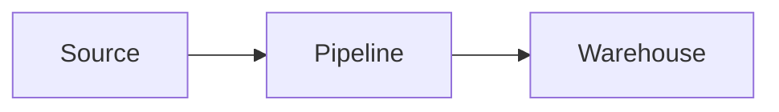

# Data Engineer Knowledge Base

A clean, extensible documentation-style website for personal use:

- 📚 Technical content on **data engineering** concepts
- 🎯 Structured **interview prep** (Junior / Mid / Senior answers)
- 📊 Native **Mermaid diagrams** for pipelines and architectures
- ✍️ Easy editing with **Markdown / MDX**

Built with [Docusaurus 3](https://docusaurus.io/), Mermaid, and Prism.

---

## 🚀 Quick start

### Requirements

- Node.js **≥ 18**
- npm or yarn

### Install

```bash
npm install
```

### Start the dev server

```bash
npm run start
```

The site will be available at [http://localhost:3000](http://localhost:3000) and reload on every file change.

### Build for production

```bash
npm run build
```

The static site is generated in `./build/`. Serve it locally with:

```bash
npm run serve
```

---

## 📁 Project structure

```
.
├── docs/
│   ├── intro.md
│   ├── data-modeling/
│   │   ├── scd.md
│   │   └── normalization.md
│   ├── data-pipeline/
│   │   ├── airflow.md
│   │   └── kafka.md
│   └── interview/
│       ├── data-engineer.md
│       └── system-design.md
├── blog/                    # optional short-form notes
├── src/
│   ├── components/          # reusable MDX components (Note, Warning…)
│   ├── css/                 # custom styles
│   └── pages/               # custom React pages (homepage)
├── static/                  # static assets (img, favicon)
├── docusaurus.config.js
├── sidebars.js
└── package.json
```

---

## ✍️ Adding content

Just create a new `.md` or `.mdx` file in the right folder. Add it to `sidebars.js` to make it appear in the navigation.

### Mermaid diagrams

Use a fenced ```` ```mermaid ```` code block:

````md

````

### Reusable MDX components

Available in any `.mdx` file:

```mdx
import Note from '@site/src/components/Note';
import Warning from '@site/src/components/Warning';

<Note>This is a friendly note.</Note>
<Warning>Be careful here.</Warning>
```

---

## 🔧 Useful commands

| Command          | What it does                              |
| ---------------- | ----------------------------------------- |
| `npm install`    | Install dependencies                      |
| `npm run start`  | Run dev server with hot reload            |
| `npm run build`  | Build static production site              |
| `npm run serve`  | Serve the production build locally        |
| `npm run clear`  | Clear Docusaurus cache (`.docusaurus/`)   |

---

## 📝 License

Personal project — adapt freely.
