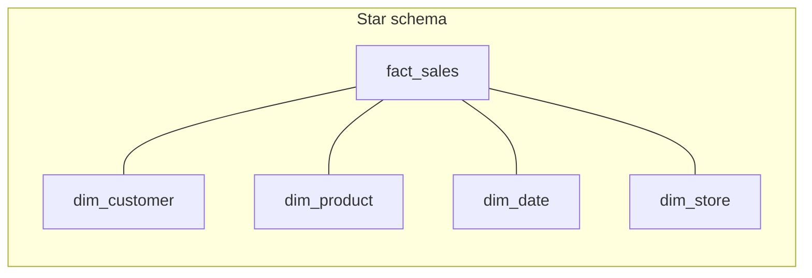

# Normalization & Denormalization

Normalization is the process of organizing tables so that **each fact lives in exactly one place**. The goal is to eliminate redundancy and prevent update anomalies.

In analytics, you'll often **deliberately denormalize** for performance — but you can only do it well if you understand what you're undoing.

---

## The normal forms (in plain English)

### 1NF — atomic columns

> Each column holds a single value. No lists, no JSON-blobs-as-arrays.

```sql
-- ❌ Not 1NF
| order_id | products              |
| -------- | --------------------- |
| 1        | "shoes, hat, gloves"  |

-- ✅ 1NF
| order_id | line_no | product |
| -------- | ------- | ------- |
| 1        | 1       | shoes   |
| 1        | 2       | hat     |
| 1        | 3       | gloves  |
```

### 2NF — no partial dependencies

> Every non-key column must depend on the **whole** primary key.

If your PK is `(order_id, product_id)`, a column like `customer_name` only depends on `order_id`, not `product_id`. Move it to the `orders` table.

### 3NF — no transitive dependencies

> Non-key columns must depend **only on the key**, not on other non-key columns.

`customer_city` depends on `customer_id`, which depends on `order_id`. Move `customer_city` to the `customer` table.

---

## OLTP vs. OLAP — different goals

The short version: **OLTP normalizes to avoid update anomalies on row-level transactions**; **OLAP denormalizes to avoid joins on full-table scans**. The two systems are tuned for opposite workloads — different storage layouts, different schema patterns, different concurrency models.

> Long-form on this distinction: [OLAP vs OLTP](../fundamentals/olap-vs-oltp).

In a warehouse, you typically **denormalize on purpose**:

- **Star schema** — one wide fact table, joined to small dimension tables.
- **Snowflake schema** — like star, but dimensions are themselves normalized into sub-dimensions.
- **One Big Table (OBT)** — fully flat, often used in BI tools and modern lakehouses.

> Long-form on these three: [Star vs Snowflake](./star-vs-snowflake) — including grain, conformed dimensions, and when OBT actually wins.



---

## When to denormalize

✅ Denormalize when:

- Joins dominate query time and the dimensions rarely change.
- BI tools struggle with deep joins.
- Storage is cheap relative to compute (most cloud warehouses).

❌ Avoid denormalizing when:

- The duplicated value changes frequently — you'll fight update anomalies forever.
- Multiple downstream consumers need different versions of the truth.

---

## Common pitfalls

- **Premature denormalization.** Flattening before you have a query workload is guesswork.
- **JSON columns as a shortcut.** They're great for flexibility, terrible for filterable columns. Promote frequently-queried JSON keys to real columns.
- **Forgetting referential integrity** in denormalized models. If `dim_product` ever lags `fact_sales`, you get orphan rows. Use late-arriving-dimension patterns or backfills.
