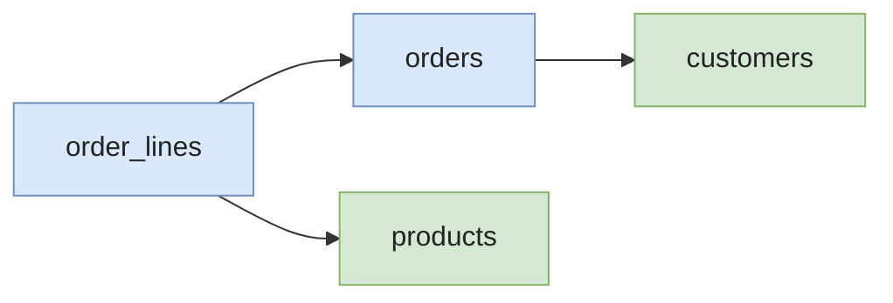
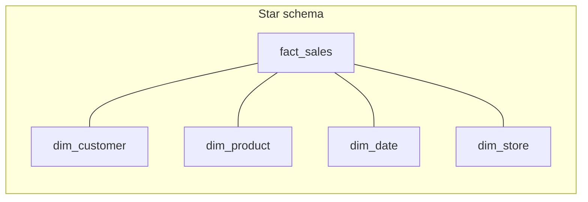

# Normalization & Denormalization

Normalization is the process of organizing tables so that **each fact lives in exactly one place**. The goal isn't aesthetic — it's to **eliminate three specific failure modes** (update, insert, delete anomalies) that plague redundant schemas.

In analytics, you'll often **deliberately denormalize** for performance — but you can only do it well if you understand what you're undoing and why.

> **TL;DR.** OLTP targets **3NF or BCNF** to keep transactions safe. Warehouses **denormalize on purpose** (star schema, OBT) to avoid joins on full scans. The middle ground is a thin OLTP store + a thicker denormalized analytical layer, bridged by [CDC](../data-pipeline/cdc).

---

## Why normalize? The three anomalies

Imagine a denormalized `enrollments` table where each row carries the student, the course, and the teacher:

| student_id | student_email      | course_id | course_name   | teacher_id | teacher_email          |
| ---------- | ------------------ | --------- | ------------- | ---------- | ---------------------- |
| 1          | alice@example.com  | CS101     | Algorithms    | 42         | dupont@uni.edu         |
| 1          | alice@example.com  | CS102     | Databases     | 51         | martin@uni.edu         |
| 2          | bob@example.com    | CS101     | Algorithms    | 42         | dupont@uni.edu         |

Three failure modes follow directly from the redundancy:

* **Update anomaly.** Teacher 42 changes their email. You must update **every row** they appear in. Miss one — by a buggy `WHERE`, a race condition, a partial replication — and the table is now inconsistent. Two emails for the same teacher, no way to know which is right.
* **Insert anomaly.** A new course `CS103` is created but has no enrollments yet. You can't insert it without making up a fake `student_id`, or breaking the schema.
* **Delete anomaly.** Bob drops `CS101` and is the only student. Deleting his row also deletes the only record that the **course** and **teacher** existed.

> Normalization is the systematic decomposition that makes each of these anomalies impossible by construction.

The decomposed schema:

```
students(student_id, student_email)
courses(course_id, course_name, teacher_id)
teachers(teacher_id, teacher_email)
enrollments(student_id, course_id)
```

Each fact (a student's email, a teacher's email, a course's name) lives in exactly one place. Update one row, every reader sees the new value.

---

## Functional dependencies — the underlying theory

The whole normal-form hierarchy is built on **functional dependencies (FDs)**. The notation `A → B` reads "A determines B" — given a value of A, there is exactly one value of B.

Examples in the messy table above:

* `student_id → student_email`
* `teacher_id → teacher_email`
* `course_id → course_name, teacher_id`

The problem: in the original table, `student_email` depends on `student_id` (only), not on the table's primary key `(student_id, course_id)`. That's a **partial dependency** — what 2NF forbids.

Normalization is, formally, **decomposing tables until every non-trivial FD has a superkey on its left side**. You don't need to remember this for daily work, but it's the answer to the senior question "why these specific normal forms".

---

## The normal forms (in plain English)

### 1NF — atomic columns

> Each column holds a single value. No comma-separated lists, no array-as-string, no key-value blobs hidden in a `VARCHAR`.

```sql
-- ❌ Not 1NF
| order_id | products              |
| -------- | --------------------- |
| 1        | "shoes, hat, gloves"  |

-- ✅ 1NF
| order_id | line_no | product |
| -------- | ------- | ------- |
| 1        | 1       | shoes   |
| 1        | 2       | hat     |
| 1        | 3       | gloves  |
```

> **Caveat on JSON.** A JSON column is technically not 1NF, but in modern Postgres / MySQL with `JSONB` and indexing, it's often the right call for genuinely sparse or schema-less attributes. The rule is: **if you ever filter or join on a key inside the JSON, promote it to a real column.**

### 2NF — no partial dependencies

> If your primary key is composite, every non-key column must depend on the **whole** key.

If your PK is `(order_id, product_id)`, a column like `customer_name` only depends on `order_id`. Move it to the `orders` table.

### 3NF — no transitive dependencies

> Non-key columns must depend **only on the key**, not on other non-key columns.

`customer_city` depends on `customer_id`, which depends on `order_id`. Move `customer_city` to the `customers` table. After 3NF, every non-key column is "a fact about the key, the whole key, and nothing but the key" — Codd's mnemonic.

### BCNF — Boyce-Codd Normal Form

> Every non-trivial FD has a **superkey** on its left side. Strictly stronger than 3NF, but the difference only matters when you have **overlapping candidate keys**.

Practical example: a `course_assignment(course_id, day, teacher_id)` table where:
* A teacher teaches at most one course per day → `(teacher_id, day) → course_id`
* A course on a given day has one teacher → `(course_id, day) → teacher_id`

Both are candidate keys. The schema is in 3NF but not BCNF if you encode `teacher → department` directly. In production, **3NF is usually enough**; <T>BCNF</T> comes up only when your domain has these overlapping-keys structures.

### 4NF and beyond

* **4NF** — no non-trivial multi-valued dependencies (e.g. one column shouldn't independently vary with two others).
* **5NF / PJ-NF** — no non-trivial join dependencies.
* **6NF** — relevant only for temporal databases.

In practice, **3NF is the working target for OLTP**, BCNF when overlapping keys force it. 4NF/5NF show up in textbooks and bitemporal designs; you can safely ignore them until you hit a concrete need.

---

## Worked example — denormalized to 3NF

Start with this denormalized order log — common when someone exports a report and treats it as the source schema:

```sql
-- ❌ orders_flat — denormalized
CREATE TABLE orders_flat (
  order_id          BIGINT,
  order_date        DATE,
  customer_id       BIGINT,
  customer_name     TEXT,
  customer_city     TEXT,
  customer_country  TEXT,
  line_no           INT,
  product_id        BIGINT,
  product_name      TEXT,
  product_category  TEXT,
  quantity          INT,
  unit_price        NUMERIC(10,2),
  PRIMARY KEY (order_id, line_no)
);
```

What's wrong:

* `customer_name`, `customer_city`, `customer_country` depend on `customer_id`, **not on the whole PK** → violates 2NF.
* `product_name`, `product_category` depend on `product_id`, **not on the whole PK** → violates 2NF.
* `customer_country` depends on `customer_city` (transitively) — would violate 3NF in many designs.

### Step 1 — split the line items

The grain of the table mixes **order-level** facts (date, customer) with **line-level** facts (product, quantity). Split:

```sql
CREATE TABLE orders (
  order_id     BIGINT PRIMARY KEY,
  order_date   DATE         NOT NULL,
  customer_id  BIGINT       NOT NULL
);

CREATE TABLE order_lines (
  order_id    BIGINT NOT NULL,
  line_no     INT    NOT NULL,
  product_id  BIGINT NOT NULL,
  quantity    INT    NOT NULL,
  unit_price  NUMERIC(10,2) NOT NULL,
  PRIMARY KEY (order_id, line_no)
);
```

### Step 2 — extract customer and product

`customer_*` columns belong to a `customers` table; `product_*` columns to a `products` table:

```sql
CREATE TABLE customers (
  customer_id      BIGINT PRIMARY KEY,
  customer_name    TEXT NOT NULL,
  customer_city    TEXT,
  customer_country TEXT
);

CREATE TABLE products (
  product_id        BIGINT PRIMARY KEY,
  product_name      TEXT NOT NULL,
  product_category  TEXT
);
```

### Step 3 — wire foreign keys

```sql
ALTER TABLE orders
  ADD CONSTRAINT fk_orders_customer
  FOREIGN KEY (customer_id) REFERENCES customers(customer_id);

ALTER TABLE order_lines
  ADD CONSTRAINT fk_lines_order
  FOREIGN KEY (order_id) REFERENCES orders(order_id);

ALTER TABLE order_lines
  ADD CONSTRAINT fk_lines_product
  FOREIGN KEY (product_id) REFERENCES products(product_id);
```



The result is in **3NF**. Each fact (a customer's city, a product's category, an order's date) lives in exactly one row. Update once, every consumer sees the new value. This is the schema you'd find in a typical Postgres OLTP backend.

---

## OLTP vs. OLAP — different goals

The short version: **OLTP normalizes to avoid update anomalies on row-level transactions**; **OLAP denormalizes to avoid joins on full-table scans**. The two systems are tuned for opposite workloads — different storage layouts, different schema patterns, different concurrency models.

> Long-form on this distinction: [OLAP vs OLTP](../fundamentals/olap-vs-oltp).

In a warehouse, you typically **denormalize on purpose**:

- **Star schema** — one wide fact table, joined to small dimension tables.
- **Snowflake schema** — like star, but dimensions are themselves normalized into sub-dimensions.
- **One Big Table (<T>OBT</T>)** — fully flat, often used in BI tools and modern lakehouses.

> Long-form on these three: [Star vs Snowflake](./star-vs-snowflake) — including grain, conformed dimensions, and when OBT actually wins.



---

## Denormalization patterns

Denormalization isn't one technique — it's a family. Pick the one that matches your read pattern, freshness requirement, and write cost.

### 1. Materialized views / pre-joined tables

Precompute the join, refresh on a schedule.

```sql
-- Postgres
CREATE MATERIALIZED VIEW mv_orders_enriched AS
SELECT
  o.order_id, o.order_date,
  c.customer_name, c.customer_country,
  p.product_name, p.product_category,
  ol.quantity, ol.unit_price
FROM orders o
JOIN order_lines ol  ON ol.order_id    = o.order_id
JOIN customers c     ON c.customer_id  = o.customer_id
JOIN products p      ON p.product_id   = ol.product_id;

REFRESH MATERIALIZED VIEW CONCURRENTLY mv_orders_enriched;
```

* **Wins when** reads dominate, freshness can lag minutes-to-hours.
* **Loses when** writes are frequent — refresh cost dominates, and stale views serve wrong data.

### 2. Computed / persisted columns

Cache a derived value on the row itself. Postgres has generated columns; warehouses usually use computed columns in dbt models.

```sql
ALTER TABLE order_lines
  ADD COLUMN line_total NUMERIC(12,2)
  GENERATED ALWAYS AS (quantity * unit_price) STORED;
```

* Eliminates per-query arithmetic.
* Updates as the underlying columns change — no refresh job.
* Beware: changing the formula means a full table rewrite.

### 3. Star schema

Lightly denormalized. Dimensions are pre-joined "lookup" tables; the fact table carries the foreign keys plus measures. The default for most warehouses.

### 4. One Big Table (OBT)

Fully flat — every column the BI tool might ever need is in a single wide table. Cheap reads, expensive backfills, brittle to schema change. Typical in BI semantic layers (Looker, Tableau extracts) and modern lakehouses where columnar storage makes wide tables cheap.

### 5. JSON for sparse / variant attributes

When 80% of rows have a different set of optional attributes, normalizing them into separate tables creates dozens of joins. A `JSONB` column with a GIN index is often the right call.

```sql
CREATE TABLE products (
  product_id   BIGINT PRIMARY KEY,
  product_name TEXT,
  attributes   JSONB
);

CREATE INDEX idx_products_attrs ON products USING gin (attributes);

-- Filter by a JSON attribute
SELECT product_id FROM products
WHERE attributes @> '{"color": "red"}';
```

* Wins when attributes are genuinely variant per row.
* Loses when most rows share the same keys — those should be promoted to columns.

### 6. Read replicas with denormalized views

Keep the OLTP primary normalized for write integrity. On a read replica, build denormalized views (materialized or virtual) for read-heavy queries. The application writes to the primary, reads from the replica's denormalized views. **Two layers, two paradigms, one source of truth.**

---

## When to denormalize

✅ **Denormalize when:**

- Joins dominate query time and the dimensions rarely change.
- BI tools struggle with deep joins (Tableau / Looker over 5+ table joins).
- Storage is cheap relative to compute (most cloud warehouses — true since ~2017).
- You need predictable, low-latency reads more than write efficiency.
- The denormalized layer is **derived** — rebuildable from a normalized source.

❌ **Avoid denormalizing when:**

- The duplicated value changes frequently — you'll fight update anomalies forever.
- Multiple downstream consumers need different versions of the truth (different aggregations, different grain).
- The source data isn't in your control (third-party API, vendor DB) — you can't guarantee referential integrity.
- The team is small and a normalized schema with views would already be fast enough.
- The freshness SLO requires same-second consistency — denormalized layers typically lag.

---

## Common pitfalls

* **Premature denormalization.** Flattening before you have a query workload is guesswork. You'll denormalize the wrong joins, and undoing it later is expensive. Build normalized first, profile, denormalize the hot paths.
* **JSON columns as a shortcut for "I don't want to design a schema".** They're great for sparse / variant data, terrible for filterable columns. Promote frequently-queried JSON keys to real columns.
* **Forgetting referential integrity in denormalized models.** If `dim_product` ever lags `fact_sales`, you get orphan rows pointing to non-existent products. Use late-arriving-dimension patterns or a backfill on every refresh.
* **Confusing 3NF with "no joins".** 3NF is about FDs, not join count. Over-decomposing into pointless tables (e.g. extracting `gender_id` to a `genders` table with two rows) is a real anti-pattern.
* **Surrogate keys without a natural-key constraint.** A `serial` PK gives you uniqueness on the surrogate but not on the business key. Always add `UNIQUE(natural_key)` so duplicate inserts fail loudly.
* **Cascading denormalized updates.** Storing `customer_name` on every row of `fact_sales` means a name change touches millions of rows. Either accept stale names (Type-2 SCD), recompute on refresh, or don't denormalize the volatile field.
* **No rebuild plan for denormalized data.** When the source schema changes, can you rebuild the denormalized layer in a reasonable time? If "no", the denormalization is technical debt.
* **Mixing 3NF and dimensional in the same schema.** Pick a paradigm per layer — raw / staging in 3NF, marts in dimensional. Mixing them in one schema confuses readers and breaks tooling that expects one or the other.
* **Treating 1NF as "no JSON, ever".** Modern engines have first-class JSON; the original 1NF was written before JSON existed. The rule is "no key inside the blob is filtered or joined", not "no blob".
* **Indexing a denormalized table like a normalized one.** A wide OBT with 50 columns and 20 indexes destroys write performance and bloats storage. Index only the columns you actually filter on.

---

## Interview questions

### Walk me through normalizing a denormalized table.

**Junior answer.** I'd identify the columns that don't depend on the whole primary key and move them to their own tables, then add foreign keys.

**Mid-level answer.** Start by listing the **functional dependencies**. For each non-key column, ask "what does this depend on?". If it depends on only part of a composite PK, that's a 2NF violation — extract those columns into a new table keyed by what they actually depend on. If a non-key column depends on another non-key column (transitively), that's 3NF — extract again. After two or three passes you typically end up with one entity per table, FKs wired up. Worked example: an `orders_flat` table with customer fields gets split into `orders`, `customers`, `order_lines`, `products`.

**Senior answer.** The mechanical steps are easy; the senior judgment is **how far to push it**. Pure 3NF on a Postgres OLTP backend is the default — it minimizes redundancy and makes writes safe. But three things make me deviate: (1) **read patterns** — if a join shows up in 90% of queries and the dimension is stable, a controlled denormalization (or a materialized view) is fine; (2) **immutable / append-only domains** — event tables don't have update anomalies because you never update them, so denormalization is much cheaper; (3) **the natural unit of business identity** — if "customer" in your domain genuinely means "the row at the time of the order", embedding the customer fields into the order row is a Type-2 SCD pattern, not a normalization failure. The trap I see: junior engineers normalize religiously to 3NF on a warehouse and then complain that every dashboard does 8-table joins. Pick the paradigm that matches the layer — 3NF for OLTP, dimensional/star for marts, OBT for BI consumption.

**Common mistakes.**
* Going past 3NF for its own sake (BCNF / 4NF rarely add value in practice).
* Extracting two-row lookup tables (`gender_id` → `genders(M, F)`) — pure noise.
* Forgetting to add `UNIQUE` constraints on natural keys after introducing surrogate keys.

**Follow-ups.**
* What's the difference between 3NF and BCNF, and when does it matter?
* You're handed a fully denormalized warehouse table. How do you decide whether it should stay flat or be normalized?

---

### When would you violate 3NF on purpose?

**Junior answer.** When joins are too slow and I want to denormalize for performance.

**Mid-level answer.** Whenever the read cost of joining dominates the write cost of redundancy. Concrete cases: (1) **dimensional models in a warehouse** — denormalize dimensions into wide tables to avoid joins; (2) **materialized views** for hot read paths; (3) **JSON columns** when attributes are genuinely sparse and variant; (4) **computed columns** to cache derived values. The discipline is: **the redundancy has to be derivable from a normalized source**, so you can rebuild without ambiguity.

**Senior answer.** The framing I use: normalization is about **where the source of truth lives**, denormalization is about **where the read-optimized copy lives**. In a healthy architecture, the OLTP database is the source of truth in 3NF (or close), and every denormalized layer (warehouse marts, BI extracts, search indexes) is **derived and rebuildable**. The cardinal sin isn't denormalization — it's denormalizing the source of truth, so updates have to fan out to N places and inconsistency becomes possible. The senior nuance most people miss: **append-only event tables play by different rules**. An event captures a fact at a point in time — `order_placed` carries the customer's name *as of that moment*, by design. That's not denormalization, that's the event semantics. Pretending the event needs to "join to customer" each time misses the whole point of event sourcing. So my heuristic: **normalize mutable state, embed fixed state into events**. The third case I'll deviate on is when the team genuinely cannot operate two layers (one normalized, one denormalized) — for a 3-person startup, a single denormalized OBT in BigQuery is fine, and the cost of architectural purity exceeds the benefit.

**Common mistakes.**
* Denormalizing the OLTP primary instead of a derived layer.
* Forgetting that appended events don't need normalization to be "correct".
* Picking denormalization for "speed" without measuring the actual join cost.

**Follow-ups.**
* How do you handle the case where a denormalized field needs to update (Type-1 vs Type-2)?
* When would you reject a colleague's PR that denormalizes a column on the production OLTP table?

---

### What's the difference between a 3NF schema and a star schema, and when would you use each?

**Junior answer.** 3NF has more tables and more joins; star schema is denormalized with one fact table and dimensions.

**Mid-level answer.** 3NF minimizes redundancy — every fact in one place, lots of small tables joined by FKs. Star schema is **deliberately denormalized**: one wide fact table holding measures plus FKs to a handful of dimension tables, where each dimension carries enough columns that a single join answers most queries. Use 3NF for OLTP — write integrity matters more than read speed, and the queries are point lookups. Use star for warehouses — reads are aggregations over millions of rows, joins are the bottleneck, and dimensions are stable enough that the denormalization tax is bearable.

**Senior answer.** The deeper difference is **what the schema is optimizing for**. 3NF optimizes for **mutation safety** — Codd's normal forms are literally about making certain failure modes impossible. Star schema optimizes for **scan-and-aggregate performance** at the cost of mutation safety, which is fine because warehouse data is largely append-only and rebuilt from upstream. The senior point most people miss: **the two schemas typically coexist**. The OLTP backend is in 3NF; CDC replicates it into a raw / staging layer that mirrors 3NF; dbt transforms into a dimensional layer (star or snowflake) for BI; some teams flatten further into OBT for self-serve analytics. The architecture is **3NF at the source, dimensional at the marts, OBT at consumption** — each layer chosen for the workload it serves. The wrong question is "3NF or star"; the right one is "what layer am I designing, and what does it need to optimize for?". When I review a schema PR, the smell of getting this wrong is mixing layers — a "warehouse" with foreign-key constraints and update triggers, or an "OLTP" with denormalized columns hand-maintained by application code.

**Common mistakes.**
* Pitting 3NF and star as alternatives instead of layers.
* Putting Kimball-style SCDs on an OLTP table.
* Putting referential integrity constraints on warehouse marts that block the load.

**Follow-ups.**
* Walk me through the dbt-layered architecture you'd recommend for a new warehouse.
* How does this story change with One Big Table?

---

## Further reading

* **E. F. Codd**, *A Relational Model of Data for Large Shared Data Banks* (1970) — the original. Worth reading at least once for the historical context.
* **Date, C.J.**, *An Introduction to Database Systems* — the textbook treatment of normal forms, including 4NF / 5NF.
* **Kimball, R.**, *The Data Warehouse Toolkit* — the canonical case for dimensional modeling and where 3NF stops being the right answer.
* **Postgres docs** — [generated columns](https://www.postgresql.org/docs/current/ddl-generated-columns.html), [JSONB indexing](https://www.postgresql.org/docs/current/datatype-json.html#JSON-INDEXING).
* Pages liées :
  * [OLAP vs OLTP](../fundamentals/olap-vs-oltp) — the workload distinction that drives most of these decisions.
  * [Star vs Snowflake](./star-vs-snowflake) — the dimensional patterns warehouses use.
  * [SCD](./scd) — how to handle dimension changes once you've denormalized.
  * [dbt fundamentals](../data-pipeline/dbt/fundamentals) — the staging/marts layering that turns 3NF into dimensional.
