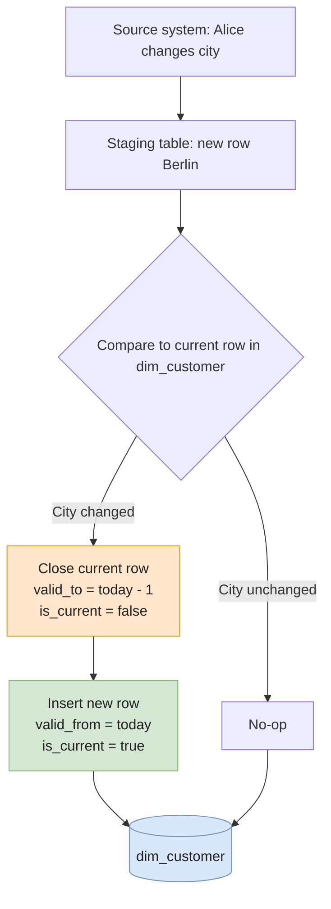
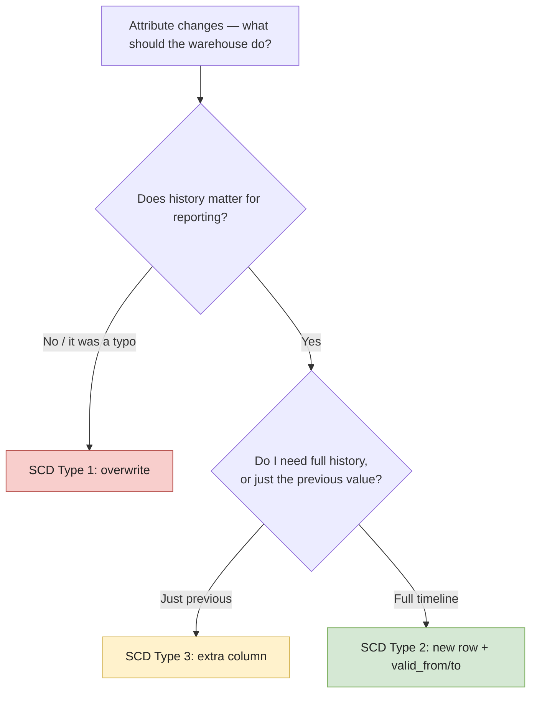

# Slowly Changing Dimensions (SCD)

In a data warehouse, **dimensions** describe the *who / what / where* of a business event (a customer, a product, a store), while **facts** describe the *what happened* (a sale, a click, a shipment).

The catch: dimension attributes change over time. A customer moves city. A product is renamed. A store changes its manager. **Slowly Changing Dimensions (SCDs)** are the patterns that decide *how* you handle those changes.

The choice is not academic — it directly determines whether historical reports stay accurate after the change.

---

## Why it matters

Imagine a retailer running this report:

> "Total revenue per store region in 2023."

A store moved from `North` to `South` in March 2024.

- If you **overwrite** the region (no history), all of 2023's sales suddenly appear in `South`. Wrong.
- If you **track history**, sales before March 2024 stay attributed to `North`. Correct.

SCDs are the formal way to make that choice explicit.

---

## SCD Type 1 — Overwrite

**The change wipes the old value. No history is kept.**

### When to use it

- Corrections of data-entry mistakes (typos, wrong codes).
- Attributes that have **no analytical value historically** (e.g., a customer's email address used only for outreach).

### Example

A customer's email is corrected:

```sql
-- Before
| customer_id | name  | email                |
| ----------- | ----- | -------------------- |
| 42          | Alice | alce@old-typo.com    |

-- UPDATE applied
UPDATE dim_customer
SET email = 'alice@example.com'
WHERE customer_id = 42;

-- After
| customer_id | name  | email              |
| ----------- | ----- | ------------------ |
| 42          | Alice | alice@example.com  |
```

### Pros / Cons

| ✅ Pros                                    | ❌ Cons                                      |
| ----------------------------------------- | ------------------------------------------- |
| Simplest possible model                   | No history — you cannot "go back in time"   |
| Storage-efficient                         | Reports that joined on the old value drift  |
| Fast updates                              | Audit trail must live elsewhere             |

---

## SCD Type 2 — Add a new row (history preserved)

**Each change creates a new row. The dimension keeps a full history.**

This is the **most common pattern** in production warehouses, because facts can always be joined to the dimension version that was active at the time of the event.

### Schema additions

A Type-2 dimension typically adds:

- `surrogate_key` — a system-generated PK (the natural key alone is no longer unique).
- `valid_from` / `valid_to` — the time interval during which this row was current.
- `is_current` — boolean flag for the latest row (an optimization).

### Example

Alice moves from Paris to Berlin in 2024-06-01:

```sql
| sk  | customer_id | name  | city   | valid_from | valid_to   | is_current |
| --- | ----------- | ----- | ------ | ---------- | ---------- | ---------- |
| 1   | 42          | Alice | Paris  | 2022-01-01 | 2024-05-31 | false      |
| 2   | 42          | Alice | Berlin | 2024-06-01 | 9999-12-31 | true       |
```

A fact row from May 2024 joins on `sk = 1` (Paris). A fact from July 2024 joins on `sk = 2` (Berlin). Both reports stay correct.

### SQL — applying a Type-2 update

```sql
-- 1. Close the current row
UPDATE dim_customer
SET valid_to   = CURRENT_DATE - INTERVAL '1 day',
    is_current = false
WHERE customer_id = 42 AND is_current = true;

-- 2. Insert the new row
INSERT INTO dim_customer (customer_id, name, city, valid_from, valid_to, is_current)
VALUES (42, 'Alice', 'Berlin', CURRENT_DATE, DATE '9999-12-31', true);
```

In modern stacks, this is often expressed declaratively with `dbt`'s `snapshots` or warehouse-native `MERGE`:

```sql
MERGE INTO dim_customer AS tgt
USING staging_customer AS src
  ON tgt.customer_id = src.customer_id AND tgt.is_current = true
WHEN MATCHED AND tgt.city <> src.city THEN
  UPDATE SET valid_to = CURRENT_DATE - 1, is_current = false
WHEN NOT MATCHED THEN
  INSERT (customer_id, name, city, valid_from, valid_to, is_current)
  VALUES (src.customer_id, src.name, src.city, CURRENT_DATE, DATE '9999-12-31', true);
```

### Diagram — SCD Type 2 lifecycle



### Pros / Cons

| ✅ Pros                                       | ❌ Cons                                              |
| -------------------------------------------- | --------------------------------------------------- |
| Full historical accuracy                     | Larger tables (one row per change)                  |
| Facts join to the right "version" of truth   | All joins must include the surrogate key            |
| Auditable                                    | Implementation is more complex (MERGE/snapshots)    |

---

## SCD Type 3 — Add a new column (limited history)

**Keep the previous value in a dedicated column. History is shallow but cheap.**

### When to use it

- You only ever care about the **previous** state, not the full timeline.
- Reorganizations where users want to query both "old" and "new" without rebuilding facts.

### Example

A company restructures sales regions. Marketing wants to compare old-region vs new-region performance:

```sql
| customer_id | name  | current_region | previous_region | region_changed_at |
| ----------- | ----- | -------------- | --------------- | ----------------- |
| 42          | Alice | EMEA-DACH      | EMEA            | 2024-06-01        |
```

### Pros / Cons

| ✅ Pros                                         | ❌ Cons                                       |
| ---------------------------------------------- | -------------------------------------------- |
| Lightweight — no extra rows                    | Only one previous value is kept              |
| Easy to query side-by-side (old vs new)        | Schema changes if you need 3rd, 4th history  |
| Good for one-off reorgs                        | Not a true historical model                  |

---

## How to choose



**Rule of thumb:** when in doubt, use **Type 2**. Storage is cheap; rewriting historical reports later is not.

---

## Common pitfalls

- **Forgetting the surrogate key on facts.** Type-2 only works if the fact table joins on `surrogate_key`, not the natural `customer_id`.
- **Using `is_current` without an index.** Filters like `WHERE is_current = true` get slow on large dimensions — index it or partition by it.
- **Using `valid_to = NULL` instead of `9999-12-31`.** `NULL` breaks `BETWEEN` joins; a sentinel date keeps range queries simple.
- **Mixing Type 1 and Type 2 silently.** Some columns naturally want Type 1 (email correction), others Type 2 (city change). Document which is which per column — or use a hybrid (sometimes called Type 6).
- **Late-arriving facts.** A fact that arrives 3 months late must join to the dimension version that was current *at the event timestamp*, not today.

---

## Further reading

- Ralph Kimball, *The Data Warehouse Toolkit* — the canonical reference.
- [dbt snapshots](https://docs.getdbt.com/docs/build/snapshots) — practical Type-2 implementation.
- [dbt — Patterns avancés](../data-pipeline/dbt-advanced#snapshots) — implémentation Type-2 côté dbt, en interne à cette base.
