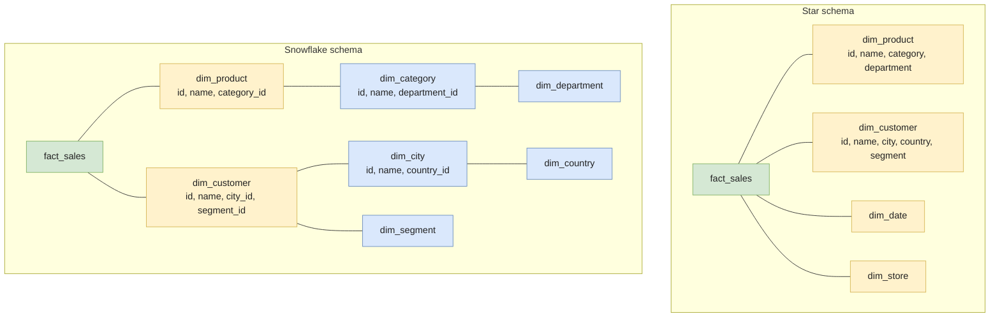

# Star vs Snowflake Schema

Once you've decided to model analytics with **facts and dimensions** (Kimball style), the next choice is how to lay out the dimensions:

- **Star schema** — dimensions are flat, denormalized tables. The fact sits in the middle, joined directly to each dim.
- **Snowflake schema** — dimensions are themselves normalized into sub-dimensions. A `dim_product` references a `dim_category`, which references a `dim_department`.

In 2026, the answer is almost always **star** — but the snowflake variant survives in places where storage is precious or master data is genuinely shared. The interesting work is knowing the difference and being able to defend the choice.

> Pre-requisites: comfort with **[Normalization & Denormalization](./normalization)** and **[SCD](./scd)**. Star vs snowflake is the *layout* question; SCD is the *history* question; they compose.

---

## The two layouts in one picture



The structural difference is one normal form: a star is dimensions in 1NF / 2NF (flat, denormalized); a snowflake pushes them to 3NF.

---

## Star schema — the default

### Layout

- One fact table per business process (`fact_sales`, `fact_orders`, `fact_clicks`).
- Dimensions are flat: every attribute lives directly on the dim row.
- Joins go fact → dim, exactly one hop.

### Example — retail sales

```sql
-- Fact table — atomic grain: one row per sales line item
CREATE TABLE fact_sales (
    sales_sk        BIGINT,
    date_sk         INT NOT NULL,        -- → dim_date
    customer_sk     BIGINT NOT NULL,     -- → dim_customer
    product_sk      BIGINT NOT NULL,     -- → dim_product
    store_sk        INT NOT NULL,        -- → dim_store
    quantity        INT,
    unit_price      DECIMAL(10, 2),
    discount        DECIMAL(10, 2),
    revenue         DECIMAL(12, 2)       -- additive measure
);

-- Flat dimension — everything about the product on one row
CREATE TABLE dim_product (
    product_sk      BIGINT PRIMARY KEY,
    product_id      VARCHAR(20),         -- natural key
    name            VARCHAR(100),
    brand           VARCHAR(50),
    category        VARCHAR(50),
    subcategory     VARCHAR(50),
    department      VARCHAR(50),
    is_seasonal     BOOLEAN,
    valid_from      DATE,                -- SCD Type 2
    valid_to        DATE,
    is_current      BOOLEAN
);
```

### Typical query

```sql
SELECT
    p.department,
    p.category,
    SUM(s.revenue) AS revenue
FROM fact_sales s
JOIN dim_product p ON s.product_sk = p.product_sk
JOIN dim_date    d ON s.date_sk    = d.date_sk
WHERE d.year = 2024
GROUP BY p.department, p.category;
```

**Two joins, fact + 2 dims.** Predictable shape, easy to explain to a BI tool, easy for the warehouse optimizer to plan.

---

## Snowflake schema — the normalized variant

### Layout

- Same fact in the middle.
- Each dimension is decomposed into sub-dimensions in 3NF.
- A query touches **N joins per dim chain**, not just one.

### Example — same retail sales, normalized

```sql
CREATE TABLE dim_product (
    product_sk      BIGINT PRIMARY KEY,
    product_id      VARCHAR(20),
    name            VARCHAR(100),
    brand           VARCHAR(50),
    category_sk     BIGINT NOT NULL      -- → dim_category
);

CREATE TABLE dim_category (
    category_sk     BIGINT PRIMARY KEY,
    name            VARCHAR(50),
    subcategory     VARCHAR(50),
    department_sk   INT NOT NULL         -- → dim_department
);

CREATE TABLE dim_department (
    department_sk   INT PRIMARY KEY,
    name            VARCHAR(50)
);
```

### Same query, more joins

```sql
SELECT
    dep.name AS department,
    cat.name AS category,
    SUM(s.revenue) AS revenue
FROM fact_sales s
JOIN dim_product    p   ON s.product_sk    = p.product_sk
JOIN dim_category   cat ON p.category_sk   = cat.category_sk
JOIN dim_department dep ON cat.department_sk = dep.department_sk
JOIN dim_date       d   ON s.date_sk       = d.date_sk
WHERE d.year = 2024
GROUP BY dep.name, cat.name;
```

The query went from **2 joins → 4 joins** to answer the same business question. Multiplied across hundreds of analyst queries per day, that's a real cost — both in compute and in the cognitive load of writing / reading the SQL.

---

## When the snowflake actually wins

Despite the conventional wisdom, snowflakes are not always wrong. They earn their keep when:

- **The same sub-dimension is shared across many dimensions.** A `dim_country` referenced from `dim_customer`, `dim_supplier`, `dim_employee`, `dim_store`. Inlining it 4× means 4 places to keep in sync when a country is renamed or merged.
- **A sub-dimension has its own slowly-changing history** that must be tracked independently. Type-2 history on a "department" that owns a hundred categories is cheaper to track once than to propagate through every dim.
- **Storage cost dominates compute cost.** Rare in 2026 cloud warehouses (object storage is ~$0.02/GB/month) but still seen in regulated environments with on-prem licensing.
- **Master Data Management (MDM) is governed centrally.** A `dim_country` with `iso_code`, `population`, `gdp` should not be redefined inside each star — there's one canonical definition.

The right framing: **snowflake selectively, on a few attributes, while keeping the rest of the dimension flat.** Pure snowflakes are interview-fodder; in production you almost always end up with a "mostly star with one or two normalized branches."

---

## Star vs Snowflake — the comparison

| Concern                          | Star                                          | Snowflake                                  |
| -------------------------------- | --------------------------------------------- | ------------------------------------------ |
| **Number of joins per query**    | 1 per dim                                     | N per dim chain                            |
| **Query SQL readability**        | High                                          | Lower (more aliases, longer chains)        |
| **Storage**                      | Higher (repeated attributes)                  | Lower (3NF, no repeats)                    |
| **ETL complexity**               | Lower (one table per dim)                     | Higher (sub-dimensions, ordering)          |
| **Update propagation**           | Update one dim row, propagated to all facts   | Update sub-dim, every parent dim sees it   |
| **BI tool ergonomics**           | ✅ Works out of the box                       | ⚠️ Tools have to navigate the chain        |
| **Optimizer-friendly**           | ✅ Star joins are a first-class plan in BQ/SF/Snowflake | Less so — depends on stats           |
| **Type-2 SCD complexity**        | One row per change                            | Sub-dim history must compose with parent   |
| **Query optimizer benefit**      | Star-join detection in BigQuery / Redshift / Snowflake | Bloom filters & SIPS partial coverage |

The summary: **storage is no longer the deciding factor in 2026.** Compute, query latency, and the cognitive cost on the analytics team usually push star.

---

## Grain and conformed dimensions — the things that actually matter

The star vs snowflake debate is downstream of two more important decisions.

### 1. Grain — what does one row of the fact mean?

The single most important sentence in dimensional modeling:

> **"The grain of the fact is one row per `<exact business event>`."**

Examples:
- `fact_sales` → one row per **line item on a receipt**.
- `fact_clicks` → one row per **page view**.
- `fact_inventory_snapshot` → one row per **(product, store, date)** at end-of-day.

Pick the **lowest atomic grain you can sustain**. Aggregated grains (one row per day, one row per region) lock you out of future questions — you can always aggregate later, you can never drill down into data that wasn't captured atomically.

### 2. Conformed dimensions — the same dim, used by multiple facts

A `dim_customer` joined by both `fact_sales` and `fact_returns` is a **conformed dimension** when:

- Same surrogate key.
- Same attribute names.
- Same values for the same `customer_id`.
- Same Type-2 history.

Conformed dimensions are what make cross-fact analysis possible — "for each customer, sales minus returns" requires both fact tables to reference the same `dim_customer`. Without conformance, you do a clumsy join on natural key and hope the values match.

This is also where the snowflake tradeoff gets interesting: a `dim_country` shared across `dim_customer`, `dim_store`, `dim_supplier` is a conformed sub-dimension. Inlining it into all three flat dims means **conforming the same data three times in the ETL**. Many teams normalize specifically to dodge that duplication.

---

## Modern variants — what 2026 actually uses

Pure star and pure snowflake are the textbook layouts. Production today uses three variants:

### One Big Table (OBT)

The fact and all its dimension attributes flattened into a single wide table. Common in BI tools (Looker, Power BI), data marts on BigQuery / Snowflake, and lakehouse staging zones.

```sql
SELECT department, category, SUM(revenue)
FROM obt_sales            -- 200 columns, 1 table
WHERE year = 2024
GROUP BY department, category;
```

- ✅ Zero joins.
- ✅ Trivial for BI tools, fast on columnar storage with <T term="predicate-pushdown">predicate pushdown</T>.
- ❌ Storage cost balloons (every row repeats every dim attribute).
- ❌ Updating a dim attribute means rewriting the whole fact.

<T>OBT</T> is the "nuclear option" — fast queries, painful maintenance. Reserved for **dashboard-fronted marts** where the read path dominates and dim updates are rare.

### Galaxy / Fact constellation

Multiple fact tables sharing **conformed dimensions**. This is what most real warehouses look like — `fact_sales`, `fact_returns`, `fact_inventory` all pointing at `dim_product`, `dim_date`, `dim_store`. A "galaxy" is just the union of multiple stars sharing dims.

### Mostly-star-with-a-snowflake-branch

The pragmatic real answer. The dim is flat for the 90% of attributes that are stable and unique to that dim. One or two attributes that are genuinely shared across dims (`country`, `currency`, `time_zone`) get normalized into their own sub-dim.

---

## Implementation in dbt

```sql
-- models/marts/dim_product.sql
{{ config(materialized='table') }}

select
    {{ dbt_utils.generate_surrogate_key(['p.product_id', 'p.valid_from']) }} as product_sk,
    p.product_id,
    p.name,
    p.brand,
    -- inline category attributes (star) — copy from raw if you want a flat dim
    p.category,
    p.subcategory,
    p.department,
    p.valid_from,
    p.valid_to,
    p.is_current
from {{ ref('stg_products_history') }} as p
```

vs. the snowflake variant:

```sql
-- models/marts/dim_product.sql — snowflake-style
select
    {{ dbt_utils.generate_surrogate_key(['p.product_id', 'p.valid_from']) }} as product_sk,
    p.product_id,
    p.name,
    p.brand,
    c.category_sk                               -- FK only
from {{ ref('stg_products_history') }} as p
left join {{ ref('dim_category') }} as c
  on p.category_id = c.category_id
 and c.is_current = true
```

And the fact is unchanged in either case — it joins `product_sk`. The difference is purely in how `dim_product` materializes its category attributes.

---

## Pros / Cons

### Star schema

| ✅ Pros                                              | ❌ Cons                                                |
| --------------------------------------------------- | ----------------------------------------------------- |
| Fewer joins → faster queries on most engines        | Higher storage (repeated attributes)                  |
| Simple SQL, BI-tool friendly                        | Updating a shared attribute means rewriting many dims |
| Star-join optimization is first-class in BQ/SF/RS   | Looser referential structure for normalized purists   |
| Type-2 SCD lives in one table per dim               | Conformance via duplication, not by design            |

### Snowflake schema

| ✅ Pros                                                    | ❌ Cons                                              |
| --------------------------------------------------------- | --------------------------------------------------- |
| Storage savings on highly repeated attributes              | More joins per query → harder SQL, slower queries   |
| Master data is canonical (one `dim_country`)               | ETL more complex (load order, FK integrity)         |
| Easier to track Type-2 on shared sub-dims                  | BI tools struggle with chains                       |
| Cleaner referential model                                  | Modern columnar engines are designed around stars   |

---

## Common pitfalls

- **Picking grain too coarse.** A `fact_sales` at "one row per day per store" cannot answer "what's the average basket size?" The atomic grain is irreversible after the fact.
- **Inconsistent surrogate keys across stars.** `dim_customer.customer_sk` in one mart ≠ `dim_customer.customer_sk` in another → cross-fact analysis silently broken. Conform or join on natural key.
- **Snowflaking everything by reflex.** A 6-level `dim_product → dim_category → dim_subcategory → dim_department → dim_division → dim_segment` chain looks elegant on a whiteboard and is misery in SQL.
- **Ignoring Type-2 in the snowflake.** A snowflaked `dim_country` with Type-2 history must compose with the parent `dim_customer`'s history → date-range joins per chain. Bug factory.
- **Adding a "junk dimension" without thinking.** Junk dims (small Boolean flags grouped into one dim) are useful, but each new junk attribute means a Cartesian explosion of dim rows.
- **Treating the fact's `created_at` as the date dim.** Time-zone bugs, daylight savings bugs, late-arriving fact bugs. Always join via a `date_sk` resolved at ingest.
- **Putting derived columns on the fact instead of the dim.** `customer_country` on `fact_sales` is fine if it never changes per fact row; but if it changes (customer moves), you've trapped the snapshot at insert time. Decide explicitly.
- **Mixing star and snowflake in the same dim chain without documenting why.** Future maintainers can't tell which attributes are reference data vs. denormalized copies.

---

## Interview Questions

### Question 1 — "Explain star vs snowflake schema. Which would you pick today, and why?"

#### Answer — Junior

> A star schema has a fact table in the middle, joined directly to flat dimension tables. A snowflake schema is the same idea but the dimensions are normalized into sub-dimensions, so a query has to traverse a chain of joins.
>
> I'd pick **star** by default. Storage is cheap on cloud warehouses, and the simpler query shape is faster and easier for BI tools.

#### Answer — Mid-level

> The two layouts solve the same problem (model a business process around facts and dimensions) with opposite priors:
>
> - **Star** prioritizes query simplicity and read performance — flatten the dim, accept the storage cost.
> - **Snowflake** prioritizes referential cleanliness and storage — normalize the dim, accept the join cost.
>
> On modern cloud warehouses (BigQuery, Snowflake, Redshift, Databricks), I default to **star** because:
> - Storage is essentially free relative to compute.
> - Star joins are a first-class optimizer pattern — broadcast the dim, hash-probe the fact.
> - BI tools (Looker, Tableau, Power BI) generate cleaner SQL on stars.
> - Type-2 SCD is easier to reason about in one table.
>
> Where I'll selectively normalize: a sub-attribute that is genuinely shared across many dimensions (e.g., `country`, `currency`) — having one `dim_country` with `iso_code`, `region`, `currency` is cleaner than copying those columns into `dim_customer`, `dim_supplier`, `dim_store`. So in practice my schemas are "mostly star with one or two snowflaked branches."

#### Answer — Senior

> The honest answer: **the star vs snowflake conversation is a distraction from the conversations that actually matter** — grain and conformed dimensions.
>
> Pick the wrong grain on `fact_sales` and you've decided what questions the warehouse can answer for the next five years. Skip conformance on `dim_customer` between `fact_sales` and `fact_returns` and your "customer LTV" report silently double-counts. These are the irreversible decisions; star vs snowflake is layout polish.
>
> That said, my position on layout: **start with a flat star, snowflake only on conformed reference data**. Reasoning:
>
> - **Cognitive load is the bottleneck on modern data teams.** Analysts spend more time understanding schemas than running queries. A flat star is documented by its column list; a 4-table snowflake chain is documented by tribal knowledge.
> - **Modern engines optimize for stars.** BigQuery's broadcast joins, Snowflake's SIPS, Databricks' DFP — all assume the fact-to-dim shape. Snowflake chains break some of these heuristics or force the optimizer to materialize intermediate results.
> - **Type-2 SCD on a snowflaked dim is a maintenance nightmare.** Composing version ranges across `dim_product` × `dim_category` × `dim_department` requires triple-bitemporal joins. Most teams that try this end up flattening anyway after the first incident.
> - **Storage is so cheap it has dropped out of the tradeoff matrix.** $0.02/GB/month on object storage means duplicating a 50-byte `category_name` across 100M product rows costs you $0.10/year. The query that scans them costs more.
>
> Where I push back on a "pure star": when the team has genuine MDM. A `dim_country` or `dim_currency` curated by a master-data team belongs in its own table — not because of storage, but because it has its own owner, its own SLA, its own update cadence. That's a real design reason, not a normal-form one. See also [Normalization & Denormalization](./normalization).
>
> The answer to the question I was actually asked: **star, with deliberate exceptions, defended by reasons other than "storage."**

#### Common pitfalls

- Picking snowflake "for cleanliness" when no attribute is actually shared.
- Picking star without thinking about how Type-2 SCD will be applied.
- Confusing snowflake schema (the layout) with Snowflake the warehouse — they're unrelated.

#### Follow-up questions

- A `dim_customer` exists in both `fact_sales` and `fact_returns`. They were modeled by different teams with different surrogate keys. How do you reconcile?
- You inherit a 7-table snowflake chain on a critical dim. Migration plan?
- When does One Big Table (OBT) beat star?

---

### Question 2 — "Define grain and conformed dimensions. Why do they matter more than star vs snowflake?"

#### Answer — Junior

> **Grain** is what one row of the fact table represents — for example, "one row per line item on a sales receipt." It needs to be the lowest atomic level so you can aggregate up later.
>
> **Conformed dimensions** are dimension tables shared across multiple fact tables — same surrogate key, same attributes, same values. They let you compare metrics across business processes (sales vs returns).

#### Answer — Mid-level

> Grain is the **single most important sentence in your model documentation**. Get it wrong and the fact table answers a different question than the team thinks. The rule: pick the **atomic grain** — one row per the lowest-level event the source can produce. You can always aggregate up; you can never disaggregate.
>
> Concretely: `fact_sales` at "one row per receipt" can answer "average revenue per customer" but **cannot** answer "average basket size" because line items aren't visible. At "one row per line item," both questions work.
>
> Conformed dimensions are how you stitch multiple stars into a coherent warehouse. The discipline:
>
> - **Same surrogate key.** `dim_customer.customer_sk` means the same row in every star.
> - **Same attribute names and types.** No `dim_customer.country` here and `dim_customer.country_code` there.
> - **Same Type-2 history semantics.** Both stars use the same valid_from/valid_to interval.
>
> Without conformance, you do "best-effort" joins on natural keys, and silent inconsistencies pile up. With conformance, "sales minus returns per customer" is a clean two-fact join.
>
> The reason these matter more than star vs snowflake: **layout is local; grain and conformance are global.** Layout you can refactor table-by-table. Grain you cannot — you'd have to re-ingest from raw. Conformance you can fix only with a coordinated migration across multiple consumers.

#### Answer — Senior

> Grain and conformance are the **boundary conditions** that determine whether the warehouse is a coherent system or a pile of independent reports that occasionally agree.
>
> The senior moves on grain:
>
> - **Force the grain conversation explicitly at design time.** I write the grain in the model docstring as the first line. If two engineers can't agree on what one row means, the model isn't ready to ship.
> - **Default to the most atomic grain the source can sustain.** This includes things the current consumer doesn't yet ask for. The question "could a future analyst want line-item level?" should be answered yes if it's at all plausible — re-ingesting raw to add the grain later is a multi-week project.
> - **Document grain in dbt model YAML.** Put it in `description:`, surface it in the docs site. Make it discoverable.
>
> The senior moves on conformance:
>
> - **Conform dimensions at the org level, not per team.** A `dim_customer` modeled by the marketing team and another modeled by the finance team is the same anti-pattern as two product teams shipping incompatible APIs. Pick a steward for each conformed dim.
> - **Surrogate keys are the conformance contract.** Don't let teams generate their own SKs locally — there must be one issuance process. dbt's `dbt_utils.generate_surrogate_key` with a shared input convention is the simplest version.
> - **Test conformance in CI.** A dbt test that joins `fact_sales` and `fact_returns` on `customer_sk` and asserts no orphans is cheap insurance.
> - **A new conformed dim is a foundation-team concern, not an analyst's side project.** Adding `dim_employee` should require sign-off from anyone who'll join to it.
>
> The deeper observation: **the conversations about layout (star vs snowflake) are tactical and reversible. The conversations about grain and conformance are strategic and define how the warehouse evolves.** A junior models a star; a mid models conformed stars; a senior makes sure the org models conformed stars *consistently* across teams and over time.

#### Common pitfalls

- "We'll add line-item grain later" — you won't, the source data is gone.
- Two stars referring to the same business entity with different surrogate keys.
- Adding a metric to a fact at the wrong grain (averaging averages).
- Treating grain as a property of the SQL rather than the semantic model.

#### Follow-up questions

- The source DB rotates raw events after 90 days. The new grain you want needs 2 years of history. Options?
- Two teams ship `dim_customer` independently. How do you converge them without breaking existing reports?
- How does grain interact with [SCD](./scd) Type 2?

---

### Question 3 — "When would you choose One Big Table over a star schema?"

#### Answer — Junior

> One Big Table is the fact and all its dimensions flattened into a single wide table. No joins.
>
> I'd use it when query speed matters more than storage — for example, a dashboard that runs the same aggregation 10,000 times a day.

#### Answer — Mid-level

> OBT trades storage and update cost for read simplicity. The main wins:
>
> - **Zero joins.** On a wide columnar table, the query reads only the projected columns and filters, with predicate pushdown. Often the fastest pattern on cloud warehouses.
> - **Trivial for BI tools.** No relationship modeling, no LookML joins, no `dimensions:` block in semantic-layer files.
> - **Cheap aggregation at scale** — 1B rows of `(date, country, category, revenue)` aggregates faster than the equivalent star-join.
>
> The costs:
>
> - **Storage explodes.** A `customer_country` column repeated across 100M order rows is 100M copies of a 50-byte string.
> - **Updating a dim attribute** means rewriting matching fact rows. A customer rename → millions of row-rewrites.
> - **No conformance.** OBT means you've forfeited the cross-fact analysis benefits.
>
> When I reach for OBT: **dashboard-fronted marts** where the same queries run thousands of times a day, the dim attributes don't change much, and the OBT is a derived layer (not the source of truth). The star or galaxy still lives upstream as the canonical model; OBT is the cached, denormalized read layer.

#### Answer — Senior

> The right framing: **OBT is a materialized view of a star, not a replacement for it.**
>
> If you treat OBT as the canonical model, you've lost:
> - **Conformance across business processes** — every fact lives in its own bubble.
> - **Type-2 SCD ergonomics** — flattening Type-2 dim attributes onto a fact is fine if you do it once at ingest, but you've baked in the dim version per fact row, and changing your mind costs a rewrite.
> - **Reusability of dim definitions** — your `category` logic lives in 17 OBT tables and drifts.
>
> If you treat OBT as a **read-optimized projection on top of a star**, all those concerns vanish. The star is the source of truth, conformed and Type-2-aware. The OBT is built nightly (or hourly) by joining fact + dims and writing the wide flat table for BI consumption. When you need to change a dim definition, you change the star; the OBT regenerates.
>
> The pattern I push for in 2026 lakehouses:
>
> ```
> raw → staging → fact + dim (star, conformed) → obt_<dashboard>  (read-only mart)
> ```
>
> Each layer has a different SLA and ownership. The star is owned by the analytics-engineering team and changes carefully; the OBT is regenerated cheaply and can be tweaked per dashboard team without touching foundation.
>
> Where this falls apart: when teams skip the star and build OBTs directly from raw because "it's faster." It is, until it isn't — six months later, you have 12 OBTs with conflicting definitions of `customer_country` and the analytics team is the new master-data manager. The star is what protects against that. OBT is the icing.

#### Common pitfalls

- Treating OBT as the canonical model and losing conformance.
- Updating a dim attribute on an OBT and not realizing how many partitions you just rewrote.
- Building 12 OBTs straight from raw for "speed."
- Not regenerating the OBT when the underlying star changes.

#### Follow-up questions

- An OBT has 200 columns and is 5TB. A user wants a new metric that requires a new dim. How do you add it?
- How does OBT interact with Iceberg/Delta time travel and partition evolution?
- When does columnar storage make OBT *worse* than a star?

---

## Further reading

- **Ralph Kimball**, *The Data Warehouse Toolkit, 3rd ed.* — chapters 1–3 are the canonical reference for grain, dimensions, and conformance.
- **Kimball Group** — [Dimensional Modeling Techniques](https://www.kimballgroup.com/data-warehouse-business-intelligence-resources/kimball-techniques/dimensional-modeling-techniques/), [Conformed Dimensions](https://www.kimballgroup.com/data-warehouse-business-intelligence-resources/kimball-techniques/dimensional-modeling-techniques/conformed-dimension/).
- **dbt blog** — [Building a Kimball dimensional model with dbt](https://docs.getdbt.com/blog/kimball-dimensional-model).
- Pages liées :
  - [Normalization & Denormalization](./normalization) — the OLTP/OLAP-level framing this builds on.
  - [SCD](./scd) — Type 1 / 2 / 3 history compose with the layout chosen here.
  - [dbt advanced](../data-pipeline/dbt/advanced) — snapshots and incremental models for keeping these tables fresh.
  - [Idempotency & Backfills](../quality/idempotency-and-backfills) — fact-table reload patterns that depend on the chosen grain.
