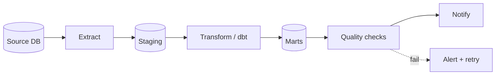

# Apache Airflow

Airflow is a **workflow orchestrator**: it schedules, executes, and monitors directed acyclic graphs (DAGs) of tasks.

It is **not** a data-processing engine. It calls other systems (Spark, dbt, Python, SQL) and tracks whether they succeed.

---

## Core concepts

| Concept       | What it is                                                                      |
| ------------- | ------------------------------------------------------------------------------- |
| **DAG**       | A workflow definition — set of tasks + dependencies + schedule.                 |
| **Task**      | A single unit of work, instantiated from an `Operator`.                         |
| **Operator** | A reusable template (PythonOperator, BashOperator, SnowflakeOperator…).         |
| **Run**       | One execution of a DAG for a given `logical_date`.                              |
| **Scheduler** | Decides what runs and when.                                                     |
| **Executor**  | Decides where tasks run (Local, Celery, Kubernetes…).                           |

---

## A minimal DAG

```python
from datetime import datetime, timedelta
from airflow import DAG
from airflow.operators.python import PythonOperator

def extract():
    print("Pulling raw data...")

def transform():
    print("Cleaning + joining...")

def load():
    print("Writing to warehouse...")

default_args = {
    "owner": "data-eng",
    "retries": 2,
    "retry_delay": timedelta(minutes=5),
}

with DAG(
    dag_id="daily_sales_etl",
    description="Extract, transform, and load daily sales",
    start_date=datetime(2024, 1, 1),
    schedule="0 6 * * *",          # 06:00 every day
    catchup=False,
    default_args=default_args,
    tags=["sales", "etl"],
) as dag:

    e = PythonOperator(task_id="extract", python_callable=extract)
    t = PythonOperator(task_id="transform", python_callable=transform)
    l = PythonOperator(task_id="load", python_callable=load)

    e >> t >> l
```

---

## A typical pipeline shape



---

## DAG design rules

1. **Idempotent tasks.** Running the same task twice for the same `logical_date` must produce the same output. Use `MERGE`/`INSERT … ON CONFLICT`, not blind `INSERT`.
2. **Parameterize on `logical_date`**, never `datetime.now()`. Backfills and reruns depend on it.
3. **Small, narrow tasks.** A failed 10-minute task is cheaper to retry than a failed 4-hour one.
4. **Don't put business logic in Python `PythonOperator` callables** that grow unbounded. Move it into a versioned Python package, dbt project, or SQL file.
5. **Sensors with `mode='reschedule'`** for long waits — `mode='poke'` holds a worker slot.

---

## Backfills

A backfill re-runs a DAG over a historical date range:

```bash
airflow dags backfill \
  --start-date 2024-01-01 \
  --end-date   2024-01-31 \
  daily_sales_etl
```

For backfills to work, **every task must be idempotent and parameterized on `logical_date`**. Otherwise re-running January will double-count January.

---

## Common pitfalls

- **`catchup=True` left on by accident.** A new DAG with `start_date=2020-01-01` will trigger thousands of runs at deploy time.
- **Top-level imports doing real work.** The scheduler parses every DAG file every few seconds. A `pd.read_sql()` at the module level will hammer your DB.
- **Cross-DAG dependencies via sensors.** Prefer `Datasets` (Airflow 2.4+) or explicit triggers over polling sensors that stall the scheduler.
- **Putting secrets in `default_args`.** Use Connections or a secrets backend (AWS Secrets Manager, Vault).
- **Treating Airflow as a data engine.** Don't process gigabytes inside `PythonOperator`. Push compute to Spark/Snowflake/BigQuery and let Airflow orchestrate.

---

## When *not* to use Airflow

- **Real-time / sub-minute** workloads → use Kafka + a stream processor.
- **Simple cron** with no dependencies → cron + a healthcheck is fine.
- **Pure [dbt](./dbt-fundamentals) project** → `dbt-cloud` or a thin scheduler may be enough.
