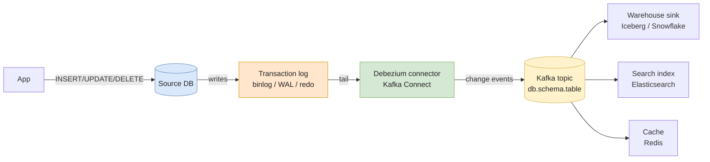
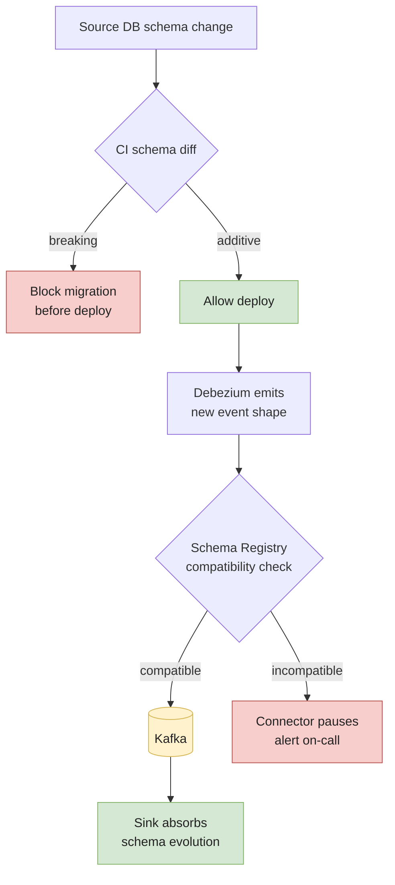

# Change Data Capture (CDC)

**Change Data Capture** is how you turn an OLTP database into a stream of events. Every `INSERT`, `UPDATE`, and `DELETE` in the source becomes a message downstream — usable to feed a warehouse, a search index, a cache, or another microservice.

CDC is the modern alternative to nightly `SELECT *` extracts. Done well, it gives you **low-latency replication, hard-delete capture, and zero load on the source DB**. Done badly, it silently drops rows on schema changes and becomes the most expensive on-call rotation in the team.

> Pre-requisite: comfort with **[Kafka](./kafka)**. Most production CDC stacks land events on a Kafka topic before doing anything useful with them.

---

## Why CDC, and not a nightly SELECT?

A daily `SELECT * FROM orders WHERE updated_at >= ?` is the entry-level pattern. It works until it doesn't:

- **Hard deletes are invisible.** A row deleted in the source stays forever in the warehouse — orphan records, broken counts.
- **Soft deletes are missed** if no one set `deleted_at`.
- **Clock skew** between the app and the DB makes the `updated_at` watermark unreliable. An overlap window is a band-aid, not a fix.
- **Polling load.** At 20k writes/s, a 5-minute poll scans 6M changed rows just to find what moved.
- **Latency floor.** Best case: the polling interval. Real-time is impossible.

CDC fixes all five — but each method does so with different tradeoffs.

---

## The three CDC methods

### 1. Query-based CDC (polling)

You repeatedly query the source on a watermark column (`updated_at`, monotonic id).

```sql
SELECT * FROM orders
WHERE updated_at > :last_seen
ORDER BY updated_at;
```

- ✅ Trivial. No DB privilege beyond `SELECT`.
- ❌ Misses **deletes**.
- ❌ Misses **intermediate states** (a row updated 3 times within the polling interval shows up once).
- ❌ Read load on the source.
- ❌ Latency bounded by the polling interval.

**When it's fine:** small tables, append-mostly, batch-tolerant downstream (BI dashboards refreshed hourly). It's also what tools like Airbyte default to when log access isn't granted.

### 2. Trigger-based CDC

A `BEFORE`/`AFTER` trigger writes every change to a shadow table; a separate process drains the shadow table.

```sql
CREATE TRIGGER orders_audit
AFTER INSERT OR UPDATE OR DELETE ON orders
FOR EACH ROW EXECUTE FUNCTION audit_orders();
```

- ✅ Captures **deletes**.
- ✅ Works on any DB that supports triggers.
- ❌ Adds **synchronous work to every write** — a hot table doing 10k writes/s typically sees write latency go from ~5ms to ~7-8ms (roughly +40-60%).
- ❌ Triggers must be created and maintained per table — 200 tables = 200 triggers to keep in sync with schema changes.
- ❌ The shadow table itself becomes a hot spot.

**When you're stuck with it:** legacy DB without log access, tight DBA control, only a handful of tables to mirror.

### 3. Log-based CDC

You read the database's own write-ahead log — the same mechanism the DB uses for crash recovery and replication.

| DB         | Log mechanism                                  |
| ---------- | ---------------------------------------------- |
| MySQL      | `binlog` (row-based)                           |
| PostgreSQL | `WAL` via logical decoding (`pgoutput`, `wal2json`) |
| SQL Server | Native CDC tables / Change Tracking            |
| Oracle     | Redo logs (LogMiner / XStream)                 |
| MongoDB    | Oplog                                          |

- ✅ **Zero impact on the write path.** The log already exists.
- ✅ Captures inserts, updates, **and deletes**, in **commit order**.
- ✅ Sub-second latency at very high throughput.
- ❌ Requires elevated DB privileges (`REPLICATION` role, log access).
- ❌ Each DB's log format is different — can't write your own portable parser.
- ❌ If your consumer falls behind and the log is rotated, you lose events. Retention policy matters.

**This is the production default in 2026** for any pipeline with > 1k writes/s or a real-time SLA. The standard tool for it is **Debezium**.

---

## Mental model — log-based CDC



The key insight: the source DB does **nothing extra**. Debezium tails a log that the DB writes anyway, parses it, and emits structured change events.

---

## Debezium — the canonical implementation

Debezium is an open-source CDC platform built on top of **Kafka Connect**. It's the reference implementation for log-based CDC across MySQL, PostgreSQL, SQL Server, Oracle, MongoDB, and a few others.

### How a Debezium pipeline is wired

```
Source DB → Debezium connector (Kafka Connect worker) → Kafka topics → Sink connectors
                                  ↓
                           Schema Registry
                        (Avro / Protobuf / JSON Schema)
```

- One **connector instance per source DB** (or per logical schema).
- One **Kafka topic per source table** by default — `<server>.<schema>.<table>`.
- Each event is keyed by the table's **primary key** → all events for one row land in the same partition, in commit order.

### Anatomy of a change event

A Debezium event for a row update looks like this (simplified JSON):

```json
{
  "before": { "id": 42, "amount": 99.0,  "status": "pending" },
  "after":  { "id": 42, "amount": 99.0,  "status": "paid"    },
  "source": {
    "db": "shop",
    "table": "orders",
    "ts_ms": 1715000000000,
    "lsn": 28473823,
    "txId": 9981
  },
  "op": "u",
  "ts_ms": 1715000000123
}
```

The `op` field tells you what happened: `c` (create), `u` (update), `d` (delete), `r` (read — emitted during initial snapshot). `before` is `null` for inserts; `after` is `null` for deletes.

### The initial snapshot — the part everyone underestimates

When you start a new Debezium connector against a non-empty table, it **must** first emit the full current state before tailing the log. Otherwise downstream sees only the deltas, not the rows that already existed.

The snapshot phase:
1. Acquires a read lock (or uses a transaction-level snapshot — depends on the DB).
2. Reads every row of every captured table, emitting `op: r` events.
3. Records the log position at snapshot start.
4. Switches to **streaming mode** from that position.

**This is where production CDC pipelines die.** A 500GB source table snapshot can take hours. During that time:
- The connector is doing a full table scan on the source.
- The log keeps growing — if it rotates past your snapshot start position, you're stuck.
- Downstream sees a flood of `r` events that look like "everything just changed."

Modern Debezium (≥ 1.6) supports **incremental snapshots**: chunked, resumable, can run in parallel with streaming. Use them on any table > a few GB.

### Minimal connector config (PostgreSQL → Kafka)

```json
{
  "name": "orders-cdc",
  "config": {
    "connector.class": "io.debezium.connector.postgresql.PostgresConnector",
    "database.hostname": "pg-prod.internal",
    "database.port": "5432",
    "database.user": "debezium",
    "database.password": "${env:DBZ_PG_PASSWORD}",
    "database.dbname": "shop",
    "topic.prefix": "shop",
    "plugin.name": "pgoutput",
    "publication.name": "dbz_publication",
    "slot.name": "dbz_slot",
    "table.include.list": "public.orders,public.customers",
    "snapshot.mode": "initial",
    "key.converter": "io.confluent.connect.avro.AvroConverter",
    "value.converter": "io.confluent.connect.avro.AvroConverter",
    "key.converter.schema.registry.url": "http://schema-registry:8081",
    "value.converter.schema.registry.url": "http://schema-registry:8081"
  }
}
```

Notes that matter in production:
- The **replication slot** (`slot.name`) is durable — if the connector dies, the slot keeps the WAL pinned. **If the connector stays dead for days, your source disk fills up**. Always alert on slot lag.
- `topic.prefix` defines the topic naming convention; renaming it later means re-bootstrapping the whole pipeline.
- One Schema Registry per environment, with strict compatibility rules (see schema drift below).

---

## Schema drift — the real production problem

You can ship Debezium in an afternoon. You'll fight schema drift for years.

### What "schema drift" means

The source DB is owned by another team. They run a migration: `ALTER TABLE orders ADD COLUMN currency VARCHAR(3)`. Three things happen:

1. The next change event has a new field.
2. The downstream consumer doesn't know about it.
3. **Something breaks** — usually silently.

Whether this is fatal depends entirely on your serialization format and registry policy.

### Compatibility modes — the four buckets

When you use a schema registry (Avro / Protobuf / JSON Schema), you set a **compatibility mode** per subject:

| Mode                  | What's allowed at the source                                  | What it protects                                |
| --------------------- | ------------------------------------------------------------- | ----------------------------------------------- |
| **BACKWARD**          | Add optional fields, drop required fields                     | New consumers can read old data                 |
| **FORWARD**           | Drop optional fields, add required fields                     | Old consumers can read new data                 |
| **FULL**              | Add/drop **optional** fields only                             | Both directions — strongest                     |
| **NONE**              | Anything                                                      | Nothing. Don't.                                 |

The Debezium-friendly default is **BACKWARD**: producers (the connector) can evolve, consumers stay alive.

### Why PostgreSQL is special

PostgreSQL's logical decoding **does not surface DDL events separately**. An `ALTER TABLE` is invisible until the next DML event on that table — at which point the new schema appears in the change event without warning. There's no "schema changed" message you can react to.

Workarounds:
- **Subscribe to a heartbeat / DDL audit trigger** that emits a row on schema changes. Hacky but it's the canonical fix.
- **Run schema diffs in CI** against the source — fail the build before the migration ships.
- **Use a data contract** — see `docs/quality/data-contracts.md` (when written) or treat the source schema as a versioned API.

MySQL and SQL Server emit DDL events natively — they're easier here.

### Drift handling in the sink

Even if your pipeline is well-behaved, the **sink** has to absorb the new column. With:

- **Iceberg / Delta** — schema evolution is native. Add a column and `MERGE` keeps working. See [Iceberg vs Delta](../storage/iceberg-vs-delta).
- **Plain Parquet on Hive** — additive changes work; renames and type changes mean rewriting partitions.
- **Snowflake / BigQuery** — additive changes work via `ALTER TABLE`; schema-on-read tools like `INFER_SCHEMA` help bootstrap.
- **A typed Python consumer** — your code crashes the moment a new field appears. Generated classes (Avro / Protobuf compiled) at least crash loudly.

### A working pattern



The schema registry is the **second line of defense**. The first is CI on the source repo. If both fail, the connector's compatibility check stops the bleeding before garbage hits the warehouse.

---

## Delivery semantics

Debezium itself is **at-least-once** — on connector restart, it may re-emit a few events from the last committed log position. Your downstream must handle duplicates.

End-to-end exactly-once requires:
- **Idempotent sinks.** A `MERGE` keyed on the source primary key is naturally idempotent.
- **Iceberg / Delta sinks** with the upsert keyed on `(pk, source.lsn)` — the LSN gives you a tiebreaker for late events.
- **No mid-pipeline transforms that aren't deterministic.** `now()`, random sampling, calls to external APIs all break replay.

If the sink is HTTP, an external cache, or any non-transactional system — assume duplicates and design accordingly. See **[Kafka — delivery semantics](./kafka#delivery-semantics)**.

---

## Pros / Cons of CDC overall

| ✅ Pros                                                  | ❌ Cons                                                       |
| ------------------------------------------------------- | ------------------------------------------------------------- |
| Sub-second latency, no load on source DB (log-based)    | Operational complexity — Kafka, Connect, Schema Registry, slots |
| Captures hard deletes and intermediate states           | Initial snapshot of large tables is fragile                   |
| Naturally event-driven — feeds many sinks at once       | Schema drift requires real governance, not just tooling       |
| Replay possible from Kafka or from re-snapshotting      | Replication-slot / log-retention failures fill the source disk |
| Decouples source DB rhythm from consumer rhythm         | Privileged DB access is required (security review)            |

---

## Common pitfalls

- **Trusting `updated_at` on a query-based pipeline.** Clock skew or transactions committed out of order silently drop rows. Add a 2x-margin overlap window or move to log-based.
- **Forgetting deletes exist.** Query-based CDC sees nothing when a row is deleted. The warehouse keeps it forever. Audit row counts vs. source weekly.
- **No alert on replication-slot lag.** A paused PostgreSQL Debezium connector pins WAL files indefinitely — at 100MB/s of writes, the source disk fills in hours. Page on `pg_replication_slots.confirmed_flush_lsn` lag.
- **Doing the initial snapshot in one shot on a 1TB table.** The connector takes 12h, the log rotates, you start over. Use **incremental snapshots** (Debezium ≥ 1.6).
- **Schema Registry set to `NONE`.** Looks like it works. Garbage propagates the day someone runs an `ALTER TABLE`.
- **Naive `MERGE` for every event.** A 1B-row fact table with row-by-row merges costs more than the source DB. Batch by event time, partition the sink, write only affected partitions.
- **Routing all CDC topics through one Kafka consumer.** When one topic spikes (snapshot of a big table), it head-of-line-blocks every other table. Group consumers by domain, not by convenience.
- **Mixing CDC + manual backfills against the same sink table** without a tie-breaker (LSN, transaction id). The backfill silently overwrites newer rows. See [Idempotency & Backfills](../quality/idempotency-and-backfills) for the safe replay pattern.

---

## Interview Questions

### Question 1 — "What's the difference between log-based and query-based CDC, and when would you pick each?"

#### Answer — Junior

> Query-based CDC polls the source DB on a watermark like `updated_at`. It's simple but it can't see deletes and adds load on the source.
>
> Log-based CDC reads the database's transaction log directly (binlog for MySQL, WAL for Postgres). It captures inserts, updates, and deletes with no extra load on the source, in commit order.
>
> I'd pick log-based for production. Query-based is fine for small tables or when I don't have log access.

#### Answer — Mid-level

> The decision is mostly driven by three things: write volume, latency SLA, and DB access.
>
> Query-based works under ~1k writes/s with minute-level latency tolerance. It's the only option when you can't get replication privileges, but it has two hard limits: **no hard-delete capture** and **misses intermediate states** within the polling interval. A row updated three times between polls shows up once. For most analytics use cases that's acceptable; for anything operational it's not.
>
> Log-based is the production default once you cross ~1k writes/s or need sub-second latency. Tooling-wise it means **Debezium** on Kafka Connect for almost all stacks. The cost is operational: you now own a Kafka cluster, a Schema Registry, a Connect cluster, replication slots, and the alert on slot lag.
>
> Trigger-based is the fallback when log access is impossible. I avoid it because it adds synchronous write latency to the source — typically a 40-60% increase on hot tables — and every new table means a new trigger to maintain.

#### Answer — Senior

> The right answer is "what does the consumer actually need?" — and most teams skip that conversation.
>
> If the consumer is a daily BI dashboard, log-based is **architectural over-engineering**. A nightly extract on `updated_at` with a 2-hour overlap window is fine, costs nothing operationally, and breaks in obvious ways. The org should resist the buzzword pull.
>
> Log-based becomes mandatory when:
> - The downstream is operational (a search index, a fraud rules engine, a cache).
> - You need to **propagate hard deletes** for compliance — GDPR right-to-erasure means a delete in the source must reach every replica within hours.
> - The source DB is a shared bottleneck and any extra read load is unacceptable.
>
> The hidden cost of log-based isn't Debezium itself — it's the **org commitment**. You're now coupled to the source schema in a way you weren't before. Every migration on the source is a release on the pipeline. That's a real-world cost; I budget for at least one engineer's worth of ongoing CDC operations across the team. If the org can't sustain that, the right answer is sometimes "stay on batch and accept the limitations."
>
> The compromise architecture I've shipped a few times: **CDC into a Kafka topic, batch consumer into the warehouse**. You get hard-delete capture and replay, but you don't pay the full streaming cost downstream. It's a strict superset of nightly extracts and a strict subset of full streaming — usually the right place to land.

#### Common pitfalls

- Forgetting that query-based CDC doesn't see hard deletes — leads to orphan records.
- Choosing log-based without budgeting the operational cost of Kafka + Connect + Schema Registry.
- Letting Debezium's replication slot sit on a paused connector — fills the source disk.

#### Follow-up questions

- The source DBA refuses replication privileges. What's your fallback architecture?
- How would you handle a table that has 1B rows and you want to start CDC tomorrow?
- A consumer fell behind by 6 hours. What goes wrong, and how do you recover?

---

### Question 2 — "Walk me through how Debezium handles schema drift on a PostgreSQL source."

#### Answer — Junior

> Debezium reads the WAL through PostgreSQL's logical decoding. When the source table schema changes, the next change event will reflect the new schema. If we use a Schema Registry (Avro), it checks compatibility before publishing.
>
> For an additive change (a new nullable column), this works automatically. For a breaking change, the registry rejects it and the connector pauses.

#### Answer — Mid-level

> The PostgreSQL specifics matter here. Logical decoding **doesn't expose DDL events**. An `ALTER TABLE` is invisible to Debezium until the next `INSERT`/`UPDATE`/`DELETE` on that table — at which point the new schema appears in the change event with no separate "schema changed" signal.
>
> So the layered defense is:
>
> 1. **CI check on the source repo** — schema diff against main. Block migrations that break compatibility before they ship.
> 2. **Schema Registry compatibility mode** = `BACKWARD`. A new field is OK, a removed required field gets the connector paused.
> 3. **Sink that supports schema evolution** — Iceberg or Delta absorb additive changes natively; a Snowflake `MERGE` needs an `ALTER TABLE` first.
>
> The thing that bites in practice is when the schema **registry policy and the sink schema diverge**. The registry says "compatible," but the dbt model in the warehouse hasn't been updated, so the new column is silently dropped at the sink. I add a step in the dbt project to fail when an unknown column appears in the staging model.

#### Answer — Senior

> The honest answer: schema drift is not a tooling problem, it's an **organizational interface problem**. Debezium and the Schema Registry are mechanisms; the discipline has to come from upstream.
>
> The patterns I rely on:
>
> - **Treat the source schema as a versioned API.** The producing team owns a contract: column names, types, semantics. Breaking changes go through the same review as a public API break. Tools like Bunsen, Apicurio, or even a homemade registry on top of dbt sources work — what matters is that the conversation happens.
> - **CI gate on migrations.** A pre-merge job runs `pg_dump --schema-only` on a staging DB after the migration and diffs it against the locked-in schema. Anything not in the additive whitelist (`ADD COLUMN ... NULL`) requires explicit sign-off.
> - **Schema Registry on `BACKWARD_TRANSITIVE`.** Stricter than `BACKWARD` — covers the long tail of consumers reading old data after multiple schema versions.
> - **DDL-aware heartbeats on Postgres.** A trigger that fires on DDL and writes a row to an audit table — the row goes through the WAL, Debezium emits it, and we can react before the malformed DML hits.
> - **Sink-side schema evolution must be tested.** Iceberg "supports" schema evolution, but rename + type change still rewrites partitions. The CI suite includes a "drift simulation" that adds, drops, and renames columns in the source and asserts the sink converges.
>
> The thing that's surprisingly underappreciated: **PostgreSQL's lack of DDL events isn't going away soon**. Logical decoding's design predates the ecosystem. If you're committing to PostgreSQL CDC at scale, accept that the DDL trigger / audit table / CI-gate combo is permanent infrastructure.

#### Common pitfalls

- Setting Schema Registry compatibility to `NONE` "to unblock the team."
- Trusting `ALTER TABLE ... ADD COLUMN DEFAULT ...` to be additive — the default value rewrites the table, blasts the WAL, and the connector falls behind.
- Adding a column upstream and forgetting to update the dbt staging model — the new column is silently dropped.
- Renames are "additive" if you forget that consumers reading the old name break instantly.

#### Follow-up questions

- The team needs to rename a column. What's the safe migration sequence?
- A consumer is on `BACKWARD` compatibility but the producer evolves to `FORWARD`. What breaks?
- How would your story differ on MySQL vs PostgreSQL?

---

### Question 3 — "Your Debezium connector has been paused for 18 hours. The source DB on-call is paging you. Walk me through what's happening and how you fix it."

#### Answer — Junior

> Debezium uses a replication slot in PostgreSQL (or a similar mechanism in MySQL). When the connector pauses, the slot tells the DB "don't recycle the WAL past this point." The WAL keeps growing on disk.
>
> So the fix is: get the connector running again so it consumes the WAL, or drop the slot if I don't need that data anymore.

#### Answer — Mid-level

> The symptom on the source side is a full disk on the WAL volume — the DB is at risk of refusing writes. Behind it: a Debezium replication slot pinning the oldest unacknowledged LSN.
>
> Triage in order:
>
> 1. **Check `pg_replication_slots`** — confirm which slot is lagging and by how much. `confirmed_flush_lsn` vs `pg_current_wal_lsn()`.
> 2. **Check the connector status** in Kafka Connect REST API. Is it in `FAILED`, `PAUSED`, or just slow?
> 3. **If FAILED** — read the error. Schema incompatibility, Kafka cluster issue, network. Restart only after the root cause is known.
> 4. **If slow** — check Kafka topic backlog. Sometimes the connector is fine; the downstream sink is back-pressuring.
> 5. **If the disk is about to fill** and we can't restore the connector fast enough — drop the slot. **This is destructive**: we lose all WAL since the slot's last commit. Recovery requires an incremental snapshot.
>
> The post-incident: alert on slot lag, not just connector health. A FAILED connector is loud; a healthy connector that's just slow is silent until the disk fills.

#### Answer — Senior

> The 18-hour-paused connector is rarely the actual bug — it's the **alerting gap**. If a connector can sit paused for 18 hours before the source DBA pages me, my monitoring is wrong, and the fix-the-incident conversation has to lead to a fix-the-design conversation.
>
> Concretely, what I'd do in the moment:
>
> 1. **Buy time.** If the source disk is critical, expand the disk before doing anything clever. A 30-minute disk resize buys hours of headroom; a destructive WAL recovery is irreversible.
> 2. **Diagnose without restarting.** Restart-first is a junior reflex — it loses logs and may re-trigger the same failure with a fresh stack trace. Pull the connector's task config, read the last 1000 lines of the Connect worker log, check Schema Registry for recently-rejected schemas.
> 3. **Decide: recover or rebuild.** If the WAL gap is < 6h and the connector can be unblocked (e.g., new field added → push the schema, restart), recover. If the gap is > 24h or the issue is structural (corrupted slot, incompatible upgrade), drop the slot and re-snapshot from scratch using an **incremental snapshot** so the source isn't pinned during the resync.
>
> What I'd push for after:
>
> - **Slot lag alert at 1h, page at 4h.** Disk-fill takes longer than that on most prod setups; this gives a real on-call window.
> - **Disk auto-grow on the WAL volume** with a hard upper bound. The DB never refuses writes because of CDC.
> - **Heartbeat events** in Debezium — periodic dummy events to a low-traffic table, so even quiet tables advance the slot. Solves the "slot lag without traffic" failure mode.
> - **Pre-flight checks in CI** — a connector config change goes through a staging environment with a synthetic load before it touches prod.
>
> The lesson I write into the post-mortem is the same one most teams keep relearning: **CDC couples the source DB's reliability to the consumer's reliability**. A bug in your dbt project can now page the DBA team. That's a cost the org has to budget for, not a failure mode to fix once.

#### Common pitfalls

- Restarting the connector before reading the failure log — loses the diagnosis.
- Dropping a slot without confirming the data has been delivered downstream → silent data loss.
- Alerting on connector status only; missing the "slow but healthy" scenario.

#### Follow-up questions

- The slot is pinned because the *Kafka cluster* is the bottleneck, not the connector. How do you tell, and what changes?
- You drop the slot and re-snapshot. The downstream warehouse already has 3 months of data. How do you reconcile?
- What's your runbook for a Debezium upgrade in prod?

---

## Further reading

- **Debezium** — [official documentation](https://debezium.io/documentation/), [FAQ](https://debezium.io/documentation/faq/).
- **PostgreSQL logical decoding** — [pgoutput plugin](https://www.postgresql.org/docs/current/logical-replication.html).
- **Confluent** — [Schema Registry compatibility modes](https://docs.confluent.io/platform/current/schema-registry/avro.html).
- **Martin Kleppmann**, *Designing Data-Intensive Applications* — chapter 11 covers CDC patterns at the conceptual level; still the best long-form treatment.
- Pages liées :
  - [Kafka](./kafka) — the bus most CDC pipelines run on.
  - [Iceberg vs Delta](../storage/iceberg-vs-delta) — table formats that absorb schema drift gracefully.
  - [dbt advanced — incremental models](./dbt/advanced) — the warehouse-side companion to a CDC ingest.
