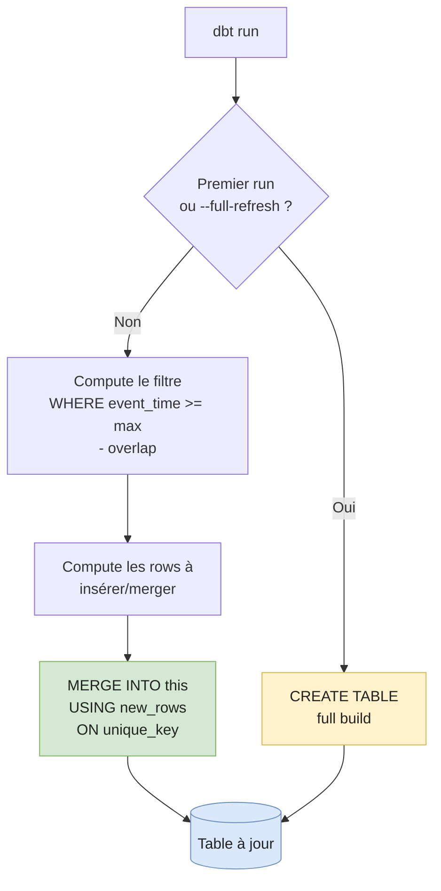

# dbt — Patterns avancés

Suppose que tu as lu **[dbt fundamentals](./dbt-fundamentals)**. On attaque ici les trois patterns qui séparent un projet jouet d'un projet de production : **incremental models**, **snapshots**, **macros & packages**.

---

## Incremental models

Quand `fct_events` fait 2 milliards de rows, tu ne peux plus faire un `CREATE OR REPLACE TABLE` chaque nuit. Les modèles incrémentaux ne traitent **que les nouvelles données** depuis le dernier run.

### Quand l'utiliser

✅ Bon candidat :
- Fact table append-only volumineuse (events, orders, logs).
- Source qui expose un `event_time` ou `updated_at` fiable.
- Le coût d'un full-refresh devient douloureux (temps ou €).

❌ Mauvais candidat :
- Petite table (< 100M rows) → reste en `table`. Plus simple, moins de bugs.
- Source qui mute massivement l'historique (gros UPDATE sur 6 mois) → full-refresh + clustering est plus sûr.

### Stratégies

| Stratégie          | Comportement                                              | Quand                                              |
| ------------------ | --------------------------------------------------------- | -------------------------------------------------- |
| `append`           | INSERT pur, pas de dédoublonnage                          | Source 100% append-only, garantie côté producteur  |
| `merge` (défaut)   | `MERGE INTO` avec `unique_key` — insère ou update         | Cas général, sources avec updates rares            |
| `delete+insert`    | DELETE des rows touchées puis INSERT                      | Engines sans MERGE performant (Redshift)           |
| `insert_overwrite` | Réécrit des partitions entières                           | BigQuery / Spark — par jour ou heure               |

### Pattern de base — `is_incremental()`

```sql
{{ config(
    materialized='incremental',
    unique_key='event_id',
    incremental_strategy='merge',
    on_schema_change='append_new_columns'
) }}

select
    event_id,
    user_id,
    event_type,
    event_time
from {{ ref('stg_events') }}


    -- Au premier run : ce bloc est ignoré, dbt fait un full build.
    -- Aux runs suivants : on lit uniquement les events plus récents
    -- que le max déjà chargé, avec une fenêtre d'overlap pour la late data.
    where event_time >= (
        select coalesce(max(event_time), '1900-01-01')
        from {{ this }}
    ) - interval '1 day'

```

Trois choses à comprendre :

1. **`{{ this }}`** = la table en cours, telle qu'elle existe avant ce run.
2. **L'overlap window (`- interval '1 day'`)** rattrape les events arrivés en retard. Sans elle, un event horodaté hier mais arrivé aujourd'hui est perdu à jamais.
3. **`unique_key='event_id'` + `merge`** déduplique les rows réimportés par l'overlap.

### Le cycle d'un model incremental



### `--full-refresh` : quand et pourquoi

`dbt run --full-refresh --select fct_events` rebuild la table de zéro. À utiliser quand :

- Tu changes la logique du SELECT (le passé doit être retraité).
- Tu changes les colonnes (ajout / renommage).
- Tu suspectes une corruption (bug d'overlap, doublons).

⚠️ Sur 2B rows c'est cher. Beaucoup d'équipes mettent un full-refresh hebdo programmé en plus du run incrémental quotidien.

### Pitfalls — incremental

- **`unique_key` manquant** sur stratégie `merge` → doublons silencieux à chaque run d'overlap.
- **Filtre `is_incremental()` sans overlap** → late-arriving events perdus définitivement.
- **`current_timestamp()` / `now()` dans le SELECT** → sortie non-déterministe ; un backfill ne reproduit pas le passé.
- **Changement de schéma sans `on_schema_change`** → la nouvelle colonne reste vide pour tous les rows historiques. Penser `append_new_columns` ou `sync_all_columns`.
- **Filtrer sur `ingestion_date` au lieu de `event_time`** quand les consommateurs querient par event_time → partition pruning cassé côté warehouse.

---

## Snapshots

Les snapshots sont l'implémentation **Type-2 SCD** (cf. [SCD](../data-modeling/scd)) gérée par dbt. Chaque changement détecté sur une dimension crée un nouveau row avec `dbt_valid_from` / `dbt_valid_to`.

### Stratégies

| Stratégie    | Comment dbt détecte un changement                                        | Quand                                                       |
| ------------ | ------------------------------------------------------------------------ | ----------------------------------------------------------- |
| `timestamp`  | Compare une colonne `updated_at` à la valeur snapshotée                  | Source expose un `updated_at` fiable. **Préféré.**          |
| `check`      | Compare le hash d'une liste de colonnes                                  | Pas de `updated_at` exploitable                             |

### Exemple — `snapshots/dim_customer_snapshot.sql`

```sql


{{ config(
    target_schema='snapshots',
    unique_key='customer_id',
    strategy='timestamp',
    updated_at='updated_at',
    invalidate_hard_deletes=True
) }}

select
    customer_id,
    name,
    email,
    city,
    region,
    updated_at
from {{ source('app_db', 'customers') }}


```

À chaque `dbt snapshot`, dbt :

1. Lit la source actuelle.
2. Compare aux rows actifs (`dbt_valid_to is null`) sur `unique_key`.
3. Pour chaque row dont `updated_at` a changé : ferme l'ancien (`dbt_valid_to = now()`) et insère un nouveau.

Résultat — table `snapshots.dim_customer_snapshot` :

| customer_id | name  | city   | dbt_valid_from        | dbt_valid_to          | dbt_scd_id |
| ----------- | ----- | ------ | --------------------- | --------------------- | ---------- |
| 42          | Alice | Paris  | 2022-01-01 00:00:00   | 2024-06-01 09:12:00   | abc123     |
| 42          | Alice | Berlin | 2024-06-01 09:12:00   | NULL                  | def456     |

### `invalidate_hard_deletes`

Activé : si une row disparaît de la source, dbt ferme la version active (`dbt_valid_to = now()`). Sans cette option, les hard deletes ne sont jamais reflétés et le snapshot ment.

### Règle critique — irréversibilité

> **Un snapshot ne se ré-exécute jamais pour une date passée.**

Snapshots = **append-only**. Si tu re-run aujourd'hui un snapshot pour "rattraper" les 3 jours de données ratés, dbt ne sait pas qu'il s'agit d'historique : il écrit `dbt_valid_from = now()` et **corrompt** la timeline.

Si tu rates un run, le mieux est de l'accepter : la prochaine exécution capturera l'état courant. Si l'historique manquant est critique, ça se reconstruit depuis les **logs CDC** ou un audit-log de la source — pas depuis le snapshot.

### Pitfalls — snapshots

- **Re-run pour une date historique** → corruption (cf. ci-dessus).
- **Changer la stratégie après mise en prod** (`timestamp` → `check`) → le hash change pour tous les rows, dbt voit "tout a changé", création massive de versions.
- **Supprimer une colonne snapshot-ée** sans réfléchir → dbt ne peut plus reconstruire l'historique pour cette colonne.
- **Snapshot directement sur une `view`** côté source → comparaison potentiellement non-déterministe selon l'ordre de retour. Snapshot des tables.
- **Pas de tests sur la table snapshot** → on ne sait pas si elle est encore correcte. Au minimum : `unique` sur `(unique_key, dbt_valid_from)`.

---

## Macros & packages

### Packages — réutiliser plutôt que réécrire

`packages.yml` :

```yaml
packages:
  - package: dbt-labs/dbt_utils
    version: 1.1.1
  - package: calogica/dbt_expectations
    version: 0.10.4
```

Puis `dbt deps`.

Quoi y chercher :

- **`dbt_utils`** — `surrogate_key`, `pivot`, `date_spine`, `unpivot`, et des tests génériques (`equal_rowcount`, `expression_is_true`).
- **`dbt_expectations`** — port de Great Expectations, ~60 tests prêts à l'emploi (distributions, valeurs attendues, etc.).

### Macros — quand en écrire un

Une macro Jinja, c'est juste une fonction qui génère du SQL :

```sql
-- macros/cents_to_eur.sql

    cast({{ column_name }} as decimal(12,2)) / 100.0

```

Utilisation :

```sql
select {{ cents_to_eur('amount_cents') }} as amount_eur
from {{ ref('stg_orders') }}
```

**Quand écrire un macro :**
- Tu copie-colles 3+ fois la même logique.
- Tu veux normaliser un calcul métier (TVA, conversion devise).
- Tu génères du SQL dépendant des colonnes (avec `adapter.get_columns_in_relation`).

**Quand t'abstenir :**
- Tu en as besoin une seule fois → SQL inline.
- Le macro devient si complexe qu'il est plus dur à lire que le SQL qu'il remplace.
- Tu masques des règles métier critiques derrière 3 niveaux de Jinja.

> Règle perso : un macro doit être **plus lisible** que le SQL qu'il remplace, pas juste plus court.

---

## Pros / Cons des patterns avancés

| ✅ Pros                                            | ❌ Cons                                                       |
| ------------------------------------------------- | ------------------------------------------------------------ |
| Coût et temps de build divisés sur les gros facts  | Plus de pièges (overlap, unique_key, late data)              |
| Snapshots = SCD-2 productionisé en 30 lignes       | Snapshots irréversibles — une erreur coûte cher              |
| Macros + packages = DRY sans perdre la lisibilité  | Jinja-spaghetti si on en abuse                                |

---

## Récap des pitfalls

**Incremental :**
- `unique_key` manquant → doublons.
- Filtre sans overlap → late data perdue.
- `now()` dans le model → non-déterministe.
- Pas de `on_schema_change` → colonnes manquantes silencieusement.

**Snapshots :**
- Re-run pour date passée → historique corrompu.
- Changement de stratégie après prod → faux changements massifs.
- Pas d'`invalidate_hard_deletes` → dimensions fantômes.
- Snapshot d'une view non-déterministe → bruit.

**Macros :**
- Sur-abstraire pour 1 seul caller → dette inverse.
- Cacher la logique métier derrière du Jinja → revue de code impossible.

---

## Follow-up questions (entraînement interview)

- Comment tu gères un changement de schéma sur une source qui alimente un model incremental ?
- Pourquoi un snapshot ne peut-il pas être ré-exécuté pour une date passée ? Comment rattraper un trou de données ?
- Tu observes des doublons dans `fct_events` à 0,01%. Diagnostic possible ?
- Quelle stratégie incrémentale choisirais-tu pour BigQuery vs Snowflake vs Redshift ? Pourquoi ?
- Comment décider entre un macro et un model `ephemeral` pour une logique partagée ?

---

## Further reading

- **Doc officielle dbt** — [Incremental models](https://docs.getdbt.com/docs/build/incremental-models), [Snapshots](https://docs.getdbt.com/docs/build/snapshots).
- Pages liées dans cette base :
  - [SCD](../data-modeling/scd) — la théorie derrière les snapshots.
  - [Airflow](./airflow) — orchestrer `dbt run` et `dbt snapshot`.
  - [Data Engineer interview](../interview/data-engineer) — Q3 cite explicitement ces patterns.
