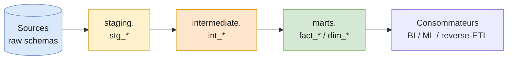

# dbt — Fundamentals

[dbt](https://www.getdbt.com/) (data build tool) est la **couche de transformation SQL** d'une stack moderne — le **T** dans **ELT**.

Il transforme des tables brutes en marts analytiques, **dans l'entrepôt**, en utilisant uniquement du SQL + un peu de Jinja. Ses superpouvoirs : versionnage Git, lineage automatique, tests déclaratifs, documentation générée.

> 🎯 dbt n'est **ni un orchestrateur** (utilise Airflow / Dagster / dbt Cloud), **ni un moteur de données** (le warehouse fait le travail). C'est un compilateur SQL versionné.

---

## Structure d'un projet

```
my_project/
├── dbt_project.yml          # config racine
├── profiles.yml             # connexion warehouse (hors repo)
├── models/
│   ├── staging/             # 1:1 avec les sources, casts + renommages
│   ├── intermediate/        # logique partagée, pas exposée aux consommateurs
│   └── marts/               # fact_*, dim_* — la sortie
├── tests/                   # singular tests (.sql libres)
├── snapshots/               # SCD Type 2
├── seeds/                   # CSV statiques (mappings, country codes…)
├── macros/                  # fonctions Jinja réutilisables
└── packages.yml             # dépendances (dbt_utils, dbt_expectations…)
```

Le flux conceptuel d'un projet dbt :



**Règle de cohérence :** un consommateur ne lit jamais `staging` ou `intermediate` — uniquement `marts`. Cela permet de refactorer librement les couches internes.

---

## `ref()` et `source()` — comment dbt construit le DAG

Tu **ne dois jamais** hardcoder un nom de table dans un model. Utilise `ref()` (autre model) ou `source()` (table externe brute) :

```sql
-- models/staging/stg_orders.sql
select
    order_id,
    customer_id,
    cast(amount as decimal(10,2)) as amount,
    cast(created_at as timestamp) as created_at
from {{ source('app_db', 'orders') }}     -- table brute déclarée dans schema.yml

-- models/marts/fct_orders.sql
select
    o.order_id,
    o.amount,
    c.country
from {{ ref('stg_orders') }} as o          -- autre model dbt
left join {{ ref('dim_customer') }} as c
    on o.customer_id = c.customer_id
```

À chaque appel à `ref()` / `source()`, dbt **enregistre une arête** dans le DAG. Tout le reste — l'ordre d'exécution, le lineage, la doc, les tests de relation — en découle.

Sources déclarées dans un YAML :

```yaml
# models/staging/_sources.yml
version: 2
sources:
  - name: app_db
    database: raw
    schema: app
    tables:
      - name: orders
      - name: customers
```

---

## Materializations

Comment dbt matérialise un model dans le warehouse :

| Materialization | Que fait dbt                                          | Quand l'utiliser                                                  |
| --------------- | ----------------------------------------------------- | ----------------------------------------------------------------- |
| `view`          | `CREATE OR REPLACE VIEW`                              | Défaut. Logique légère, source toujours fraîche.                  |
| `table`         | `CREATE OR REPLACE TABLE` (recompute complet)         | Calculs lourds, ou queries fréquentes sur peu de données.         |
| `ephemeral`     | Inline CTE — pas matérialisé                          | Helper réutilisé dans 2-3 models, sans intérêt à exposer.         |
| `incremental`   | Insère/merge uniquement les nouveaux rows             | Gros fact tables append-only. **Voir [dbt advanced](./dbt-advanced).** |
| `snapshot`      | Type-2 SCD géré par dbt                               | Tracker l'historique d'une dimension. **Voir [dbt advanced](./dbt-advanced).** |

Définition au niveau du model :

```sql
{{ config(materialized='table') }}

select ...
```

Ou par dossier dans `dbt_project.yml` :

```yaml
models:
  my_project:
    staging:
      +materialized: view
    marts:
      +materialized: table
```

---

## Tests

Tests = assertions sur tes données, exécutées via `dbt test`. Deux familles.

### Generic tests

Quatre tests built-in couvrent ~80% des cas :

```yaml
# models/marts/_marts.yml
version: 2
models:
  - name: fct_orders
    columns:
      - name: order_id
        tests:
          - unique
          - not_null
      - name: status
        tests:
          - accepted_values:
              values: ['pending', 'paid', 'refunded']
      - name: customer_id
        tests:
          - relationships:
              to: ref('dim_customer')
              field: customer_id
```

### Singular tests

Un fichier `.sql` qui **doit retourner 0 ligne** pour passer :

```sql
-- tests/no_negative_amounts.sql
select *
from {{ ref('fct_orders') }}
where amount < 0
```

### Custom generic tests

Quand tu réutilises la même logique sur plusieurs models, transforme-la en macro :

```sql
-- tests/generic/test_at_least_n_rows.sql

    select count(*) as cnt
    from {{ model }}
    having count(*) < {{ n }}

```

Utilisation :

```yaml
- name: dim_customer
  tests:
    - at_least_n_rows:
        n: 100
```

### Severity & store_failures

```yaml
- name: amount
  tests:
    - not_null:
        config:
          severity: warn          # error (default) | warn
          store_failures: true    # garde les rows fautives dans test_failures.<test_name>
```

`severity: warn` est utile pour des règles de qualité que tu veux **observer** sans bloquer le pipeline.

---

## Lineage et documentation

Une fois que tes models utilisent `ref()` / `source()` partout :

```bash
dbt docs generate
dbt docs serve
```

Tu obtiens un site interactif avec :

- Le **DAG** de tous les models (cliquable, zoom).
- Les descriptions de colonnes propagées depuis les YAML.
- Les tests appliqués à chaque colonne.
- Le SQL compilé (Jinja → SQL pur).

Pour aller plus loin :

- **[dbt-osmosis](https://github.com/z3z1ma/dbt-osmosis)** — propage automatiquement les descriptions de colonnes depuis les sources jusqu'aux marts.
- **[OpenLineage](https://openlineage.io/)** + Marquez — lineage cross-outils (dbt + Airflow + Spark…).

---

## Pros / Cons

| ✅ Pros                                            | ❌ Cons                                                  |
| ------------------------------------------------- | ------------------------------------------------------- |
| Versionné en Git, code review naturel              | Nécessite un warehouse compute-rich (cher si mal géré)  |
| Tests + doc + lineage générés ensemble             | Jinja peut devenir spaghetti si on en abuse             |
| Onboarding rapide pour un dev SQL                  | Pas adapté aux gros traitements row-by-row (pas Spark)  |
| Communauté énorme + packages (`dbt_utils`)         | dbt Cloud est cher ; dbt-core demande de l'orchestration |

---

## Pitfalls

- **Hardcoder un nom de table** au lieu d'utiliser `ref()` / `source()`. Le DAG est cassé, les builds en `--defer` échouent, le lineage ment.
- **Sur-tester.** 1500 tests `not_null` sur des colonnes qui n'ont jamais été nulles depuis 5 ans = bruit. Garde les tests qui ont attrapé un vrai bug ou qui protègent un invariant métier.
- **Confondre `source` et `ref`.** `source()` pour les tables brutes externes au projet ; `ref()` pour tout autre model dbt. Inverser casse le DAG.
- **Documentation YAML jamais mise à jour.** Sans `dbt-osmosis` ou un check CI, les `description:` divergent silencieusement.
- **Tout en `view`.** Les marts en view rendent les dashboards lents et coûteux ; matérialise en `table` (ou `incremental`) à partir de la couche marts.

---

## What's next

Une fois ces fondamentaux acquis, deux patterns sont **incontournables en production** : les modèles incrémentaux (pour ne pas reprocesser 2 ans de fact_orders chaque nuit) et les snapshots (pour tracker l'historique des dimensions).

→ Voir **[dbt — Patterns avancés](./dbt-advanced)**.
