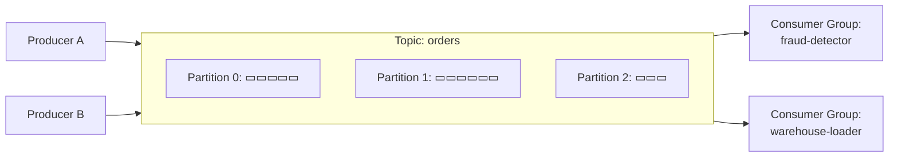

# Apache Kafka

Kafka is a **distributed, partitioned, append-only log**. Producers write events to topics; consumers read them at their own pace. It's the backbone of most streaming architectures.

---

## Mental model



Two consumer groups can read the **same topic independently** — each tracks its own offsets.

---

## Core concepts

| Concept           | Definition                                                                            |
| ----------------- | ------------------------------------------------------------------------------------- |
| **Topic**         | A named log of events.                                                                |
| **Partition**     | A topic is split into ordered shards. Order is guaranteed **within a partition only**. |
| **Offset**        | A monotonically-increasing ID of an event within a partition.                          |
| **Producer**      | Writes events. Chooses the partition (round-robin, by key, custom).                    |
| **Consumer**      | Reads events. Tracks its position via committed offsets.                               |
| **Consumer group**| Set of consumers that share work — each partition is consumed by exactly one member.   |
| **Broker**        | A Kafka server. A cluster has many.                                                    |
| **Replication**   | Each partition is replicated across N brokers for durability.                          |

---

## Partitioning — the most important design choice

The **partition key** decides:

- **Ordering guarantees.** Events with the same key always land in the same partition, in order.
- **Parallelism.** More partitions → more concurrent consumers possible.
- **Hot spots.** A skewed key (`country = "US"` for a global app) overloads one partition.

Rule of thumb: choose the key as the **smallest unit you need ordered**. For a banking app, `account_id` is usually the right answer — events for one account stay ordered, but accounts process in parallel.

---

## Delivery semantics

| Mode              | Guarantee                                  | How                                                                   |
| ----------------- | ------------------------------------------ | --------------------------------------------------------------------- |
| **At-most-once**  | May lose, never duplicate                  | Commit offset *before* processing                                     |
| **At-least-once** | May duplicate, never lose (most common)    | Commit offset *after* processing                                      |
| **Exactly-once**  | No loss, no duplicates                     | Idempotent producer + transactions, **within Kafka**                  |

**<T>Exactly-once</T> is end-to-end only if your sink is <T term="idempotency">idempotent</T>.** Writing to a non-transactional sink (an HTTP endpoint, a cache) breaks the guarantee.

---

## Producer — minimal example (Python)

```python
from confluent_kafka import Producer

p = Producer({
    "bootstrap.servers": "kafka:9092",
    "enable.idempotence": True,        # protects against duplicate retries
    "acks": "all",                     # wait for all in-sync replicas
    "compression.type": "zstd",
})

def delivery(err, msg):
    if err:
        print(f"FAILED: {err}")
    else:
        print(f"ok partition={msg.partition()} offset={msg.offset()}")

p.produce(
    topic="orders",
    key="account-42",                  # partition key
    value=b'{"order_id": 1, "amount": 99}',
    on_delivery=delivery,
)
p.flush()
```

---

## Consumer — minimal example (Python)

```python
from confluent_kafka import Consumer

c = Consumer({
    "bootstrap.servers": "kafka:9092",
    "group.id": "warehouse-loader",
    "enable.auto.commit": False,        # commit manually after processing
    "auto.offset.reset": "earliest",
})
c.subscribe(["orders"])

while True:
    msg = c.poll(1.0)
    if msg is None:
        continue
    if msg.error():
        raise RuntimeError(msg.error())

    process(msg.value())                # <-- your business logic
    c.commit(msg)                       # at-least-once: commit AFTER processing
```

---

## Common pitfalls

- **Auto-commit + crash mid-process** → events look processed but aren't. Disable auto-commit for at-least-once.
- **Increasing partitions later breaks key ordering.** Adding partitions reshuffles future events for the same key. Plan partition count up-front (overestimate by 2–4×).
- **Long single-message processing** → consumer is kicked out of the group (`max.poll.interval.ms` exceeded). Process in batches or shorten work.
- **Schema drift.** A producer adds a field; consumers crash. Use a schema registry (Avro / Protobuf / JSON Schema) and enforce **backward compatibility**. See [CDC — schema drift](./cdc#schema-drift--the-real-production-problem) for the production playbook.
- **Mixing transactional and non-transactional writes** in the same consumer breaks exactly-once.
- **Using Kafka as a database.** It's a log, not a key-value store. For "give me the latest state for key X," use a compacted topic + a materialized view (e.g., ksqlDB, Flink).

---

## Kafka vs. queues (RabbitMQ, SQS)

| Concern                  | Kafka                              | Traditional queue (RabbitMQ/SQS)        |
| ------------------------ | ---------------------------------- | --------------------------------------- |
| Replay history           | ✅ Native (re-read offsets)         | ❌ Once consumed, gone                   |
| Multiple independent consumers | ✅ Consumer groups            | ⚠️ Fan-out via exchanges/SNS            |
| Ordering                 | Per partition                      | Per queue                                |
| Throughput               | Very high (millions/s)             | High but lower                           |
| Use case                 | Event streaming, log               | Task queues, RPC-like work distribution  |
