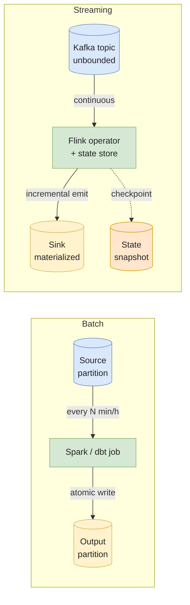
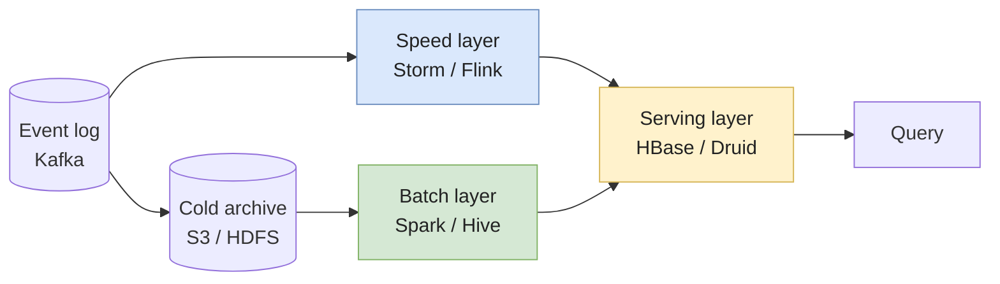

# Batch vs Streaming

Batch and streaming are the two processing paradigms behind every data pipeline. Batch reads a **bounded** dataset, computes once, writes the result, and exits. Streaming reads an **unbounded** dataset, maintains state continuously, and emits results as they evolve.

The framing "batch vs streaming" is overcooked. In 2026 most serious data platforms run both — the question isn't which one to pick, it's **what's the latency budget for this specific use case, and what operational cost am I willing to pay for it?**. A surprising number of "we need streaming" requirements collapse to "we need 5-minute incremental batch" when you push on the *why*.

This page lays out the six dimensions that actually differ between the paradigms, the architectures that have tried to merge them ([Lambda](https://nathanmarz.com/blog/how-to-beat-the-cap-theorem.html), Kappa, modern lakehouse), and the workload-to-paradigm mapping I'd defend in an interview.

---

## The two paradigms

### Batch — bounded data, scheduled compute

* Input: a finite dataset that exists in full at job start (yesterday's events, last hour's CDC dump, a Parquet partition).
* Compute: scheduled — every 15 min, hourly, nightly. Reads everything, transforms, writes, exits.
* State: stateless across runs (each job starts fresh) or recovered from the previous output.
* Engines: Spark batch, dbt, Airflow-orchestrated SQL, BigQuery scheduled queries, Snowflake tasks.
* Latency: minutes (incremental dbt) to hours (nightly warehouse refresh).

### Streaming — unbounded data, continuous compute

* Input: a never-ending sequence of events arriving over time (Kafka topic, Kinesis stream, CDC log, IoT sensors).
* Compute: long-lived operators consuming events as they arrive, maintaining state in RocksDB / managed state.
* State: continuously evolving — windowed aggregations, joins, sessionization. Recovered from checkpoints on failure.
* Engines: Kafka Streams, Flink, Spark Structured Streaming (micro-batch), Dataflow, Materialize, ksqlDB.
* Latency: milliseconds (Flink, Materialize) to seconds (micro-batch).



The key difference is **boundedness**. Once you accept that streams are unbounded, every other constraint follows: you can never "see all the data", every aggregation needs a window, every join needs a state store, every failure needs a checkpoint to recover from.

---

## The six dimensions that actually differ

Most "batch vs streaming" comparisons collapse into "speed". The honest comparison has six axes, and only one is latency.

### 1. Latency

| Paradigm | Typical end-to-end latency | Lower bound |
|---|---|---|
| **Nightly batch** | 12–24 hours | Job duration + scheduler delay |
| **Hourly batch** | 1–2 hours | Same |
| **Incremental batch / dbt** | 5–60 minutes | Job interval + run duration |
| **Micro-batch streaming** (Spark Structured Streaming, default) | 1–60 seconds | Trigger interval + processing time |
| **True streaming** (Flink, Kafka Streams, Materialize) | 10ms–1s | Network + state-store I/O |

The latency *floor* matters: micro-batch streaming cannot do sub-second p99, and true streaming cannot easily do 30-day backfills.

### 2. Throughput vs latency curve

Batch optimizes throughput at the cost of latency: read 100 GB sequentially, vectorize the scan, write the result, leave. A nightly job processing 10 TB on a 100-node Spark cluster is the cheapest cents-per-GB you'll find.

Streaming optimizes latency at the cost of throughput per dollar: continuous operators don't get the bulk-read efficiency of a batch scan, state stores add per-event I/O, and the cluster runs 24/7 even when traffic is idle. Per GB processed, streaming is **typically 3–10× more expensive** than batch — exact ratio depends on event size and state complexity.

### 3. State management

Batch jobs are mostly stateless across runs. Each run reads its input, computes, writes, exits. State (e.g. an SCD type-2 table) lives in storage between runs, not in the job process.

Streaming jobs hold **continuous, in-memory state**:

* **Windowed aggregations** — last 5-minute count per user, requires a tumbling/sliding window with eviction.
* **Stream-stream joins** — join two streams within a time window, requires both sides buffered.
* **Sessionization** — group events by inactivity gap, requires per-key timers and state expiry.

That state needs to be **checkpointed durably** (Flink: Chandy-Lamport asynchronous snapshots; Kafka Streams: changelog topics in Kafka itself) and **recoverable on operator restart** in seconds, not hours. Operating a 500 GB Flink state store is a real skill — most teams underestimate it until the first checkpoint takes 20 minutes and stalls the pipeline.

### 4. Failure semantics

| | Batch | Streaming |
|---|---|---|
| **What happens on crash** | Job fails, scheduler retries the whole run | Operator restarts from last checkpoint, replays events since |
| **Time to recover** | Job runtime (minutes-hours) | Seconds-minutes (depends on state size + replay window) |
| **Idempotency requirement** | Strongly recommended (re-run = same output) | Mandatory (every retry replays events; non-idempotent sinks duplicate) |
| **Replay cost** | Trivial (re-read source partition) | Moderate (replay from Kafka offset) to expensive (replay from cold storage) |
| **Operational burden** | Low — `airflow tasks retry` or rerun cron | High — checkpoint compatibility, state migration, watermark drift |

Batch fails **loudly and obviously** — Airflow turns the task red, you rerun it, you move on. Streaming fails **subtly** — the consumer lags, the watermark stalls, results stop updating, and unless you have lag SLOs and alerting, the dashboard goes silently stale. See [idempotency & backfills](../quality/idempotency-and-backfills) — it's a pre-requisite for streaming, not a nice-to-have.

### 5. Cost model

Batch is **pay-per-run**: a 10-minute Spark job on EMR or a 30-second BigQuery scan. Idle 90% of the time, costs nothing then.

Streaming is **pay-per-uptime**: a Flink cluster, a Kafka cluster, a stateful operator, all running 24/7 to be ready when an event arrives. Even at zero traffic, the bill is constant.

A back-of-the-envelope: a Flink cluster sized for 50k events/s costs roughly $5–15k/month in raw compute (managed offerings like Confluent Flink, Amazon Managed Service for Apache Flink, or Decodable charge a multiple). A daily Spark job processing the same 4B events costs $50–500/month, completes in 30 minutes, and pays nothing for the other 23.5 hours. The streaming bill is justified when latency genuinely matters; otherwise it's burning money for "real-time" that's not actually consumed in real time.

### 6. Operational complexity

Batch ops are well-understood: cron, Airflow, dbt schedules, retries, backfills. Most teams already have the muscle memory. Hiring is easy.

Streaming ops add a half-dozen new failure modes: **late events**, **out-of-order events**, **watermark stragglers**, **state explosion**, **checkpoint failures**, **schema evolution mid-stream**, **consumer lag spikes**, **rebalance storms**. Each one is solvable, none are obvious until you've hit them in production. The team needs someone who understands event-time semantics, watermarks, and state-store internals — that role is harder to hire and pays a 20–30% premium.

> **The cost most teams underweigh.** Streaming is 3–5× the operational complexity of batch for the same business outcome. If the latency genuinely matters (fraud, real-time inventory, IoT alerting), pay it. If it doesn't (BI dashboards, model training, regulatory reports), don't.

---

## The architecture continuum

In practice, batch and streaming don't sit at two endpoints — they sit on a continuum that the industry has tried several ways to unify.

### Lambda architecture (Marz, ~2011)

Two parallel pipelines: a **batch layer** computes the authoritative view nightly, a **speed layer** computes an approximate, low-latency view from the live stream. A **serving layer** merges them.



Strengths: real-time freshness with eventual batch correctness.
Killer weakness: **two codebases for the same business logic**. Bug fixes happen twice, results diverge, the team burns out maintaining the gap. Almost nobody runs Lambda by choice in 2026.

### Kappa architecture (Kreps, 2014)

One pipeline: streaming for everything. Backfills happen by replaying the source log from offset 0 through the same operators. One codebase, one set of semantics.

Strengths: no duplication, real-time by default.
Weakness: replaying months of events through stateful operators is expensive, and historical scans (the kind a warehouse does in a 30-second BigQuery query) are agonizingly slow as a streaming job.

### The modern lakehouse pattern (2022+)

Today's de facto answer for analytics: **incremental batch on table formats**.

* Sources land in [Iceberg / Delta / Hudi](../lakehouse/table-formats-comparison) tables via continuous ingestion (Flink writers, Kafka Connect, [CDC](../data-pipeline/cdc) into Iceberg).
* Transformations run as **incremental batch** (dbt incremental, Spark Structured Streaming with `Trigger.AvailableNow`, Snowflake Dynamic Tables, BigQuery Continuous Queries) on a 1-to-15-minute cadence.
* Real-time use cases (the 5–10% that genuinely need it) read directly from the streaming layer.

This pattern wins because it's **one logical pipeline, two execution modes**. The same SQL transformation runs as a batch backfill against history and as an incremental forward-fill against the latest commits. dbt and Spark Structured Streaming both support this. Materialize and Snowflake Dynamic Tables go further — they maintain the result *incrementally* without re-reading inputs, which is closer to a true unified model.

### Micro-batch as the pragmatic middle

Spark Structured Streaming's default execution mode is micro-batch — every trigger interval (e.g. 1 second), it runs a tiny batch over the new data since the last trigger. The semantics are streaming (windows, watermarks, exactly-once), the implementation is batch.

* Fine for latency floors of ~1 second.
* Reuses Spark's batch optimizer and ecosystem.
* Continuous Processing (true streaming, sub-100ms) exists in Spark but has narrow use; most teams stay on micro-batch.

Dataflow / Beam unifies the two even more cleanly — the same pipeline runs in batch or streaming mode based on a flag, with the engine handling boundedness internally. The Beam model (Akidau et al., "The Dataflow Model") is the cleanest formalism of "what + where + when + how" that streaming computation needs.

---

## Mapping workloads to paradigms

The senior framing: **start with the latency SLO, then check the operational cost the org can absorb**. The mapping I'd default to:

| Workload | Latency target | Right paradigm | Why |
|---|---|---|---|
| **Nightly executive dashboard** | 24 h | Batch (dbt + warehouse) | Cheapest, matches consumer cadence (humans look at it once a morning). |
| **Daily revenue report** | 1–24 h | Batch (dbt incremental) | Same. |
| **BI dashboards (most)** | 15 min – 1 h | Incremental batch (dbt every 15 min) | Real-time isn't useful when nobody's looking; the cost gap is huge. |
| **Operational dashboard** (ops UI showing today's traffic) | 1–5 min | Micro-batch streaming or 1-min incremental batch | "Refresh on user click" is rare; "auto-refresh every 30s with 1-min lag" is fine. |
| **Real-time fraud detection** | 100ms–1s | True streaming (Flink, Kafka Streams) | Decision happens before the transaction completes. Latency is the product. |
| **Inventory consistency for e-commerce** | 1–10s | Streaming (CDC → stream processor → cache) | Overselling = real money. CDC + stream is the standard pattern. |
| **IoT alerting** (temperature spike, machine failure) | 100ms–10s | True streaming with windowed alerting | A 5-minute lag means a melted server. |
| **Model training data** | Daily–weekly | Batch | Training reads months of history; streaming the same data is wasteful. |
| **Online feature serving** | < 50ms read | Streaming for write, key-value for read | Features are computed in stream (Flink → online feature store); reads are point lookups. |
| **Regulatory reporting** | Daily–monthly | Batch | Auditable, reproducible, no benefit from low latency. |
| **Backfill of 18 months of data** | One-shot | Batch | Replaying a year of events through Flink is theoretical pain; Spark backfills it in hours. |
| **Replication of OLTP → warehouse** | 1–5 min | Streaming CDC + incremental batch into warehouse | Standard pattern; see [CDC](../data-pipeline/cdc). |

The two patterns most teams over-engineer:

* **"Real-time dashboards"** — almost always means "1-minute lag is fine, 1-hour is not". A 1-minute incremental dbt job is cheaper, simpler, and more debuggable than a Flink pipeline.
* **"Streaming because the future is streaming"** — adopting streaming for analytical workloads when no consumer needs sub-minute latency is the most expensive architectural mistake in mid-stage data teams.

---

## Implementation — the same logic, two engines

A common warehouse aggregation: hourly revenue by country, with deduplication on `order_id`.

### Batch — dbt incremental model

```sql
-- models/marts/fct_hourly_revenue.sql
{{ config(
    materialized='incremental',
    unique_key=['order_hour', 'country'],
    incremental_strategy='merge'
) }}

WITH new_orders AS (
  SELECT
    DATE_TRUNC('hour', order_ts) AS order_hour,
    country,
    SUM(amount)                  AS revenue,
    COUNT(DISTINCT order_id)     AS order_count
  FROM {{ source('raw', 'orders') }}
  
    WHERE order_ts >= (SELECT MAX(order_hour) FROM {{ this }})
  
  GROUP BY 1, 2
)
SELECT * FROM new_orders
```

* Triggered by Airflow / dbt Cloud every 15 minutes.
* Reads only new rows since the last run.
* `merge` deduplicates on `(order_hour, country)` — re-running is safe.
* Latency: 15 min + run duration.
* Operational cost: minimal — same patterns as any dbt model.

### Streaming — Flink SQL

```sql
-- Source: Kafka topic with order events
CREATE TABLE orders (
  order_id   BIGINT,
  country    STRING,
  amount     DECIMAL(10, 2),
  order_ts   TIMESTAMP(3),
  WATERMARK FOR order_ts AS order_ts - INTERVAL '5' MINUTE
) WITH (
  'connector' = 'kafka',
  'topic'     = 'orders',
  'properties.bootstrap.servers' = 'kafka:9092',
  'format'    = 'avro'
);

-- Sink: Iceberg table
CREATE TABLE fct_hourly_revenue (
  order_hour  TIMESTAMP(3),
  country     STRING,
  revenue     DECIMAL(18, 2),
  order_count BIGINT,
  PRIMARY KEY (order_hour, country) NOT ENFORCED
) WITH (
  'connector' = 'iceberg',
  'catalog'   = 'glue',
  'database'  = 'analytics'
);

-- Continuous tumbling-window aggregation
INSERT INTO fct_hourly_revenue
SELECT
  window_start                AS order_hour,
  country,
  SUM(amount)                 AS revenue,
  COUNT(DISTINCT order_id)    AS order_count
FROM TABLE(
  TUMBLE(TABLE orders, DESCRIPTOR(order_ts), INTERVAL '1' HOUR)
)
GROUP BY window_start, country;
```

* Runs continuously; emits per-hour aggregates as windows close.
* **Watermark** delays emission by 5 minutes to absorb late events.
* State store holds open windows in RocksDB; checkpoints to S3 every 30 seconds.
* Latency: window-close + 5-min watermark grace = ~1 hour and 5 minutes from event to emission for the *complete* aggregate (because hourly windows only close at the hour boundary).
* Operational cost: a 24/7 Flink cluster, watermark + lag monitoring, state-store sizing, checkpoint storage in S3, schema evolution discipline on the Kafka topic.

The startling reality: for **hourly aggregates**, the streaming pipeline produces results at roughly the same end-to-end latency as the dbt-every-15-minutes pipeline — because the window closure dominates. The streaming version costs 5–10× more in compute and 3× more in operational complexity, for **no observable user benefit**. This is the "streaming because we should" trap. Streaming wins when the *computation cadence* is finer than the window — sub-second decisions, per-event alerts, sliding 5-minute fraud detection — not for hourly aggregates a human looks at twice a day.

---

## Trade-offs at a glance

| Dimension | Batch | Streaming |
|---|---|---|
| **Boundedness** | Bounded input | Unbounded input |
| **Latency** | Minutes to hours | Milliseconds to seconds |
| **Throughput per $** | High (sequential scan, vectorized) | Lower (per-event I/O, 24/7 cluster) |
| **State** | Lives in storage between runs | In-memory + checkpointed |
| **Failure recovery** | Re-run job (minutes-hours) | Resume from checkpoint (seconds-minutes) |
| **Idempotency** | Strongly recommended | Mandatory |
| **Cost model** | Pay per run | Pay per uptime |
| **Operational complexity** | Low — Airflow/dbt patterns | High — watermarks, state, checkpoints, lag |
| **Backfill** | Trivial (re-run with date range) | Painful (replay through stateful operators) |
| **Best for** | Aggregates, reports, training data, regulatory | Alerts, real-time decisions, CDC propagation, sessionization |
| **Hiring** | Standard SQL/Python skills | Specialized — Flink/Kafka Streams/Beam expertise |

---

## Common pitfalls

* **Adopting streaming for "real-time" that nobody consumes in real time.** A "real-time" dashboard refreshed by humans every morning at 9am gets the same business value from a nightly batch. The 24/7 Flink cluster is pure cost. Always ask **who consumes this, on what cadence, and what do they do with the lower latency?**.
* **Confusing "low-latency ingest" with "low-latency analytics".** CDC into Iceberg every 30 seconds is fine even if the dashboard refreshes hourly — the *ingest* is streaming, the *analytics* is batch. These are independent decisions, not a single architecture choice.
* **Forgetting that windows dominate end-to-end latency.** A streaming pipeline producing hourly aggregates is bounded by the hour, not by your engine's latency. A 100ms Flink doesn't make a 1-hour window emit faster.
* **Late events without watermarks.** A streaming job emits a "complete" hourly aggregate at the hour boundary, then a late event arrives 4 minutes later. Without watermark + allowed-lateness configuration, the late event either updates the aggregate (cascading downstream invalidation) or is silently dropped.
* **No checkpoint or state-size monitoring.** A Flink job with a 500 GB state store that takes 20 minutes to checkpoint will eventually fail to checkpoint at all, then silently fall behind. The fix is **state TTL, key cardinality control, and alerting on checkpoint duration** — none of which are obvious until you hit the wall.
* **Re-running a streaming backfill through stateful operators.** Replaying 18 months of events through a windowed aggregation rebuilds 18 months of state in memory, often OOMs the cluster. Backfills should run as **batch jobs against the same source**, separate from the live streaming pipeline.
* **Schema evolution mid-stream.** Adding a non-nullable field to the source schema breaks every consumer simultaneously. Streaming requires **stricter contract discipline** than batch — schema registry, backwards-compatibility checks in CI, and a coordinated rollout. See [data contracts patterns in CDC](../data-pipeline/cdc).
* **Treating Lambda as the default architecture.** Two pipelines, two codebases, two sources of truth that diverge. The 2014–2018 era of Lambda is over for a reason. Default to incremental batch on a lakehouse + a thin streaming layer for the genuinely real-time slice.
* **Picking streaming for a 5-person team.** Operating Flink / Kafka Streams in production needs people who understand watermarks, state, and stream semantics. A 5-person team can keep dbt + Airflow running with 1 part-time SRE; the same team running Flink will burn 1.5 FTEs on the streaming stack alone.
* **Believing the engine when it says "exactly-once".** Exactly-once is end-to-end, not per-engine. The moment your sink is non-idempotent (HTTP API, plain S3 without conditional puts), Flink's checkpointing buys you nothing. See [distributed systems](./distributed-systems) and [idempotency](../quality/idempotency-and-backfills).

---

## Interview questions

### When would you choose streaming over batch — and when would you push back on a "we need streaming" requirement?

**Junior answer.** Streaming for low-latency use cases like fraud detection or real-time dashboards; batch for nightly reports.

**Mid-level answer.** Streaming wins when the **business decision happens within seconds of the event** — fraud scoring before a transaction completes, inventory updates to prevent overselling, IoT alerts on machine failure. Batch wins when the consumer cadence is human (hourly, daily) or the workload is naturally bounded (model training, regulatory reports, backfills). The pushback I'd give on "we need streaming": ask **what changes for the user if results are 5 minutes stale instead of 5 seconds?**. Often the answer is "nothing" — at which point a 5-minute incremental dbt job is 5× cheaper and 3× simpler. The trap is adopting streaming for analytical dashboards because "real-time sounds modern".

**Senior answer.** The framing I use: streaming is justified when **latency is part of the product**, not just an engineering preference. Three concrete tests: (1) **is there a downstream automated action triggered by the event?** Fraud rejection, inventory decrement, alert dispatch — all yes. A dashboard a human looks at — no. (2) **what's the cost of staleness in money or risk?** Quantify it. If the answer is "the dashboard is awkward at standup", that's not a streaming case. (3) **does the team have the operational capacity?** Streaming is 3–5× the ops burden — watermarks, state stores, checkpoint tuning, schema discipline, lag SLOs. A 5-person team cannot run Flink in production without dropping something else. The most expensive mistake I've debugged: a mid-stage company built a Flink pipeline for "real-time analytics" that nobody read in real time, paid $80k/year for the cluster, lost an engineer to operational toil, and would have been fine with dbt every 5 minutes. The senior move is **defaulting to batch and earning the case for streaming per workload**, not the reverse. The second senior point: **the ingest layer can be streaming even if the analytics is batch** — CDC into Iceberg every 30 seconds + dbt every 15 minutes is a perfectly fine architecture, and the two decisions are independent. Confusing "low-latency ingest" with "real-time analytics" is the most common framing error I see in design reviews.

**Common mistakes.**
* Picking streaming for "future-proofing" without a concrete sub-minute SLO.
* Confusing "streaming source" (Kafka, CDC) with "streaming analytics" (Flink). The former doesn't require the latter.
* Underestimating the operational cost — Flink is not "Spark with a 1-second window".

**Follow-ups.**
* Walk me through the cost difference between a Flink pipeline and a dbt-every-5-min pipeline for the same hourly aggregate.
* What's the operational difference between debugging a stuck Airflow DAG and a stuck Flink job?

---

### Explain Lambda vs Kappa architecture and which one you'd build today.

**Junior answer.** Lambda has two layers — batch and speed — that get merged at query time. Kappa has just one streaming layer, with backfills done by replaying.

**Mid-level answer.** Lambda runs **two parallel pipelines**: a batch layer for authoritative aggregates (Spark / Hive nightly), a speed layer for low-latency approximations (Storm / Flink), merged in a serving layer. Kappa **replaces both with one streaming pipeline** — backfills replay events from the log through the same operators. The killer problem with Lambda is **two codebases for the same logic** — bug fixes happen twice, results drift apart, the team burns out maintaining the gap. Kappa solves that but introduces its own problems: **replaying months of events through stateful operators is expensive and slow**, and historical analytical queries (the kind a warehouse runs in 30 seconds) are painful as streaming jobs. Today I'd build neither. The 2026 default is **incremental batch on a lakehouse**: CDC / streaming ingest into Iceberg or Delta, transformations run as incremental dbt or Spark Structured Streaming with `Trigger.AvailableNow`, and a thin true-streaming layer (Flink / Materialize) for the 5–10% of workloads that need sub-second latency.

**Senior answer.** Both Lambda and Kappa were responses to a specific era — Lambda when batch was the only thing that worked at scale and streaming was bolted on for freshness; Kappa when Kafka mattured enough to be the system of record. The 2026 architecture is **a third synthesis** that neither paper anticipated: **table formats (Iceberg, Delta, Hudi) made the lake transactional**, which means you can do incremental batch with snapshot isolation and atomic commits — the operational simplicity of batch, the freshness of streaming for most analytical workloads. The pattern: ingest is continuous (Flink / Kafka Connect / Debezium → Iceberg), transformation is incremental batch on a 1–15 min cadence (dbt incremental, Snowflake Dynamic Tables, BigQuery Continuous Queries, Spark Structured Streaming with `AvailableNow`), real-time decisioning is a separate streaming layer reading from Kafka directly. This wins on three axes: one source of truth (the lakehouse), one transformation language (SQL/dbt), and clean separation between **analytical** and **operational** real-time. The pure-Kappa "everything is streaming" pitch underestimates how expensive replay is and how much analytical work is genuinely batch-natural. The Lambda pitch underestimates how brutal two-codebase maintenance becomes by year three. The honest senior take: **architectures are responses to the substrate** — Lambda made sense before Kafka, Kappa made sense before lakehouse table formats, the lakehouse pattern makes sense now. In five years, something else will replace it.

**Common mistakes.**
* Treating Lambda as the canonical "real-time + correct" architecture and proposing it for new work.
* Equating Kappa with "use Flink for everything" — the original Kreps post was specifically about replay semantics, not engine choice.
* Missing that the lakehouse pattern is a third synthesis, not a Lambda variant.

**Follow-ups.**
* Walk me through how Snowflake Dynamic Tables or BigQuery Continuous Queries change the picture.
* When would you still pick true Kappa today? (Hint: pure event-driven systems with no historical analytical needs.)

---

### How does end-to-end latency actually break down in a streaming pipeline, and where do most teams misunderstand it?

**Junior answer.** Latency is the time from event production to result emission, dominated by the engine's processing time.

**Mid-level answer.** End-to-end latency = **producer-to-broker latency** (network, ack semantics) + **broker-to-consumer latency** (consumer poll interval, partition assignment) + **processing latency** (operator computation, state access) + **window-close + watermark delay** (for windowed operations) + **sink-write latency** (commit semantics, downstream system). For most pipelines, the dominant terms are the **window + watermark grace** (often minutes) and the **sink write** (Iceberg commit cycle, warehouse load batch), not the engine itself. A Flink job processing events in 20ms is irrelevant if the hourly window holds emission for 60 minutes.

**Senior answer.** The misunderstanding I see most often: teams obsess over **per-event processing latency** (Flink p50, RocksDB I/O) when the real latency budget is dominated by **structural delays** that no engine choice can fix. Three structural delays do most of the work: (1) **Window semantics**. A tumbling 1-hour window cannot emit until the hour closes — your latency floor is the window size, plus the watermark grace, regardless of engine. (2) **Watermark delay**. To handle late events, you delay emission by N minutes after the event time has "passed". This is necessary for correctness, not a tuning knob — too aggressive and you drop late events, too lax and you add latency. Tyler Akidau's [Streaming 101 / 102](https://www.oreilly.com/radar/the-world-beyond-batch-streaming-101/) is the canonical reference. (3) **Sink commit cadence**. Iceberg/Delta sinks commit every N seconds; a Snowflake `MERGE` runs on its own micro-batch. Even with sub-second engine processing, your downstream sees results when the sink commits. The senior framing: **decompose the latency budget by stage and find the dominant term**. If the window is 1 hour, optimizing the engine from 100ms to 10ms is meaningless. The other senior insight: **most "real-time" requirements are actually freshness requirements, not latency requirements**. "Real-time" usually means "I want the data fresh when I look at it", which is satisfied by 1-minute incremental batch — not "I need a decision in 100ms", which is the only case true streaming actually wins. Pin down which one the requirement is, then size the architecture accordingly.

**Common mistakes.**
* Optimizing engine latency when the bottleneck is the window or the sink.
* Tuning watermark grace without measuring late-event distribution — guessing leads to either dropped events or excessive latency.
* Conflating ingest latency (Kafka producer → broker, sub-ms) with end-to-end latency (event → user-visible result, often minutes).

**Follow-ups.**
* If the sink is a warehouse with a 5-minute load cycle, does using Flink vs Spark Structured Streaming matter for end-to-end latency?
* How would you instrument a streaming pipeline to attribute latency to each stage?

---

## Further reading

* **Tyler Akidau et al.**, ["The Dataflow Model: A Practical Approach to Balancing Correctness, Latency, and Cost in Massive-Scale, Unbounded, Out-of-Order Data Processing"](https://research.google/pubs/pub43864/) (VLDB 2015) — the formal model that unified batch and streaming. The single most important paper on the topic.
* **Tyler Akidau**, ["Streaming 101"](https://www.oreilly.com/radar/the-world-beyond-batch-streaming-101/) and ["Streaming 102"](https://www.oreilly.com/radar/the-world-beyond-batch-streaming-102/) — the readable companion to the Dataflow paper. Watermarks, windows, and out-of-order processing explained from first principles.
* **Jay Kreps**, ["Questioning the Lambda Architecture"](https://www.oreilly.com/radar/questioning-the-lambda-architecture/) (2014) — the original Kappa argument.
* **Nathan Marz**, ["How to beat the CAP theorem"](https://nathanmarz.com/blog/how-to-beat-the-cap-theorem.html) — the original Lambda architecture post. Worth reading for historical context.
* **Martin Kleppmann**, *Designing Data-Intensive Applications*, chapters 10 (batch processing) and 11 (stream processing) — the textbook treatment.
* **Apache Flink** — [Stateful Stream Processing](https://nightlies.apache.org/flink/flink-docs-release-1.18/docs/concepts/stateful-stream-processing/) and [Watermarks](https://nightlies.apache.org/flink/flink-docs-release-1.18/docs/concepts/time/).
* **Spark Structured Streaming** — [Programming Guide](https://spark.apache.org/docs/latest/structured-streaming-programming-guide.html), in particular the section on `Trigger.AvailableNow` for incremental batch.
* **Snowflake Dynamic Tables** — [docs](https://docs.snowflake.com/en/user-guide/dynamic-tables-about) — the SQL-native incremental computation pattern.
* Pages liées :
  * [Distributed systems](./distributed-systems) — the invariants behind every streaming engine.
  * [OLAP vs OLTP](./olap-vs-oltp) — workload context for picking analytical vs operational.
  * [Kafka](../data-pipeline/kafka) — the partitioned log that underpins most streaming architectures.
  * [CDC](../data-pipeline/cdc) — the most common streaming source in analytical pipelines.
  * [Idempotency & backfills](../quality/idempotency-and-backfills) — pre-requisite for any retry-safe pipeline, batch or streaming.
  * [Iceberg vs Delta vs Hudi](../lakehouse/table-formats-comparison) — the table formats that make incremental batch on a lake practical.
