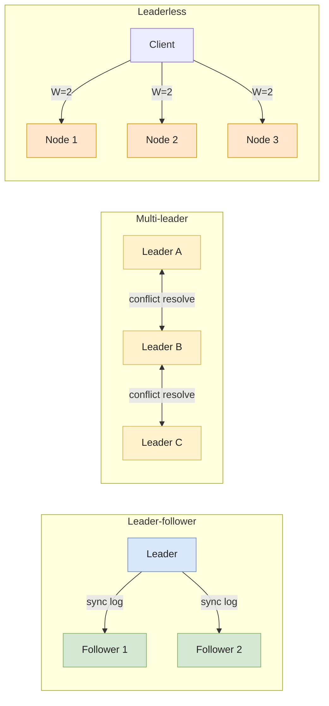
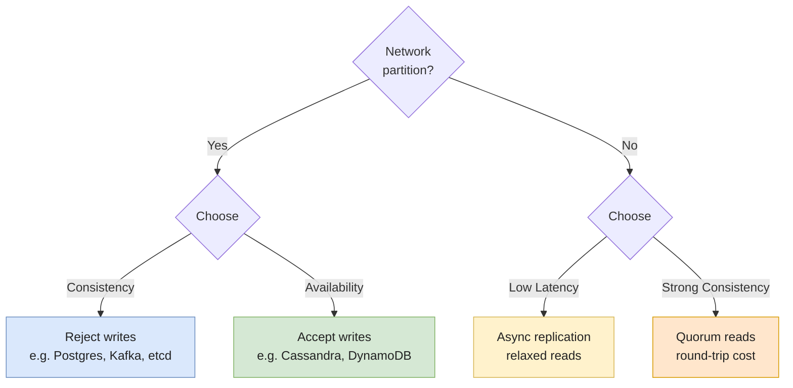

# Distributed Systems & Architectures

Every tool a data engineer touches in 2026 — Kafka, Spark, Snowflake, BigQuery, Cassandra, Iceberg, S3, Postgres replicas — is a **distributed system**. They use different vocabularies and ship with different defaults, but they all wrestle with the same five invariants: **partitioning, replication, consensus, fault tolerance, and consistency**.

Internalize those five and the systems stop looking exotic. A "Snowflake clustering key", a "Kafka partition", a "Cassandra token range", and a "Postgres logical slot" are the same idea wearing four costumes. The bugs are also the same — a stuck consumer, a stale read, a split brain, a runaway shuffle — and the diagnostic muscles transfer.

This page is the mental model. It's deliberately broad; the system-specific pages ([Kafka](../data-pipeline/kafka), [Iceberg](../lakehouse/iceberg), [CDC](../data-pipeline/cdc)) drill into the per-tool details.

---

## Why distribute at all?

A single node has hard ceilings. Modern hardware pushes those ceilings high — a current AWS `u-24tb1` instance has 24 TB of RAM and 448 vCPUs — but three pressures still force distribution:

1. **Data volume**: petabyte-scale storage doesn't fit on one box, and even when it does, scanning it serially is too slow.
2. **Throughput**: a single Postgres instance tops out around 10–50k TPS; a single Kafka broker around 1 GB/s. Beyond that, you shard.
3. **Fault tolerance**: one node has one power supply, one failure domain, one upgrade window. Shared-nothing replication is the only way to get four-nines availability.

A fourth pressure — **geographic latency** — applies to user-facing systems but rarely to analytical pipelines. Most warehouses are single-region by design.

> **Vertical scaling first.** Distribution buys throughput and durability at the cost of complexity, latency variance, and surprise. If a beefier box solves it, take the box.

---

## The five invariants

Every distributed system makes a choice on each of these. The choices are not independent — pick "strong consistency" and you've constrained your replication and consensus options.

### 1. Partitioning (a.k.a. sharding)

> Split the data so each node owns a slice. Reads and writes route to the owning node.

The partition function decides everything downstream:

| Strategy | How it works | Where it shows up |
|---|---|---|
| **Hash partitioning** | `partition = hash(key) % N` | Kafka (default), Cassandra, DynamoDB, Postgres `HASH` partitions |
| **Range partitioning** | `partition = lookup(key, ranges)` | HBase, Bigtable, Spanner, Postgres `RANGE` partitions |
| **List partitioning** | Explicit value → partition mapping | Postgres `LIST` partitions, Iceberg with `bucket` + `truncate` |
| **Round-robin** | Next event → next partition, no key | Kafka without a key, Spark `repartition()` without a column |

The choice is a trade between **load balance** and **data locality**:

* **Hash** spreads load evenly but destroys range queries (`WHERE date BETWEEN ...` reads every partition).
* **Range** keeps related rows together (great for scans) but creates **hot partitions** when the key is monotonic (`ts`, `id`).

The pathological case: hash-partitioning by `country` in a global app. The US partition gets 40% of the load while the LU partition gets 0.01%. The fix is either a **composite key** (`country + user_id`) or a smarter partitioner.

> See [Kafka partitioning](../data-pipeline/kafka) for a worked example, and [Parquet & file formats](../storage/parquet-and-formats) for how partitioning interacts with columnar storage.

### 2. Replication

> Keep N copies of each partition on different nodes. Read from any copy that's up; write so the system survives losing some.

Three replication topologies dominate:



| Topology | Writes go to | Conflict handling | Examples |
|---|---|---|---|
| **Leader-follower** | One leader per partition | None — followers replay the leader's log | Postgres physical/logical replication, MySQL, Kafka (in-sync replicas), MongoDB |
| **Multi-leader** | Any leader, async replicate | Last-write-wins, CRDTs, or app-level merge | Cassandra (with `allow_filtering` writes), CouchDB, geo-distributed Postgres (BDR / pglogical) |
| **Leaderless** | Quorum of N nodes | Vector clocks, read-repair, hinted handoff | Cassandra, DynamoDB, Riak |

Replication mode is also **synchronous vs asynchronous**:

* **Sync**: writes ack only after replicas confirm. Strong durability, higher latency, **availability gap if a replica is down**.
* **Async**: writes ack after the leader writes locally. Lower latency, **risk of data loss** on leader failure (the unreplicated tail).

Kafka's `acks=all` + `min.insync.replicas=2` is sync to a quorum. Postgres's `synchronous_commit = on` is sync to one replica. Snowflake's storage layer replicates to S3 (already 11-nines durable) and asynchronously copies across AZs. Different defaults, same dial.

### 3. Consensus

> Get a group of nodes to agree on a single value (or a sequence of values) despite failures and message loss.

Consensus is **only needed for state that has one canonical truth**: who's the leader of partition 7, what's the next offset to assign, has this transaction committed? It's not needed for "what value does key X have" if your system tolerates eventual consistency.

The two algorithms you'll meet:

* **Paxos** (Lamport, 1989) — the original. Conceptually elegant, notoriously hard to implement correctly. Used in Google Spanner (Multi-Paxos), Chubby.
* **Raft** (Ongaro & Ousterhout, 2014) — designed to be understandable. Same guarantees as Paxos. Used in etcd, Consul, CockroachDB, TiKV, **Kafka KRaft mode** (post-ZooKeeper, default since 3.3, ZooKeeper removed in Kafka 4.0).

Both require a **quorum** (typically `floor(N/2) + 1` of the cluster) to make progress. A 3-node cluster survives 1 failure; a 5-node cluster survives 2. **Even-numbered clusters are wasteful** — a 4-node cluster also tolerates 1 failure but pays for 4 nodes.

The hidden cost: every consensus operation is **at least one network round-trip across a majority**. That's why high-throughput systems (Kafka, Cassandra) push as much as possible **outside** the consensus path — only metadata goes through Raft, the data plane is direct.

> **FLP impossibility (1985).** In a fully asynchronous network with even one faulty process, no deterministic consensus algorithm can guarantee termination. Real systems sidestep this with timeouts and randomized backoff — that's why Raft elections feel slow when the network is flaky.

### 4. Fault tolerance

> Assume every component fails. Design so the system survives any single failure, and degrades gracefully under cascading ones.

The failure modes a data engineer sees:

* **Crash failure**: a node stops. Easy to detect (heartbeat times out), easy to recover (failover).
* **Network partition**: a subset of nodes can't reach the rest. The cluster might split-brain — two halves both think they're authoritative.
* **Partial failure**: a node responds slowly, drops some messages, or returns wrong results for some keys. **Hardest to detect.**
* **Gray failure**: a node passes health checks but is functionally degraded (slow disk, GC pause, misconfigured DNS). Requests hang instead of failing.
* **Byzantine failure**: a node lies — corrupted memory, malicious actor. Most data systems assume this away (non-Byzantine model). Blockchains don't.

The standard tools:

| Mechanism | What it buys |
|---|---|
| **Heartbeats / health checks** | Detect crash failure within seconds. |
| **Timeouts + retries (idempotent)** | Recover from transient network blips. Requires [idempotency](../quality/idempotency-and-backfills). |
| **Circuit breakers** | Stop hammering a degraded downstream. |
| **Quorum reads/writes** | Survive minority failures. |
| **Hinted handoff** | Buffer writes for a temporarily-down replica. |
| **Read repair / anti-entropy** | Fix divergent replicas in the background (Cassandra). |

### 5. Consistency

> Define the contract: when I write `X = 5`, what value can later reads return, and from which nodes?

The consistency models, from strongest to weakest:

* **Linearizable (strong)**: every operation appears to take effect at a single point in time, visible to all subsequent reads. Spanner. Single-node Postgres. The default mental model — and the one that doesn't scale geographically without latency cost.
* **Sequential**: all operations appear in the same order to every observer, but the order may not match wall-clock time.
* **Causal**: if A causally precedes B (A's effects observed before B starts), every observer sees A before B. Concurrent operations may be reordered.
* **Read-your-writes**: a client sees its own writes immediately. Other clients may see stale data.
* **Monotonic reads**: a client never sees data go backward in time.
* **Eventual**: replicas converge eventually, no ordering guarantees in between. DynamoDB default. S3 list-after-write was eventual until Dec 2020.

> The honest framing: **almost no production system is fully linearizable end-to-end**. They're linearizable per partition, eventual across partitions, with read-your-writes via session pinning. The application code papers over the gaps. Knowing where the gaps are is the senior skill.

---

## CAP and PACELC — the trade-off, demystified

The **CAP theorem** (Brewer 2000, formalized Gilbert & Lynch 2002) says: in the presence of a network **P**artition, you must choose between **C**onsistency and **A**vailability. You cannot have all three simultaneously.

The misreading: "pick 2 of 3". The correct reading: **partitions are not optional** — they happen in every real network — so the actual choice during a partition is **CP** (refuse writes to preserve consistency) or **AP** (accept writes, reconcile later).

| System | CAP choice | What it means in practice |
|---|---|---|
| **Postgres (single primary)** | CP | If the primary is unreachable, writes block until failover. |
| **Kafka** (default `acks=all`, `min.isr=2`) | CP | If too few replicas are in-sync, writes are rejected (`NotEnoughReplicasException`). |
| **Cassandra / DynamoDB** (default consistency) | AP | Writes always succeed somewhere; reads may see stale data. Tunable per query. |
| **MongoDB** (`writeConcern: majority`) | CP | A minority partition cannot accept writes. |
| **etcd / ZooKeeper / Raft cluster** | CP | A minority partition has no leader, full unavailability. |

The blind spot in CAP: it only describes behavior **during a partition**, which is rare. **PACELC** (Daniel Abadi, 2010) extends it: **if Partitioned, choose A or C; Else, choose Latency or Consistency**.

> **PACELC** is what you actually live with day-to-day. Spanner is "PC/EC" — consistent always, at a latency cost. Cassandra is "PA/EL" — fast and available, eventually consistent. DynamoDB defaults to "PA/EL" but you can opt into "PC/EC" per request with strong consistent reads (at 2× the read capacity unit cost).



---

## Architecture patterns in data systems

Five patterns cover almost every distributed data system you'll meet.

### Shared-nothing

Each node owns its slice of data on its local disk. Coordination is minimal. **Scales linearly with node count**, fails gracefully one node at a time.

* **Examples**: Cassandra, classic Hadoop, on-prem Greenplum, Vertica.
* **Strength**: throughput per dollar.
* **Weakness**: rebalancing is painful — adding a node moves data.

### Shared-disk (cloud-era variant)

Nodes share a common storage layer (S3, GCS, ADLS). Compute is stateless and elastic. **Storage and compute scale independently.**

* **Examples**: Snowflake, BigQuery, Databricks, Trino over Iceberg, Redshift Serverless.
* **Strength**: instant compute scaling, single source of truth in object storage.
* **Weakness**: storage I/O is the bottleneck (latency to S3 is ~10ms vs ~100µs to local NVMe). Caching layers (Snowflake's SSD cache, BigQuery's storage API, Databricks' Delta cache) hide this.

This pattern is sometimes called **disaggregated storage and compute**. It's the dominant cloud warehouse architecture in 2026.

### MPP (Massively Parallel Processing)

A query is split across N workers that scan in parallel and shuffle intermediate results. Inherits from shared-nothing or shared-disk.

* **Examples**: every modern OLAP engine — Snowflake, BigQuery (Dremel), Spark, Trino, Redshift, ClickHouse.
* **Strength**: throughput on big scans.
* **Weakness**: **shuffle is the killer** — cross-node data movement on joins and aggregations dominates query time. Skew on the join key destroys performance.

### MapReduce / batch DAG

A computation is decomposed into stages of (map → shuffle → reduce). Each stage materializes to disk for fault tolerance.

* **Examples**: Hadoop MapReduce (legacy), Spark (in-memory variant), Dataflow, Flink batch mode.
* **Strength**: fault tolerance via lineage and checkpointing — a failed task replays from the last shuffle boundary.
* **Weakness**: latency. Batch DAGs are seconds-to-hours; streaming engines exist precisely because batch DAGs don't fit sub-second SLAs.

### Streaming dataflow

Continuous operators consume from a partitioned log (Kafka), maintain state (RocksDB / managed state), and emit to a sink. Failure recovery via **distributed snapshots** (Chandy-Lamport in Flink, idempotent producer + transactions in Kafka Streams).

* **Examples**: Kafka Streams, Flink, Dataflow streaming, Materialize.
* **Strength**: low latency (millisecond p99), incremental computation.
* **Weakness**: state size, late events, exactly-once is hard end-to-end. See [Kafka delivery semantics](../data-pipeline/kafka).

---

## How the systems you use map to these invariants

| System | Partitioning | Replication | Consensus | Consistency | CAP |
|---|---|---|---|---|---|
| **Kafka** | Hash by key (or round-robin) | Leader-follower (ISR) | KRaft (Raft) for metadata | Per-partition order, at-least-once default | CP |
| **Cassandra** | Hash (token ring) | Leaderless (N replicas) | None (gossip + Paxos for LWT) | Tunable (`R+W>N` → strong) | AP (default) |
| **DynamoDB** | Hash by partition key | Leaderless across 3 AZs | Internal (Paxos-like) | Eventually consistent default; strongly consistent reads opt-in | AP (default) |
| **Postgres** | None native (range / hash partitions are local) | Leader-follower (streaming / logical) | Single primary; failover via Patroni/etcd | Linearizable on primary; replica reads are stale | CP |
| **Spanner** | Range (tablets) | Paxos groups, multi-region | Multi-Paxos per group | Externally consistent (TrueTime) | CP (with very low partition probability) |
| **Snowflake** | Micro-partitions (auto, by clustering key) | Storage on S3 (already replicated) | Cloud Services Layer for metadata | Snapshot isolation per query | CP-ish |
| **BigQuery** | Capacitor file blocks; columnar | Triplicated within a region by Colossus | Internal | Snapshot isolation, strong within session | CP-ish |
| **Iceberg / Delta** | Hidden partitioning (Iceberg), Hive-style (Delta) | Inherits object store (S3 = 11×9 durability) | Catalog (REST/Glue/Unity) for atomic commits | Snapshot isolation via metadata pointer swap | CP |
| **S3** | Hash on object key prefix | 3+ AZs within region | Internal | Strong read-after-write (since Dec 2020) | AP-ish, but strong semantics on individual objects |
| **Spark** | RDD/DataFrame partitions | None (re-execute from lineage) | Driver coordinates | Per-stage; final output write is atomic via output committers | N/A (compute, not storage) |

The pattern: **the metadata plane is CP** (consistency over availability — you cannot tolerate two leaders), the **data plane is often AP** or eventually consistent, with the application opting into stronger guarantees per operation.

---

## Implementation — tunable consistency in practice

Two snippets that show the dial in action.

### Cassandra: quorum reads/writes

Cassandra's consistency level is a per-query knob. The rule: **R + W > N** guarantees strong consistency.

```sql
-- Cluster: replication factor N = 3
CREATE KEYSPACE banking
  WITH replication = {'class': 'NetworkTopologyStrategy', 'eu-west-1': 3};

-- Strong consistency: write to 2, read from 2 (2+2 > 3)
INSERT INTO accounts (id, balance) VALUES (1, 100)
  USING CONSISTENCY QUORUM;       -- W = 2

SELECT balance FROM accounts WHERE id = 1
  USING CONSISTENCY QUORUM;       -- R = 2

-- AP mode: write to 1, read from 1 — fast, may be stale
INSERT INTO accounts (id, balance) VALUES (1, 100)
  USING CONSISTENCY ONE;
SELECT balance FROM accounts WHERE id = 1
  USING CONSISTENCY ONE;
```

`QUORUM` writes block until 2 of 3 replicas ack — a single dead node doesn't stop you, but a partition isolating 2 of 3 nodes does. `ONE` writes ack as soon as one replica accepts — always available, sometimes stale.

### Kafka: durability vs latency

Producer-side configuration governs the same trade-off:

```properties
# Strong durability — wait for all in-sync replicas
acks=all
min.insync.replicas=2
enable.idempotence=true

# Faster, weaker — ack on leader only, may lose tail on leader crash
acks=1

# Fire-and-forget — almost never the right answer
acks=0
```

With `acks=all` + `min.insync.replicas=2` on a topic with replication factor 3, the cluster tolerates 1 broker failure. Lose 2 brokers and the producer gets `NotEnoughReplicasException` — the system is choosing C over A, on purpose. See [Kafka delivery semantics](../data-pipeline/kafka) for the consumer-side story.

---

## Concrete trade-offs

| Dimension | Stronger consistency | Higher availability |
|---|---|---|
| **Latency** | At least one round-trip to a quorum (~ms cross-AZ, ~10s ms cross-region) | Local-only ack possible (~µs–ms) |
| **Throughput** | Bounded by quorum coordination | Scales near-linearly with nodes |
| **Failure behavior** | Refuse writes during partition (CP) | Accept writes, reconcile later (AP) |
| **Application complexity** | Simple — read what you wrote | Complex — handle conflicts, stale reads, idempotency |
| **Cost** | More nodes (quorum overhead), often higher per-op | Fewer coordination overheads, can be cheaper |
| **When it wins** | Money, inventory, identity, anything with a "single truth" | Telemetry, social feeds, recommendations, anything where staleness is tolerable |

---

## Common pitfalls

* **Treating the network as reliable.** It isn't. Packets drop, reorder, duplicate, and arrive out-of-time. Every retry must assume the previous attempt may have succeeded — see [idempotency](../quality/idempotency-and-backfills). The 8 fallacies of distributed computing (Deutsch, 1994) are still true.
* **Assuming clocks are synchronized.** NTP is good to ~10ms in a datacenter, ~100ms across the internet, and it can run backward during a leap second. **Never use wall-clock time as a tiebreaker for distributed ordering** — use logical clocks (Lamport, vector) or a TrueTime-style API. The 2012 Cloudflare outage from a leap second is the canonical war story.
* **Picking quorum size by gut feel.** `replication_factor=2, min_isr=2` looks safe but tolerates **zero failures** — losing one node makes the cluster unavailable. The minimum sane setup is `RF=3, min_isr=2`: tolerates one failure, still consistent.
* **Confusing CAP "AP" with "no consistency".** AP systems (Cassandra, DynamoDB) offer **tunable** consistency — the default may be eventual, but you can read with `QUORUM` or `STRONG` per query. Choosing AP doesn't mean accepting wrong data, it means accepting the trade-off **per operation**.
* **Forgetting that "exactly-once" is end-to-end, not per-system.** Kafka's exactly-once works **within Kafka** (producer → broker → consumer with transactions). The moment your sink is a non-transactional system (HTTP endpoint, Redis without idempotency, S3 without conditional puts), you're back to at-least-once. See [Kafka delivery semantics](../data-pipeline/kafka).
* **Hot partitions from monotonic keys.** Hash-partitioning by `created_at` or an auto-increment ID concentrates all new writes on one partition. The result: 1 of N nodes is at 100% CPU, the other N-1 are idle. The fix is a **bucketed prefix** (`bucket(id, 16) || created_at`) or a different partitioning strategy entirely.
* **Split brain after a partition heal.** Two nodes both believe they're the leader, both accept writes, partition heals, you have divergent state. Consensus systems (Raft, Paxos) prevent this by requiring a quorum to elect a leader. Manual failover scripts (`promote_replica.sh`) reliably create split brain unless they fence the old primary.
* **Operating an even-number cluster.** A 4-node etcd cluster tolerates 1 failure (same as 3 nodes) but costs 33% more and has a worse partition-tolerance profile. **Always odd-numbered** for consensus clusters.
* **Ignoring partial failure.** A node that's "up but slow" is harder to handle than a node that's down. Heartbeats pass, but every request times out. The fix: **request hedging** (send to two replicas, take the first response), aggressive client-side timeouts, and circuit breakers.
* **Building on an event store and forgetting the materialized view consistency lag.** CQRS / event-sourced architectures have **eventual consistency between the write side and the read side by design**. A user who places an order and immediately queries "my orders" may see nothing. Either pin reads to the leader for the user's session, or design the UI to assume optimistic state.
* **Cross-region writes without measuring latency budget.** A synchronous quorum write across `us-east-1` and `eu-west-1` is a ~80ms round-trip. If your write SLO is 50ms, you cannot have multi-region strong consistency. Pick async replication or a single-region write leader.

---

## Interview questions

### Explain the CAP theorem. Why is "pick 2 of 3" misleading?

**Junior answer.** CAP says a distributed system can have at most two of Consistency, Availability, and Partition tolerance — for example Cassandra is AP and Postgres is CP.

**Mid-level answer.** CAP says that **during a network partition**, a system must choose between consistency (refuse to serve possibly-stale data) and availability (serve, even if stale). Partition tolerance isn't optional — networks partition in real production — so the actual choice is CP or AP. Postgres is CP: when the primary is unreachable, writes block. Cassandra is AP by default: writes always succeed on at least one replica, reads may be stale, the application reconciles. The "pick 2 of 3" framing is misleading because P is not a knob you turn off — partitions happen whether you plan for them or not.

**Senior answer.** CAP is the right intuition for a back-of-the-envelope, but it underspecifies real-world behavior. Two refinements matter. First, **PACELC** (Abadi 2010): when **not** partitioned, you still trade Latency for Consistency on every quorum read. That's the choice you live with 99.9% of the time, and CAP is silent on it. Spanner is PC/EC — strongly consistent always, at a TrueTime + Paxos round-trip cost. Cassandra is PA/EL — eventually consistent, blazing fast. DynamoDB defaults to PA/EL but lets you opt into PC/EC per request at 2× cost. Second, **CAP applies to a single operation, not a system**. Cassandra is AP at `CL=ONE`, CP at `CL=ALL`, and somewhere in between at `CL=QUORUM`. Treating CAP as a system-level label is a junior mistake — the right framing is "what's the consistency contract for **this query**?". The third nuance: most real systems are CP for their **metadata plane** (you cannot have two leaders) and AP-ish for their **data plane** (replicas may diverge briefly). The application code lives at that seam, and getting it wrong shows up as subtle bugs — the user sees "your order was placed" then refreshes and it's gone.

**Common mistakes.**
* Saying "you can't have all three" without clarifying that P is non-negotiable.
* Treating a system as monolithically CP or AP when it's actually tunable per query.
* Confusing eventual consistency with "no consistency" — it's a contract with bounded reconciliation, not chaos.

**Follow-ups.**
* Walk me through a Cassandra `QUORUM` write with RF=3 — what happens if 2 of 3 replicas are down?
* Why does Spanner need TrueTime, and what would happen without it?

---

### Your team wants to add geographic replicas to a Postgres database for low-latency reads in EU and US. Walk me through the design.

**Junior answer.** Set up streaming replication from the US primary to an EU replica and route read queries to the closer region.

**Mid-level answer.** Single-leader streaming replication is the pragmatic default — async replication keeps the EU replica behind by tens to hundreds of milliseconds, application reads from the local replica, writes go cross-region to the US primary. The trade-offs to call out: (1) **EU writes pay the cross-Atlantic round-trip** (~80ms) on top of the normal commit cost; (2) **EU reads may be stale** by replication lag, which matters if the user just wrote and immediately reads — the fix is **session-pinned reads to the primary** for the post-write window; (3) **failover is delicate** — promoting the EU replica to primary needs **fencing** of the old primary to avoid split brain (Patroni + etcd, or pg_auto_failover, handle this). Logical replication (vs physical) lets you replicate only some tables and across major versions, at the cost of more lag and no DDL replication.

**Senior answer.** The first question I'd push back on: **why do you actually need this?** "Low-latency EU reads" can mean several things: (a) UI feels slow because every API call crosses the Atlantic — fix the API layer with caching, not the database; (b) reporting users in EU run analytical queries — put a CDC pipeline into a regional warehouse, not a Postgres replica; (c) regulatory data residency (GDPR) — that's not a replica problem, that's an architectural decision about where data lives. Assuming the answer is genuinely "transactional reads in EU with sub-100ms latency on user data": single-leader async replication is fine **if you accept that EU writes go to the US primary** at ~80ms RTT. If EU writes also need to be local, you've left Postgres-shaped solutions and you're now in **multi-leader territory** — that means BDR/pglogical with conflict resolution (and the pain that comes with it), or moving to a system designed for it (CockroachDB, YugabyteDB, Spanner). The hidden cost most teams miss: **operating multi-region is ~3× the SRE work** of single-region — failover runbooks, lag monitoring per region, schema migrations that have to roll across regions, backup strategies. I've seen teams add a multi-region setup for one feature, then carry the operational burden for years on a feature nobody uses. Measure the actual user pain first; the right answer is often "add a CDN + Redis cache, keep Postgres single-region". And nail the **failover story** — fencing, quorum-based promotion (Patroni + etcd / Consul), and a tested DR drill. A multi-region Postgres setup that's never been failover-tested is theater.

**Common mistakes.**
* Conflating "low-latency reads" with "multi-region writes" — they have very different costs.
* Adding a replica without a failover plan — manual failover scripts cause split brain.
* Forgetting that replica lag breaks "read-your-writes" UX.

**Follow-ups.**
* What's a "session-pinned read" and how would you implement it at the application layer?
* If you needed multi-region writes, how would you choose between BDR Postgres, CockroachDB, and Spanner?

---

### What does "exactly-once" really mean in a distributed pipeline, and how do you actually achieve it from a Postgres source through Kafka into Snowflake?

**Junior answer.** Exactly-once means each event is processed once, no duplicates and no losses. Use Kafka transactions and idempotent consumers.

**Mid-level answer.** Exactly-once is **end-to-end** only if every hop preserves it. The breakdown: (1) **Source → Kafka**: Debezium or another CDC connector captures from the WAL with at-least-once + a key strategy that lets Kafka deduplicate within a partition. The Postgres LSN is a natural idempotency key. (2) **Inside Kafka**: enable the **idempotent producer** (`enable.idempotence=true`) and **transactions** (`transactional.id`) so producer retries don't duplicate, and the read-process-write loop is atomic. (3) **Kafka → Snowflake**: the sink must be **idempotent on a deterministic key**. Snowpipe with a dedup table, or a `MERGE` keyed on the source primary key, gets you there. The end-to-end guarantee requires every link to hold; the moment one link is at-least-once without idempotency, duplicates leak through. See [idempotency and backfills](../quality/idempotency-and-backfills) and [CDC](../data-pipeline/cdc).

**Senior answer.** The honest senior framing: **"exactly-once" is a promise about observable behavior, not about message delivery**. No distributed system delivers a message exactly once at the physical layer — TCP retries, brokers retry, sinks retry. What "exactly-once" actually means is "the **effect** of processing each event happens exactly once", which you achieve via **at-least-once delivery + idempotency at the effect boundary**. The architectural pattern: assign every event a **deterministic, durable identifier** at the source (the Postgres LSN, an event UUID generated by the producer and persisted before send), then make every downstream operation **idempotent on that identifier**. Kafka transactions get you exactly-once **within Kafka** — they atomically commit producer writes and consumer offsets in one transaction, so a crashed processor never re-emits without consuming again. But the moment your sink is non-transactional (HTTP API, Redis, plain S3), Kafka transactions buy you nothing — the sink must dedupe on its own key. The Snowflake-specific play: load to a `staging_raw` table with no dedup, then `MERGE` into the target keyed on `(source, lsn)`. The merge is naturally idempotent. Two failure modes I've debugged in production: (a) **schema drift** breaks the dedup key — someone renames `id` to `event_id` upstream, the merge starts inserting "new" events, duplicates explode; (b) **clock-based dedup keys** (`processed_at` rounded to seconds) collide under load. The rule: the dedup key must come from the source-of-truth, never from the pipeline. Finally, there's a perf cost — exactly-once via transactions is ~3-10× slower than at-least-once. Most teams should ask "would at-least-once + a dedup key be cheaper and simpler?". The answer is usually yes for analytical pipelines and no for financial / state-machine pipelines.

**Common mistakes.**
* Enabling Kafka transactions but writing to a non-idempotent sink — the guarantee evaporates.
* Using `processed_at` as the idempotency key — non-deterministic, collides under retry.
* Believing the marketing — "exactly-once" is a property of the **effect chain**, not a checkbox.

**Follow-ups.**
* Walk me through the read-process-write loop with Kafka transactions — what failure does it protect against that idempotent-producer alone doesn't?
* How does Flink's exactly-once differ from Kafka Streams' exactly-once?

---

## Further reading

* **Martin Kleppmann**, *Designing Data-Intensive Applications* — the canonical text. Chapters 5 (replication), 6 (partitioning), 7 (transactions), 8 (trouble with distributed systems), 9 (consistency and consensus) cover everything on this page in depth.
* **Diego Ongaro & John Ousterhout**, ["In Search of an Understandable Consensus Algorithm"](https://raft.github.io/raft.pdf) (2014) — the Raft paper. Pair with the [Raft visualization](https://raft.github.io/) for intuition.
* **Daniel Abadi**, ["Consistency Tradeoffs in Modern Distributed Database System Design"](https://www.cs.umd.edu/~abadi/papers/abadi-pacelc.pdf) (2012) — PACELC formalized.
* **Seth Gilbert & Nancy Lynch**, ["Brewer's Conjecture and the Feasibility of Consistent, Available, Partition-Tolerant Web Services"](https://users.ece.cmu.edu/~adrian/731-sp04/readings/GL-cap.pdf) (2002) — the CAP proof.
* **Peter Bailis et al.**, ["Highly Available Transactions: Virtues and Limitations"](https://www.vldb.org/pvldb/vol7/p181-bailis.pdf) — what's possible without sacrificing availability.
* **Jepsen reports** — [https://jepsen.io/analyses](https://jepsen.io/analyses). Empirical correctness audits of every major distributed database. Required reading before betting your business on a system's consistency claims.
* **Kafka KRaft** — [KIP-500](https://cwiki.apache.org/confluence/display/KAFKA/KIP-500%3A+Replace+ZooKeeper+with+a+Self-Managed+Metadata+Quorum) and the [KRaft documentation](https://kafka.apache.org/documentation/#kraft).
* **Spanner** — Corbett et al., ["Spanner: Google's Globally Distributed Database"](https://research.google/pubs/pub39966/) — the TrueTime story.
* Pages liées :
  * [OLAP vs OLTP](./olap-vs-oltp) — the workload distinction that drives most consistency choices.
  * [Kafka](../data-pipeline/kafka) — partitioned log, ISR, delivery semantics in depth.
  * [CDC](../data-pipeline/cdc) — distributed change capture and exactly-once.
  * [Idempotency & backfills](../quality/idempotency-and-backfills) — the application-level glue that makes at-least-once safe.
  * [Iceberg](../lakehouse/iceberg) — distributed table format with atomic snapshot commits.
