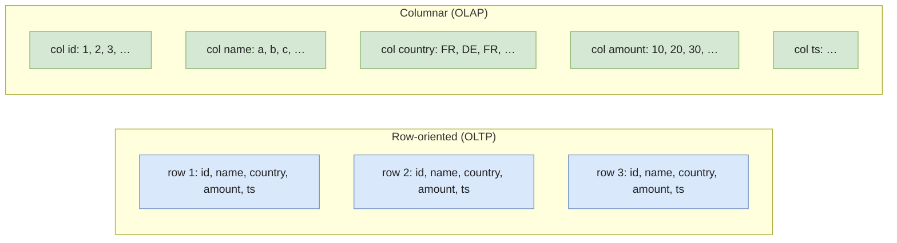
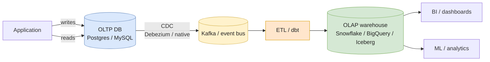

# OLAP vs OLTP

**OLTP** (Online Transaction Processing) and **OLAP** (Online Analytical Processing) are the two archetypal database workloads. Almost every engineering decision in a data platform — storage layout, schema design, indexing, replication, cost model — traces back to which of the two you're optimizing for.

This page covers what each one really is, **why no single system can do both well at scale**, the typical architecture that separates them, and the HTAP middle ground in 2026.

---

## The two workloads

### OLTP — short, frequent, by primary key

* "Fetch the user with `id = 12345`."
* "Insert this order, debit this account, in one transaction."
* "Update the inventory count by −1."

Profile:

* **Reads/writes per query**: 1–10 rows.
* **Latency target**: sub-millisecond to ~10 ms.
* **Concurrency**: thousands to hundreds of thousands of concurrent connections.
* **ACID**: strict — money must not vanish, inventory must not double-decrement.
* **Workload mix**: ~50/50 reads/writes, occasionally write-heavy.
* **Typical engines**: PostgreSQL, MySQL, SQL Server, Oracle, DynamoDB, Cassandra (eventually-consistent variant).

### OLAP — long, infrequent, scanning lots of rows

* "Sum revenue by country for the last 12 months."
* "Find the 100 customers with declining order frequency."
* "Join 8 tables for the BI dashboard refresh."

Profile:

* **Reads/writes per query**: millions to billions of rows scanned.
* **Latency target**: seconds to minutes.
* **Concurrency**: tens to a few hundred concurrent users.
* **ACID**: <T term="eventual-consistency">eventual consistency</T> is usually fine; queries are read-only.
* **Workload mix**: 95%+ reads, batched or streamed writes from upstream.
* **Typical engines**: Snowflake, BigQuery, Redshift, Databricks SQL, ClickHouse, DuckDB, Trino on Iceberg/Delta.

The **same SQL** runs on both — `SELECT`, `JOIN`, `GROUP BY`. The systems underneath are radically different because they make opposite trade-offs.

---

## Why one system can't do both well

### Storage layout — row vs columnar



Same query, two layouts:

```sql
SELECT SUM(amount) FROM events WHERE country = 'FR';
```

* **Row store**: read every row (all columns) → filter on `country` → sum `amount`. Touches the full row width × N rows.
* **Columnar**: read only `country` and `amount` → <T>vectorized</T> SIMD comparison + sum. Touches ~16 bytes × N rows for two `BIGINT`/`DOUBLE` columns.

On 100M rows × 30 columns, columnar reads ~10% of the bytes a row store reads. Compression makes the gap wider — homogeneous columns (all dates, all country codes) compress 5–20× better than mixed rows.

Now invert the query:

```sql
SELECT * FROM users WHERE id = 12345;
```

* **Row store + B-tree on `id`**: 3–5 disk reads, under 1 ms.
* **Columnar**: must read the position of `id=12345` in the `id` column, then fetch every other column at that position from 30 separate column files. Columnar engines do this, but it's slow — typically 100–1000× slower than a row-store point lookup.

> Same data, opposite storage layout. **No way to optimize both with one disk format.**

### Concurrency — many small vs few large

OLTP databases hold **row locks** (or MVCC versions) for the duration of a transaction. They're tuned for **thousands of tiny transactions** completing in milliseconds. Postgres can sustain ~10–50k TPS on a single node.

OLAP engines hold **table-level snapshots** and run **fewer, larger queries**, often pushed to distributed compute (Snowflake warehouses, BigQuery slots). Concurrency is bounded by compute resources, not lock contention. A typical Snowflake account runs 5–50 concurrent queries per warehouse — 50k concurrent queries would crater it.

Trying to run 50k point-lookups/s on Snowflake costs 100× more and runs 10× slower than on Postgres. Trying to run a 4-table BI aggregate on production Postgres holds locks long enough to slow down user-facing transactions.

### Schema — normalized vs denormalized

* **OLTP**: 3NF or higher. One fact, one place. Updates touch one row.
* **OLAP**: star or snowflake schema, often **denormalized to the point of redundancy**. Joins are cheap if dimensions are small; full denormalization (<T term="obt">One Big Table</T>) is increasingly common in cloud warehouses.

A page on this lives at [Normalization](../data-modeling/normalization) and [Star vs Snowflake](../data-modeling/star-vs-snowflake).

### Indexing

* **OLTP**: dozens of B-tree / hash indexes per table, on every join key, foreign key, and frequent filter.
* **OLAP**: usually **no secondary indexes**. The engine relies on partition pruning, columnar min/max stats, and zone maps. Modern formats (Iceberg, Delta) add bloom filters but don't approach OLTP-style point-lookup performance.

---

## The standard architecture

In production, you don't pick one — you have **both**, and you bridge them.



The bridge is almost always:

* **CDC** (log-based) for low-latency replication of operational data — see [CDC](../data-pipeline/cdc).
* **Batch dumps** (nightly `COPY` to S3 or `pg_dump`) for low-volume or stable tables.
* **Event streams** for system-of-record events that aren't in a transactional DB.

The warehouse is a **derived store** — never the source of truth for application data. If it gets dropped, you rebuild it from CDC + raw event lake; the OLTP DB stays untouched.

---

## Concrete example — a banking app

| Workload | Where it runs | Why |
|---|---|---|
| **Debit account on transfer** | Postgres | ACID transaction, row lock on account, sub-ms latency. |
| **Show last 10 transactions** | Postgres (read replica) | Point lookup by `user_id` + recency, indexed. |
| **Detect 3+ failed logins in 5 min** | Redis or OLTP DB | Real-time, low-latency state lookup. |
| **Monthly account statement (PDF)** | OLTP DB or read replica | Per-user query, bounded result set. |
| **Fraud model training data** | Snowflake / Iceberg | Scan 18 months of transactions, join with merchant data. |
| **Daily revenue dashboard** | Snowflake | Aggregations on millions of rows. |
| **Cohort retention analysis** | Snowflake | Window functions over years of data. |

Trying to put the dashboard on Postgres breaks the application; trying to put the debit on Snowflake breaks the customer experience. The two-system architecture is **the default** because the trade-offs are real, not historical baggage.

---

## HTAP — the convergence story

**Hybrid Transactional/Analytical Processing** systems try to serve both workloads from one platform. Real options in 2026:

| System | Approach | Sweet spot |
|---|---|---|
| **SingleStore** | One engine, two storage layers (row + columnar) per table | Real-time dashboards on operational data, ad-tech, IoT |
| **TiDB** | TiKV (row, OLTP) + TiFlash (columnar replica, OLAP) replicated via Raft | MySQL-compatible ops + fast analytics on the same DB |
| **Snowflake Unistore (Hybrid Tables)** | Row-store table type alongside columnar tables | Operational data that also needs analytics, no separate OLTP DB |
| **Databricks Lakebase** | Postgres-compatible OLTP layer co-located with the lakehouse | Application data living next to lakehouse for unified RBAC |
| **CockroachDB / YugabyteDB** | Distributed OLTP with limited analytical support | Geo-distributed OLTP with light reporting |
| **DuckDB** | Embedded OLAP, often combined with a row-store | Dev/local analytics; not a true HTAP |

The pitch is appealing: **one system, one schema, real-time analytics**. The reality:

* Most HTAP systems are **good at one side, decent at the other** — you still feel the trade-off.
* Operational complexity is non-trivial: replicas to manage, write amplification, tiered storage tuning.
* Cost: an HTAP system priced for OLAP storage on OLTP data is often more expensive than two specialized systems.

When HTAP genuinely wins:

* **Real-time analytics on transactional data** — recommendations, fraud, personalization where the analytical query needs data that's under 1 second old.
* **Small-to-mid teams** that want to avoid running two stacks.
* **Operational dashboards** where the dashboard *is* the application (admin tools, internal ops UIs).

When you should stick to two systems:

* **Independent scaling** — your OLTP load is 100× your OLAP load, or vice-versa.
* **Compliance/blast-radius** — you don't want a runaway analytical query holding locks on production.
* **Mature warehouse investment** — dbt, BI, ML pipelines all built on Snowflake/BigQuery; HTAP doesn't replace that.

> The historical pattern: **OLTP for the application, OLAP for everything else, CDC bridging.** HTAP is a deliberate choice driven by a measured freshness or operational need — not the default.

---

## Implementation

### Same query, two engines

```sql
-- OLTP query — Postgres
EXPLAIN ANALYZE
SELECT id, email, last_login_at
FROM users
WHERE id = 12345;
-- Index Scan on users_pkey (cost=0.43..8.45) — 0.3 ms
```

```sql
-- OLAP query — Snowflake / BigQuery / DuckDB
SELECT country, COUNT(*), SUM(amount)
FROM fact_orders
WHERE order_date BETWEEN '2024-01-01' AND '2024-12-31'
GROUP BY country
ORDER BY 2 DESC;
-- Scan on partition pruning + column pruning, ~3 s on 1B rows
```

Different engines, different `EXPLAIN` outputs, different cost models. Reading both plans is a junior-to-senior promotion exercise — they teach you what each system optimizes for.

### Bridging via CDC + dbt

```yaml
# Debezium connector — Postgres → Kafka → S3 → Iceberg
name: pg-orders-cdc
config:
  connector.class: io.debezium.connector.postgresql.PostgresConnector
  database.hostname: prod-db
  database.dbname: orders
  table.include.list: public.orders,public.order_items
  plugin.name: pgoutput
  publication.autocreate.mode: filtered
```

```sql
-- dbt model on top of the replicated table
-- models/marts/fct_orders.sql
{{ config(materialized='incremental', unique_key='order_id') }}

SELECT
  order_id,
  user_id,
  order_date,
  total_amount,
  status
FROM {{ source('raw', 'orders_cdc') }}

  WHERE _ingested_at > (SELECT MAX(_ingested_at) FROM {{ this }})

```

The Postgres `orders` table powers the application; the dbt model powers the analytics. **Two systems, one truth, one CDC pipeline.**

---

## Trade-offs at a glance

| Dimension | OLTP | OLAP |
|---|---|---|
| **Storage layout** | Row-oriented | Columnar |
| **Schema** | Normalized (3NF+) | Denormalized (star / OBT) |
| **Indexing** | B-tree / hash on many columns | Partition pruning, zone maps |
| **Latency** | Sub-ms to ~10 ms | Seconds to minutes |
| **Throughput** | 10k–100k+ TPS | 5–50 concurrent queries / warehouse |
| **Transaction granularity** | Row-level ACID | Snapshot reads, batched writes |
| **Compression** | Modest (mixed rows) | High (homogeneous columns) |
| **Cost model** | Provisioned (CPU + RAM) | Pay-per-byte-scanned or compute-time |
| **Failure cost** | Customer-facing immediately | Dashboard stale until next run |

---

## Common pitfalls

* **Running analytics on the OLTP primary.** A junior runs a `GROUP BY` on the production Postgres → table scan → row locks → application slows down → on-call gets paged. The fix is a **read replica at minimum**, a warehouse for anything bigger.
* **Running point lookups on the warehouse.** A web app queries Snowflake for `WHERE user_id = ?` on every page load. Each query is 500ms+ and costs cents — at scale, the bill is brutal and the UX is terrible. Either move the lookup to a key-value store, or denormalize/cache.
* **Treating the warehouse as the source of truth.** Someone deletes the `users_dim` table by accident. If the warehouse is your truth, you're in trouble. **Truth lives in OLTP / event lake.** The warehouse is rebuildable.
* **Forgetting that columnar hates updates.** Issuing 10k single-row `UPDATE` statements on Snowflake (each one a micro-partition rewrite) is order-of-magnitude slower than 10k updates on Postgres. Batch them, or use a table format with row-level deletes.
* **Picking HTAP because "it sounds simpler".** You inherit a system that's mediocre at both, with operational complexity neither team has experience with. Measure first.
* **Sizing the warehouse for OLTP-style concurrency.** Snowflake's multi-cluster warehouses can scale, but you'll pay for it. If you need 5k concurrent queries with sub-second latency, you don't have an OLAP problem — you have an OLTP problem.
* **Letting CDC lag silently.** Your "real-time dashboard" is showing yesterday's data because the CDC connector died and nobody monitored it. **Lag SLO + alerting is non-negotiable.** See [CDC](../data-pipeline/cdc).
* **Modeling the warehouse with OLTP normalization.** Faithfully replicating a 3NF schema into Snowflake means every dashboard does 8-table joins. Denormalize at the model layer (dbt) — see [Star vs Snowflake](../data-modeling/star-vs-snowflake).

---

## Interview questions

### Why can't a single database engine handle both OLTP and OLAP workloads efficiently?

**Junior answer.** OLTP needs fast inserts and point lookups; OLAP needs fast analytical scans. A single engine can't optimize for both at once.

**Mid-level answer.** The fundamental constraint is **storage layout**. OLTP wants row-oriented storage with B-tree indexes — fetching one row by primary key reads ~3–5 disk pages. OLAP wants columnar storage — a `SUM` over a billion rows reads ~10% of the bytes a row store would, and benefits from compression and SIMD vectorization. The two layouts are mutually exclusive on disk: the same byte can't be at the start of a row *and* in a contiguous column block. On top of storage, the concurrency models differ — OLTP is tuned for thousands of tiny locked transactions; OLAP runs few large snapshot-isolated queries. Different scheduling, different optimizers, different cost models.

**Senior answer.** Beyond storage and concurrency, the **execution engine** is wired differently. OLAP engines do **vectorized execution** (Volcano-Plus / push-based, batches of 1024 rows through pipelined operators), aggressive parallelism, and shuffle-heavy joins — all great for scan-and-aggregate, terrible for "fetch one row by ID". OLTP engines do **tuple-at-a-time** execution with B-tree traversals, write-ahead logging tuned for fsync latency, MVCC versioning per row — great for transactions, terrible for full-table scans. You can build a system that does both badly (early HTAP attempts), or two stores under one query layer (TiDB, SingleStore, Snowflake Unistore) — but the storage trade-off doesn't go away, you're just hiding it. The honest assessment: **a "true" single-engine HTAP doesn't exist** — what exists is two engines in one box, with replication between them. Whether to take that operational complexity in exchange for unified ergonomics is the actual decision.

**Common mistakes.**
* Saying "you can just add columnar indexes to Postgres" — you can (e.g. `cstore_fdw`), but you don't get vectorized execution or partition pruning at scale.
* Confusing "single engine HTAP" with "single deployment HTAP" — the marketing blurs them.

**Follow-ups.**
* Walk through how a `SUM(amount)` query touches disk in Postgres vs in DuckDB.
* What does "vectorized execution" actually mean and why does it matter for OLAP?

---

### Your application uses Postgres for everything. The CEO wants real-time dashboards on production data. How do you architect it?

**Junior answer.** Set up a read replica and run the dashboard against it.

**Mid-level answer.** Read replica is the first step — moves the analytical load off the primary. But for non-trivial dashboards (multi-table joins, aggregations on millions of rows), even the replica will struggle, and lock-free `SELECT` queries can still slow down ongoing replication. The proper architecture is **Postgres → CDC (Debezium / logical replication) → Kafka or directly into a warehouse** (Snowflake / BigQuery / Iceberg). Dashboards run on the warehouse, with a freshness SLO of, say, 1–5 minutes. dbt models clean and aggregate. The OLTP database stays untouched.

**Senior answer.** Two real questions hide here: (1) **what does "real-time" actually mean?** If they mean "5 minutes ago", go warehouse + CDC and you're done. If they mean "1 second ago", you're in HTAP territory — Snowflake Unistore / SingleStore / TiDB or some in-memory cache (Redis / Materialize) reading the CDC stream. (2) **what's the read pattern?** Aggregations over millions of rows want columnar; per-customer drill-downs (top-N, sessionization) want row-oriented or at least a serving layer. The pragmatic architecture I'd default to in 2026: **Postgres + CDC + Iceberg/Snowflake for analytics, with a thin serving cache (Redis or DuckDB-as-a-service) for "executive dashboard at second-precision" use cases**. Avoid the trap of picking an HTAP system for one dashboard — the operational cost outweighs the win unless you have a portfolio of these workloads. And nail the **freshness SLO and monitoring** upfront — the most common failure mode is silent CDC lag, where the dashboard looks right but is hours stale. See [CDC](../data-pipeline/cdc).

**Common mistakes.**
* Defaulting to HTAP for a single dashboard.
* Forgetting that "real-time" means radically different things to different stakeholders — pin it down before designing.

**Follow-ups.**
* What's your CDC monitoring strategy?
* If the CEO wants 100ms freshness and the dashboard is filterable, how does that change the design?

---

### When would you actually choose an HTAP system over the standard OLTP + warehouse architecture?

**Junior answer.** When you want both OLTP and OLAP in one place, simpler.

**Mid-level answer.** HTAP wins when (1) the analytical query genuinely needs data under 1 second old (real-time recommendations, fraud, personalization), (2) the team is small enough that running two stacks is a real cost, or (3) the analytical workload is operational dashboards inside the application — admin UIs, internal ops tools — where the user expects the dashboard to reflect what they just clicked. Otherwise, two systems is better.

**Senior answer.** The honest senior take: **HTAP is the right answer less often than vendors imply**. The "one stack to rule them all" pitch glosses over the fact that all current HTAP systems are really **two engines under one query layer**, with replication tax (write amplification, lag, dual storage). For most analytical workloads, "warehouse + 5-minute CDC" is faster, cheaper, and has a richer ecosystem (dbt, BI tools, ML). Where HTAP genuinely wins: **operational analytics on hot data** — a real-time fraud system that needs to join the latest transaction (1ms ago) with the user's 30-day behavioral profile, where shipping that profile to the warehouse and back to a serving system adds latency you can't afford. That's a real workload, and SingleStore / TiDB / Snowflake Unistore are reasonable answers. The trap: choosing HTAP because the dashboard refresh is annoying, when the actual problem is "the dashboard is built on a 4-hour batch job that should be 5-minute incremental". Fix the pipeline, not the architecture. The other trap: HTAP migrations from a mature OLTP+warehouse stack are **enormous projects** with months of dual-running — only do it for a measured, ROI-justified workload, not because the org wants to "modernize".

**Common mistakes.**
* Thinking HTAP eliminates the need for a warehouse — it doesn't, for non-trivial scale.
* Picking HTAP based on a single demo workload, then discovering the analytical side is 10× slower than Snowflake.

**Follow-ups.**
* What's the migration story from Postgres + Snowflake to TiDB?
* How does Snowflake Unistore actually work under the hood, and what's the cost model?

---

## Further reading

* **Stonebraker et al.** — ["The End of an Architectural Era (It's Time for a Complete Rewrite)"](https://www.vldb.org/conf/2007/papers/industrial/p1150-stonebraker.pdf) — the classic argument for specialized engines.
* **Martin Kleppmann**, *Designing Data-Intensive Applications* — chapter 3 (storage) and chapter 5 (replication) cover OLTP vs OLAP at the right depth.
* **Snowflake Unistore** — [docs](https://docs.snowflake.com/en/user-guide/tables-hybrid).
* **TiDB HTAP** — [TiFlash docs](https://docs.pingcap.com/tidb/stable/tiflash-overview).
* **SingleStore** — [universal storage](https://docs.singlestore.com/db/latest/concepts/the-universal-storage-feature/).
* Pages liées :
  * [Normalization](../data-modeling/normalization) — why OLTP normalizes and OLAP doesn't.
  * [Star vs Snowflake](../data-modeling/star-vs-snowflake) — the OLAP modeling counterpart.
  * [Parquet & file formats](../storage/parquet-and-formats) — the columnar layer that makes modern OLAP fast.
  * [CDC](../data-pipeline/cdc) — the bridge between OLTP and OLAP.
  * [Iceberg vs Delta vs Hudi](../lakehouse/table-formats-comparison) — modern OLAP storage on object stores.
