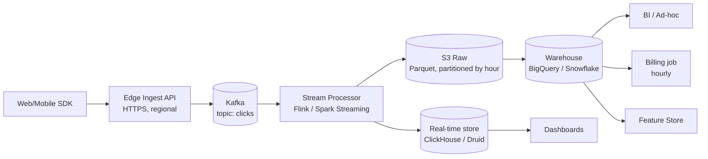

# System Design — Data

System-design interviews for data engineers test whether you can:

1. **Clarify** ambiguous requirements before drawing boxes.
2. **Pick the right storage and processing** for the workload.
3. **Reason about tradeoffs** — cost, latency, consistency, ops.
4. **Anticipate failure modes** at scale.

---

## A repeatable framework

A 45-minute interview, roughly:

| Time     | Phase                              | What to do                                                                |
| -------- | ---------------------------------- | ------------------------------------------------------------------------- |
| 0–5 min  | **Clarify requirements**           | Functional, non-functional (volume, latency, SLA), constraints.           |
| 5–10 min | **Estimate scale**                 | Events/sec, bytes/event, retention. Numbers, not adjectives.              |
| 10–25 min| **High-level design**              | Sources → ingest → storage → process → serve → consumers. Draw it.        |
| 25–35 min| **Deep dive on 1–2 components**    | Whichever the interviewer pokes at — usually storage or the streaming part.|
| 35–45 min| **Failure modes, scale, evolution**| Backfills, schema changes, late data, cost growth, GDPR.                  |

Always **check in** with the interviewer between phases. The interview is collaborative — silent box-drawing is a red flag.

---

## Worked example — "Design a real-time analytics platform for ad clicks"

### 1. Clarify

> What's the input? Click events from web + mobile SDKs.
> Volume? **Assume 50,000 events/sec peak, 1 KB each.**
> Latency? **End-to-end < 10 seconds for dashboards; < 1 minute for billing aggregates.**
> Retention? **Hot data 30 days, cold data 2 years.**
> Consumers? **Real-time dashboards, hourly billing, ML feature store, ad-hoc analytics.**
> Consistency? **Exactly-once for billing, at-least-once is fine for dashboards.**

### 2. Estimate

- 50k events/s × 1 KB = **50 MB/s** = ~4.3 TB/day raw.
- With 3× replication and Parquet compression (~5×): ~2.6 TB/day on storage.
- 30-day hot tier: ~80 TB. 2-year cold tier: ~2 PB. → Cold tier must be S3/GCS, not the warehouse.

### 3. High-level design

Key decisions:

- **Kafka, not a queue.** Replay matters; multiple consumer groups (real-time, archive, billing) read independently.
- **Stream processor splits the path** — feeds the real-time store *and* archives raw to S3. The real-time store is throwaway; S3 + warehouse is the source of truth.
- **Real-time OLAP** (ClickHouse or Druid) for sub-second dashboards. The warehouse is too slow/expensive for this.
- **S3 raw layer** is the safety net. Anything downstream can be rebuilt from it.

### 4. Deep dive — exactly-once for billing

Billing must not double-count clicks. Approach:

- Producer: idempotent SDK with a client-generated `event_id` (UUID).
- Kafka: idempotent producer + transactional writes from the stream processor.
- Stream processor: dedupe on `event_id` within a 24-hour window (RocksDB-backed state).
- Warehouse merge: `INSERT ... ON CONFLICT DO NOTHING` keyed on `event_id`.

The dedupe window is the part candidates miss. Without bounded state, the dedup table grows forever.

### 5. Failure modes

- **Kafka cluster outage.** Edge ingest must buffer to disk, retry. Don't drop. SDKs retry with backoff and `event_id` (so retries are safe).
- **Schema change.** New click field added by mobile team. Schema registry + backward-compat checks in CI block breaking changes.
- **Late events.** A click logged offline arrives 6 hours later. Stream processor uses event-time windows + watermarks; warehouse partitions are by event_date, so the row lands in the correct partition (with a small re-write).
- **Replay.** If the billing job had a bug, we can re-run from S3 raw for the affected hours. The real-time store is wiped and rebuilt.
- **Cost growth.** Real-time store is the most expensive. TTL aggressively (7 days hot, then drop). Push older queries to the warehouse.
- **GDPR / right-to-erasure.** S3 in Iceberg format → row-level deletes. The real-time store is short-TTL anyway, so the request expires naturally.

### 6. What I'd skip in v1

- The real-time OLAP store. Start with the warehouse and a 5-minute micro-batch. Add ClickHouse only if dashboards prove too slow.
- Exactly-once. Start at-least-once with idempotent sinks. Add transactions when billing pain shows up.
- Multi-region. Start single-region. The cost of cross-region Kafka is brutal.

---

## Generic rules of thumb

- **The cheapest pipeline is the one you didn't build.** Push back on real-time requirements that aren't real.
- **Pick storage for the dominant query pattern**, not all of them. You'll have multiple stores.
- **The raw, append-only layer is sacred.** Never mutate it. Every other layer is rebuildable.
- **Retention drives cost more than throughput** at scale. Decide it explicitly, write it down.
- **Schema is a contract.** If you don't enforce it at ingest, you'll enforce it during a 2 AM incident.

---

## Other prompts to practice

- Design a metrics platform (Prometheus-like) with 1M time series.
- Design the data layer for a ride-sharing app — driver location updates, trip events, surge pricing.
- Design a feature store for online ML inference.
- Design a GDPR-compliant data lake — including right-to-erasure.
- Design a multi-tenant data warehouse for B2B SaaS.
