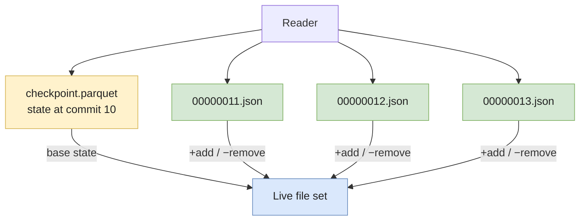

# Delta Lake

**Delta Lake** is a table format that turns Parquet files into a transactional table via a single mechanism: a **JSON-based transaction log**. Born at **Databricks in 2019**, donated to the Linux Foundation, it is the **default on Databricks** and widely used outside it via `delta-spark` and `delta-rs`.

Compared to Iceberg, Delta is the **simplest format to reason about** — the entire state of a table is reconstructible from a folder of plain JSON files you can `cat` by hand.

> Pre-req: read **[Parquet & file formats](../storage/parquet-and-formats)**. Delta is a metadata layer **on top of** Parquet, not a replacement.

---

## Architecture — the transaction log is the table

```
table_root/
├── *.parquet                       # data files (often at the root, or under part-*/)
└── _delta_log/
    ├── 00000000000000000000.json   # commit 0 — schema + initial adds
    ├── 00000000000000000001.json   # commit 1 — adds and removes
    ├── 00000000000000000002.json
    ├── ...
    └── 00000000000000000010.checkpoint.parquet   # snapshot every 10 commits
```

Every operation appends a single **JSON commit file** to `_delta_log/`. The file contains a sequence of **actions**:

```json
{ "metaData": { "schemaString": "...", "partitionColumns": ["country"] } }
{ "add":      { "path": "country=FR/part-00001.parquet", "size": 134217728, "stats": "{\"numRecords\":1234}" } }
{ "remove":   { "path": "country=FR/part-00000.parquet", "deletionTimestamp": 1700000000000 } }
{ "commitInfo": { "operation": "MERGE", "operationParameters": {...} } }
```

To reconstruct table state at a given version, the reader:

1. Finds the latest **checkpoint** (`*.checkpoint.parquet`) — an aggregated snapshot, written every 10 commits by default.
2. Replays JSON commit files **after** that checkpoint up to the target version.
3. Resolves the live set of files (`add` minus `remove`).



That's the whole format. Once you've internalized "log of `add`/`remove`, periodically checkpointed", you can read the spec in an afternoon.

---

## ACID and concurrency

Delta uses **optimistic concurrency control**. Two writers can run in parallel; on commit:

1. Each writer reads the current latest version `N`.
2. Writes commit file `(N+1).json` with a **conditional put** ("only if `(N+1).json` doesn't exist").
3. If two writers race, one wins. The loser **retries** on the new version `N+1` (now there's `N+2.json` to write).

Conflict resolution depends on the operations:

* **Append + Append** — never conflict. Both can succeed at different versions.
* **Append + Update on disjoint partitions** — no conflict (with `replaceWhere` predicate hints).
* **Update + Update on overlapping rows** — conflict, second writer retries the merge.

The atomicity of the commit relies on the **storage backend** providing conditional puts — which Delta enforces via:

* **DBFS / S3** — historically required `s3a` committer or a coordinator service (DynamoDB-based commit coordinator) for true atomicity. As of 2024+, S3 conditional writes (`If-None-Match`) are usable directly.
* **ADLS Gen2** — native conditional writes.
* **GCS** — conditional writes via object generation.

> The `_delta_log/_last_checkpoint` file is a small pointer to the latest checkpoint — readers consult it first to skip replaying from version 0.

---

## Time travel

```sql
-- Spark SQL
SELECT * FROM events VERSION AS OF 42;
SELECT * FROM events TIMESTAMP AS OF '2024-01-15T00:00:00Z';

-- Restore a table to a prior version
RESTORE TABLE events TO VERSION AS OF 42;
```

Time travel is bounded by:

* **Log retention** (`delta.logRetentionDuration`, default 30 days) — controls how far back commits are kept.
* **Tombstone retention** (`delta.deletedFileRetentionDuration`, default 7 days) — controls how long *removed* data files stay on disk before `VACUUM` can delete them.

Run `VACUUM` more aggressively than the default (e.g. weekly with `RETAIN 168 HOURS`) for tables that don't need long time travel — historical files are dead storage cost otherwise.

---

## Features that distinguish Delta

### Liquid Clustering (Databricks-only as of 2026)

Replaces partitioning + Z-ordering with a single, automatically-maintained clustering scheme. Unlike static partitioning, you can **change clustering keys** without rewriting the whole table. Only available on Databricks Runtime 13.3+.

```sql
ALTER TABLE events CLUSTER BY (user_id, event_date);
OPTIMIZE events;
```

### Deletion vectors

Instead of rewriting a Parquet file when a few rows are deleted, Delta writes a **deletion vector** — a bitmap of deleted positions. Readers apply the vector at scan time. Massive `DELETE` and `MERGE` performance boost; periodic compaction (`OPTIMIZE`) materializes the deletes.

### Delta Sharing

An open protocol for **sharing tables across organizations** without copying the data. The provider grants signed URLs to the consumer, which reads files directly. Supported by Databricks, Snowflake, Power BI, Pandas, etc.

### UniForm — interop with Iceberg

`delta.universalFormat.enabledFormats = 'iceberg'` writes Iceberg metadata alongside the Delta log. The same files are then readable as either format. Reduces lock-in for tables you want both Databricks and Trino/Athena to query.

### `delta-rs` — standalone Rust implementation

A Rust crate (with Python bindings) that reads and writes Delta **without Spark**. Excellent fit for Python pipelines using DuckDB, Polars, or Pandas. As of 2026, `delta-rs` supports nearly all read operations and most write operations including `MERGE`, but always check the version's feature matrix — some advanced features (deletion vectors, Liquid Clustering) lag Spark.

---

## Implementation

### `delta-rs` (Python, no Spark)

```python
from deltalake import DeltaTable, write_deltalake
import pyarrow as pa

# Append
df = pa.table({
    "user_id": [1, 2, 3],
    "event_ts": pa.array([1700000000, 1700000060, 1700000120], type=pa.timestamp("s")),
    "amount": [10.0, 20.0, 30.0],
})
write_deltalake(
    "s3://my-lakehouse/events",
    df,
    mode="append",
    partition_by=["user_id"],
)

# Read with time travel
dt = DeltaTable("s3://my-lakehouse/events")
df_now       = dt.to_pandas()
df_v42       = dt.load_as_version(42).to_pandas()
df_yesterday = dt.load_with_datetime("2024-01-15T00:00:00Z").to_pandas()

# Maintenance
dt.optimize.compact()
dt.vacuum(retention_hours=168)
```

### Spark SQL — typical Databricks usage

```sql
CREATE TABLE events (
  user_id BIGINT,
  event_ts TIMESTAMP,
  country STRING,
  amount DOUBLE
) USING delta
PARTITIONED BY (country)
TBLPROPERTIES (
  'delta.autoOptimize.optimizeWrite' = 'true',
  'delta.autoOptimize.autoCompact'   = 'true',
  'delta.enableDeletionVectors'      = 'true'
);

-- MERGE
MERGE INTO events t
USING staging s
ON t.user_id = s.user_id AND t.event_ts = s.event_ts
WHEN MATCHED THEN UPDATE SET amount = s.amount
WHEN NOT MATCHED THEN INSERT *;

-- Maintenance
OPTIMIZE events ZORDER BY (user_id);
VACUUM events RETAIN 168 HOURS;
```

---

## Trade-offs

### When Delta wins

✅ **You're on Databricks**. Photon, Liquid Clustering, Unity Catalog, and the rest assume Delta. Anything else is friction.
✅ **Python-first pipeline without Spark**. `delta-rs` + DuckDB/Polars is a remarkably tight stack.
✅ **You want the simplest mental model**. The `_delta_log` is human-readable; debugging "what happened to my table" is `cat`-grade.
✅ **Sharing tables externally**. Delta Sharing is the most mature protocol for cross-org table access.

### When Delta is weaker

❌ **You need true vendor neutrality**. Several premium features (Liquid Clustering, Photon, Predictive I/O) are Databricks-only. UniForm helps but adds operational complexity.
❌ **Multi-engine writes from non-Spark, non-Databricks engines**. Iceberg's REST catalog and broad engine support are stronger here.
❌ **You need partition evolution**. Delta supports schema evolution but not partition spec evolution — change the partition column and you rewrite the table.
❌ **Hidden partitioning**. Delta partitions live in the path (Hive-style); readers must filter on the partition column literally.

---

## Common pitfalls

* **Skipping `VACUUM` for time travel safety, then drowning in storage cost.** Default retention keeps every removed file for 7 days, plus the 30-day commit log. On a high-churn table, that's 5–10× the live size in dead files. Tune retention to actual time-travel needs.
* **`VACUUM` with too-short retention.** Setting `RETAIN 0 HOURS` will delete files referenced by **in-flight reads** and crash long-running queries. Don't go below 168 hours unless you've measured.
* **No `_last_checkpoint` discipline.** On very large logs, missing or stale checkpoints make readers replay thousands of JSON commits — planning latency explodes. Default is a checkpoint every 10 commits; for high-throughput tables drop to every 5.
* **Concurrent `MERGE` from two streams.** Optimistic concurrency makes them retry; with overlapping partitions, retry storms can stall both. Either partition the work disjointly or serialize via a coordinator.
* **`replaceWhere` without a predicate covering the partition columns.** You'll silently overwrite more than intended. Always include the partition columns in the predicate.
* **Reading Delta tables with mismatched protocol versions.** Newer features (deletion vectors, column mapping) bump the protocol; an old Spark version errors out at read. Pin and verify protocol versions in CI.
* **Using Delta on plain S3 without conditional writes.** Older S3 setups (or older `delta-rs` versions) need a coordinator service for atomic commits. Two writers without a coordinator can corrupt the log. Check that your storage layer supports conditional puts.
* **`OPTIMIZE` running on production hours.** A full compaction on a 10TB table can saturate the cluster for hours. Schedule off-hours or use Auto Compact for incremental work.

---

## Interview questions

### How does Delta Lake reconstruct table state at a given version?

**Junior answer.** It reads the JSON commit files in `_delta_log/` and applies them in order to figure out which files belong to the table.

**Mid-level answer.** Delta uses periodic **checkpoints** — every 10 commits by default, it writes a `checkpoint.parquet` that aggregates all `add`/`remove` actions up to that point. To reconstruct version N, the reader: (1) finds the latest checkpoint at version `M ≤ N`, (2) loads it as the base state, (3) replays JSON commits `M+1` through `N`, applying each `add` / `remove` action. The result is the live file set.

**Senior answer.** Two important details. First, the `_last_checkpoint` file is a small pointer that lets readers skip a `LIST` of `_delta_log/` — without it, listing thousands of JSON files on S3 dominates planning time. Second, checkpoints are **idempotent and self-contained** — they don't need any prior state, so a corrupt JSON commit file can be skipped if the next checkpoint covers it (with caveats around tombstone retention). Operationally, the checkpoint cadence is a knob: dense checkpoints (every 5 commits) speed reads but cost more on writes; sparse checkpoints (every 50) save on writes but slow planning. For tables with 1000s of commits/hour, drop the cadence to 5 and **run `VACUUM` aggressively** to keep the log size bounded. The opposite extreme — a table with 10 commits/day — can stay on the default and still plan in milliseconds.

**Common mistakes.**
* Saying "Delta replays from version 0" — checkpoints exist precisely to avoid that.
* Confusing log retention (commits) with tombstone retention (data files).

**Follow-ups.**
* What happens if a checkpoint write fails halfway?
* How does this differ from Iceberg's manifest-based approach?

---

### Two Spark jobs are writing to the same Delta table. What guarantees do you have?

**Junior answer.** Delta is ACID, so they won't corrupt the table.

**Mid-level answer.** Delta uses optimistic concurrency. Each writer reads the current latest version, computes its commit, and tries to write `(N+1).json` with a conditional put. One succeeds, the other gets a conflict and retries on the new latest version. As long as the operations don't conflict logically (e.g. both writing append-only data), retries succeed. Overlapping `UPDATE` / `MERGE` on the same rows will conflict — Delta detects and aborts the loser, which retries with the new state.

**Senior answer.** The atomicity guarantee depends entirely on the **storage layer providing conditional writes**. On modern S3 (with `If-None-Match`) and ADLS Gen2, this works natively. On older S3 setups, Databricks runs a DynamoDB-based commit coordinator that serializes the conditional put externally. **Without that coordinator, two writers can both succeed and corrupt the log** — this is the most common Delta foot-gun. Beyond storage, the conflict resolution rules matter: `INSERT` + `INSERT` never conflict; `INSERT` + `UPDATE` conflict only if predicates overlap (Delta uses `replaceWhere` predicates to detect this); two `MERGE`s touching the same partitions retry on the same row set, which can deadlock-ish into long retry storms. The senior fix when retry storms hit: either **partition the work disjointly** (writer A handles `country=FR`, writer B handles `country=DE`), or **serialize via a coordinator** (a single streaming job, not two). The "two-writers-on-the-same-rows" pattern is almost always a workflow design smell, not a Delta limitation.

**Common mistakes.**
* Assuming concurrency works on any S3 — older setups silently break.
* Forgetting that "no corruption" doesn't mean "no contention" — long retry chains can stall both jobs.

**Follow-ups.**
* How would you debug a corrupted Delta log?
* What's the difference between optimistic concurrency in Delta and in Postgres MVCC?

---

### When would you choose Delta over Iceberg in 2026?

**Junior answer.** When the team is on Databricks.

**Mid-level answer.** Delta is the right choice when (1) you're on Databricks and want first-class engine integration (Photon, Unity Catalog, Liquid Clustering), or (2) you're in a Python-first pipeline where `delta-rs` + DuckDB/Polars beats Spark for both speed and simplicity. Iceberg wins for multi-engine, vendor-neutral stacks. Hudi wins for streaming-heavy upsert workloads.

**Senior answer.** The honest answer in 2026 is that **the choice is rarely about the format** — it's about the **engine ecosystem you've committed to**. On Databricks, choosing Iceberg means giving up Photon's Delta-specific optimizations and Liquid Clustering, both of which are real performance wins. Off Databricks, choosing Delta means losing Iceberg's hidden partitioning, partition spec evolution, and broader native engine support (Trino, BigQuery, Snowflake, ClickHouse). The interesting middle ground is **UniForm** (Delta writing Iceberg metadata) which lets you keep Databricks tooling while exposing Iceberg readers — but the Iceberg side is lossy (no Iceberg V2 row-level deletes through UniForm yet, version lag). My default in 2026: **Iceberg for greenfield outside Databricks**, **Delta if Databricks is locked in**, and **avoid both if the table is small or short-lived** — plain Parquet + a database is simpler. The trap is choosing based on community size or hype; both formats are mature enough that operational fit beats brand.

**Common mistakes.**
* Picking based on which company donated the format.
* Ignoring engine support — a great format with no engine support is unusable.

**Follow-ups.**
* What's the migration story Delta → Iceberg, and when would it be worth doing?
* What does UniForm not handle today, and why?

---

## Further reading

* **Spec** — [Delta Protocol](https://github.com/delta-io/delta/blob/master/PROTOCOL.md).
* **`delta-rs`** — [delta-io.github.io/delta-rs](https://delta-io.github.io/delta-rs/) for Python/Rust usage.
* **Liquid Clustering** — [Databricks docs](https://docs.databricks.com/en/delta/clustering.html).
* **Delta Sharing** — [delta.io/sharing](https://delta.io/sharing/).
* Related pages:
  * [Parquet & file formats](../storage/parquet-and-formats) — the layer underneath.
  * [Apache Iceberg](./iceberg) — the main alternative.
  * [Apache Hudi](./hudi) — when streaming upserts dominate.
  * [Iceberg vs Delta vs Hudi](./table-formats-comparison) — how to choose.
  * [Idempotency & backfills](../quality/idempotency-and-backfills) — Delta's `MERGE` and time travel make this much easier.
