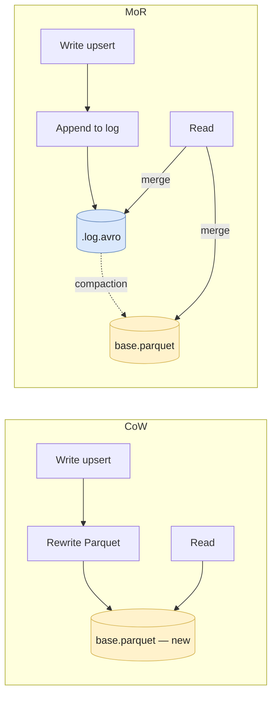

# Apache Hudi

**Apache Hudi** (Hadoop Upserts Deletes Incrementals) is the **streaming-first** table format. Born at **Uber in 2017** to handle high-frequency CDC and IoT ingestion, donated to the Apache Foundation. Less universally adopted than Iceberg or Delta, but still the right choice for a specific workload: **high-volume, low-latency upserts with incremental reads**.

The thing Hudi does that the others don't: it lets you trade off read vs write cost **per table** via two storage modes, and it ships with **native indexes** so upserts don't full-scan.

> Pre-req: read **[Parquet & file formats](../storage/parquet-and-formats)**. Hudi sits on top of Parquet (and Avro for log files).

---

## Why Hudi exists

Iceberg and Delta were designed primarily for **analytics on append-mostly** data, with upserts and deletes added later. Hudi was designed in the opposite order: **upserts first**, analytics second.

The use cases Hudi targets:

* **CDC ingestion** — Postgres → Kafka → Hudi, replicating millions of upserts/hour with sub-minute lag.
* **IoT / telematics** — vehicle positions, device states, anything with frequent updates to the same primary keys.
* **Large dimensions** — late-arriving updates to user profiles, product catalogs, billions of rows.
* **Incremental ETL** — downstream jobs that only want "what changed since timestamp X" — Hudi exposes that natively.

If your workload is "append events, read aggregates", Iceberg or Delta are simpler. Hudi is the right tool when **upserts are the load**, not the exception.

---

## Two table types — pick per table

Hudi's signature feature: every table picks one of two storage modes.

### Copy-on-Write (CoW)

* On upsert, Hudi **rewrites the whole Parquet file** containing the affected rows.
* Reads are pure Parquet reads — fast, no merge logic.
* Writes are expensive on high-churn data.

**Use when:** read-heavy, writes are batched, latency on read is critical.

### Merge-on-Read (MoR)

* On upsert, Hudi appends to a **log file (Avro)** next to the base Parquet.
* Reads merge base + logs at scan time (or read just the base for "read-optimized" mode).
* Writes are cheap; reads pay the merge cost.
* Periodic **compaction** rolls logs back into Parquet.

**Use when:** write-heavy, latency on write matters, you can tolerate slightly slower reads or accept stale-by-a-few-minutes "read-optimized" reads.



MoR exposes **two query types**:

* **Snapshot query** — merges base + logs, returns latest data. Slowest but always fresh.
* **Read-optimized query** — reads only the base files. Fast, but stale until the next compaction.
* **Incremental query** — returns only records changed between two commit times.

Snowflake/BigQuery don't have anything equivalent to "read-optimized" — it's a Hudi-specific way to trade freshness for speed without changing the underlying data layout.

---

## Native indexes — the upsert accelerator

The other Hudi distinctive: **indexes are first-class**. On upsert, Hudi consults the index to know **which file group contains a given record key** — no full scan, no <T>shuffle</T>.

| Index type | What it does | When to use |
|---|---|---|
| **Bloom (default)** | Per-file Bloom filter on the record key | General-purpose; cheap |
| **Simple** | Joins incoming records against existing data | Small tables, debugging |
| **HBase** | External HBase as a key→file mapping | Very large tables, high-frequency upserts |
| **Bucket** | Hash-based bucketing of record keys | Predictable distribution, no skew |
| **Record-Level (RLI)** | Internal Hudi-managed index | Hudi 0.14+, replaces external HBase for many cases |

The **record key** + **partition path** uniquely identify a row. Choose the record key carefully: it's the join key for every upsert, and it determines write locality.

---

## Timeline — the metadata model

Hudi maintains a **timeline** of "instants" (commits, compactions, cleans, restores). Each instant has a state: `REQUESTED → INFLIGHT → COMPLETED`. Stored under `.hoodie/`:

```
table_root/
├── <partition_path>/
│   ├── <fileId>_<commit>.parquet     # base file
│   └── .<fileId>_<commit>.log.<n>    # log file (MoR)
└── .hoodie/
    ├── 20240115_001.commit            # COW commit
    ├── 20240115_002.deltacommit       # MoR commit
    ├── 20240115_003.compaction.requested
    ├── 20240115_003.compaction.inflight
    ├── 20240115_003.commit            # compaction complete
    └── 20240115_004.clean             # cleaning old files
```

A **file group** is the durable unit: a base file + its log files. A **file slice** is one version of a file group at a given commit. The timeline + indexes + file groups together let Hudi answer "give me the data as of commit T" or "give me changes between T1 and T2" cheaply.

The **timeline service** (a long-running process) caches timeline metadata for fast lookups. Without it, every read parses the timeline files — workable for small tables, slow for large ones.

---

## Implementation

### Spark — write a CoW table

```python
hudi_options = {
    "hoodie.table.name": "events",
    "hoodie.datasource.write.recordkey.field": "user_id,event_ts",
    "hoodie.datasource.write.partitionpath.field": "country",
    "hoodie.datasource.write.precombine.field": "event_ts",
    "hoodie.datasource.write.table.type": "COPY_ON_WRITE",
    "hoodie.datasource.write.operation": "upsert",
    "hoodie.upsert.shuffle.parallelism": 200,
}

df.write.format("hudi").options(**hudi_options) \
    .mode("append") \
    .save("s3://my-lakehouse/events")
```

* `precombine.field` — when two records have the same key, Hudi keeps the one with the higher precombine value. Use the source-of-truth timestamp to handle out-of-order events.
* `recordkey.field` — composite keys are supported.

### Spark — incremental query

```python
df_changes = spark.read.format("hudi") \
    .option("hoodie.datasource.query.type", "incremental") \
    .option("hoodie.datasource.read.begin.instanttime", "20240115000000") \
    .option("hoodie.datasource.read.end.instanttime", "20240116000000") \
    .load("s3://my-lakehouse/events")
```

This is what makes Hudi shine for downstream ETL: **only the changed records** are returned, not the full table.

### Flink — streaming upsert

```sql
CREATE TABLE hudi_events (
  user_id   BIGINT,
  event_ts  TIMESTAMP(3),
  country   STRING,
  amount    DOUBLE,
  PRIMARY KEY (user_id, event_ts) NOT ENFORCED
) PARTITIONED BY (country) WITH (
  'connector'                  = 'hudi',
  'path'                       = 's3://my-lakehouse/events',
  'table.type'                 = 'MERGE_ON_READ',
  'write.operation'            = 'upsert',
  'index.type'                 = 'BUCKET',
  'hoodie.bucket.index.num.buckets' = '64',
  'compaction.async.enabled'   = 'true',
  'compaction.delta_commits'   = '5'
);

INSERT INTO hudi_events SELECT * FROM kafka_source;
```

---

## Trade-offs

### When Hudi wins

✅ **High-frequency CDC ingestion** with upserts at thousands/s and sub-minute SLAs.
✅ **Incremental downstream pipelines** — Hudi's incremental query API is more efficient than scanning full tables.
✅ **Mixed read/write workload on a per-table basis** — pick CoW for the dashboard table, MoR for the staging table.
✅ **Existing Uber-style streaming stack** (Spark Streaming + Flink + Kafka) where Hudi was designed to fit.

### When Hudi is weaker

❌ **Append-only or read-mostly analytics**. Iceberg and Delta are simpler with no CoW/MoR mental tax.
❌ **Multi-engine query**. Spark and Flink are first-class; Trino and Presto support is real but lags Iceberg; Snowflake/BigQuery support is via external table interfaces, not native.
❌ **Small teams**. Operational complexity (compaction, cleaning, timeline service, 200+ config properties) needs at least one engineer who's read the source code.
❌ **Standalone Python pipelines**. `hudi-python` exists but trails `pyiceberg` and `delta-rs` in maturity. Most production Hudi runs through Spark.

---

## Common pitfalls

* **Misconfigured precombine field.** If `precombine.field` is `event_ts` but events arrive out of order with different fields, you'll silently lose updates (an older event overwrites a newer one). Pick a monotonic source-of-truth column or compose multiple.
* **Skipping compaction on MoR.** Log files grow, snapshot queries get slower and slower, eventually unreadable. Schedule compaction (`compaction.delta_commits` triggers it after N delta commits) and **monitor the lag**.
* **Forgetting cleaning.** Cleaning removes old file slices outside the retention window. Without it, storage grows linearly with every upsert. Cleaning policy is `hoodie.cleaner.policy = KEEP_LATEST_COMMITS` with a reasonable `retain.commits` value.
* **Wrong index choice.** Bloom is fine for a few hundred GB. At TB scale with high upsert volume, Bloom false positives slow writes — switch to bucket or RLI.
* **Bucket index with too few buckets.** Skews writes onto a handful of file groups, defeating parallelism. Plan buckets ≥ writer parallelism, and rebalance via clustering when distribution shifts.
* **Read-optimized queries on a stale MoR table.** RO returns only base files; if compaction is hours behind, you read hours-old data. Document which dashboards use RO vs snapshot.
* **No timeline service in production.** Reads parse `.hoodie/` for every query — at 100k+ instants, planning becomes the bottleneck. Run the timeline service.
* **Treating Hudi like Delta or Iceberg.** Hudi's data layout has more moving parts (file groups, file slices, log files, indexes). Migration of legacy tables to Hudi is rarely "just point Spark at the path" — plan it.

---

## Interview questions

### What's the difference between Hudi's Copy-on-Write and Merge-on-Read, and when would you pick each?

**Junior answer.** CoW rewrites Parquet files on every upsert; MoR appends to log files and merges at read time. CoW is good for read-heavy, MoR for write-heavy.

**Mid-level answer.** Concretely: with CoW, an upsert reads the relevant Parquet file, applies the change, and writes a new Parquet — reads stay pure Parquet (fast), writes pay the rewrite cost. With MoR, an upsert appends a record to an Avro log file next to the base Parquet — writes are fast, but reads either merge base+logs at scan time (snapshot query, slower) or read only the base (read-optimized query, faster but stale until compaction). Pick CoW when reads dominate and you can batch writes; pick MoR when ingest is high-frequency and a few minutes of staleness on read-optimized queries is acceptable.

**Senior answer.** The choice is really about **where you want to pay the cost**: CoW front-loads it on writes (predictable read latency, expensive ingest), MoR defers it via logs + compaction (cheap ingest, variable read latency). The trap with MoR is **compaction lag**: if compaction is async and falls behind, snapshot queries grow slower over time and storage explodes. The fix is a compaction policy (`compaction.delta_commits = 5` or scheduled) plus monitoring of the gap between latest commit and latest compacted commit. The senior nuance: MoR's "read-optimized" mode is not a free lunch — it returns the **last compacted state**, so the freshness depends on compaction cadence. Document which downstream consumers are RO vs snapshot, because they see different worlds. In practice, I default to **CoW for analytical / dashboard tables** (tens of thousands of upserts/day) and **MoR for ingestion staging tables** (millions of upserts/day) with downstream jobs querying snapshot mode and tolerating the merge cost.

**Common mistakes.**
* "MoR is always better for streaming" — no, only if you can pay the read cost or run compaction reliably.
* Forgetting that compaction lag is a Hudi-specific operational concern.

**Follow-ups.**
* How would you monitor compaction lag in production?
* What happens to a MoR table during compaction — are reads blocked?

---

### How does Hudi's index speed up upserts compared to Iceberg or Delta?

**Junior answer.** Hudi has indexes on the record key, so it knows which file to update without scanning everything.

**Mid-level answer.** On upsert, Hudi looks up the record key in its index (Bloom by default, or HBase / Bucket / RLI) and identifies the **file group** containing the existing record. The upsert then reads/writes only that file group. Iceberg's `MERGE` and Delta's `MERGE` shuffle and scan target files based on the merge condition — they don't have a persistent record-key→file mapping. For high-frequency upserts on a single key (CDC, IoT), Hudi's index avoids the shuffle and scales much better.

**Senior answer.** The deeper answer is that **Hudi treats every table as a primary-key table**, while Iceberg and Delta treat tables as scan-oriented and add `MERGE` as a layer. That single design choice cascades: Hudi has record keys, file groups, indexes, precombine, incremental queries — all because the table has a known primary key. Iceberg/Delta rely on the engine (Spark, Trino) to do the merge planning each time, which works but doesn't have the per-file metadata to prune to a single file group. The trade-off: Hudi forces you to commit to a record key up front and design the partitioning/bucketing around it; Iceberg/Delta let you defer that. For a CDC source with stable primary keys, Hudi's design is the right one — at 10k upserts/s on a 10TB table, the shuffle Iceberg's `MERGE` does will burn far more compute than Hudi's bucket-indexed direct write. Below that scale, the operational cost of running Hudi (compaction, cleaning, timeline service) outweighs the benefit, and Iceberg's simpler model wins.

**Common mistakes.**
* "Iceberg has indexes too" — Iceberg has manifest stats (min/max), not record-key indexes.
* Confusing record-key index with secondary indexes (Hudi doesn't really have those).

**Follow-ups.**
* How would you choose between Bloom, Bucket, and RLI?
* What's the failure mode of a stale index?

---

### When would you choose Hudi over Iceberg in 2026?

**Junior answer.** When I have a lot of streaming upserts, like CDC.

**Mid-level answer.** Hudi is the right choice when (1) the dominant load is upserts at high frequency, (2) downstream jobs need incremental queries to scale, or (3) the team is already invested in Spark + Flink + Kafka and the streaming-first design fits the org. Iceberg is the better default for general-purpose lakehouse with multi-engine query.

**Senior answer.** Honestly, in 2026 the **window where Hudi clearly wins has narrowed**. Iceberg has added row-level deletes (V2), `MERGE` performance has improved, and broader engine support means you don't have to bet the whole stack on one format. The remaining sweet spot for Hudi is: **CDC-heavy pipelines processing millions of upserts/hour where Iceberg's `MERGE` cost shows up in the bill**, **incremental ETL chains** where Hudi's incremental query API materially simplifies downstream consumers, or **existing Hudi deployments** where the operational cost of migration outweighs the benefit. For greenfield in most orgs, Iceberg is the default and Hudi is a deliberate choice driven by a measured upsert problem. The honest senior take: choose Hudi when you've **profiled** Iceberg's `MERGE` and shown it doesn't scale for your workload — not because the docs say it's "the streaming format". The complexity tax is real (200+ config properties, compaction tuning, timeline service ops), and a junior engineer joining the team will struggle.

**Common mistakes.**
* Picking Hudi because "it's for streaming" without checking that Iceberg's `MERGE` can't handle the load.
* Underestimating the operational cost — Hudi needs more dedicated engineering attention.

**Follow-ups.**
* How would you decide between Hudi's MoR and Iceberg's V2 row-level deletes for the same CDC workload?
* What does a migration Hudi → Iceberg look like, and when is it worth doing?

---

## Further reading

* **Docs** — [hudi.apache.org/docs/overview](https://hudi.apache.org/docs/overview).
* **Storage internals** — [File Layouts](https://hudi.apache.org/docs/file_layouts) and [Timeline](https://hudi.apache.org/docs/timeline).
* **Indexes** — [Indexing strategies](https://hudi.apache.org/docs/indexing).
* **Uber engineering** — [Hudi origin post](https://www.uber.com/blog/uber-big-data-platform/).
* Related pages:
  * [Parquet & file formats](../storage/parquet-and-formats) — the layer underneath.
  * [Apache Iceberg](./iceberg) — the main alternative.
  * [Delta Lake](./delta-lake) — the other main alternative.
  * [Iceberg vs Delta vs Hudi](./table-formats-comparison) — how to choose.
  * [CDC](../data-pipeline/cdc) — Hudi's most common upstream.
