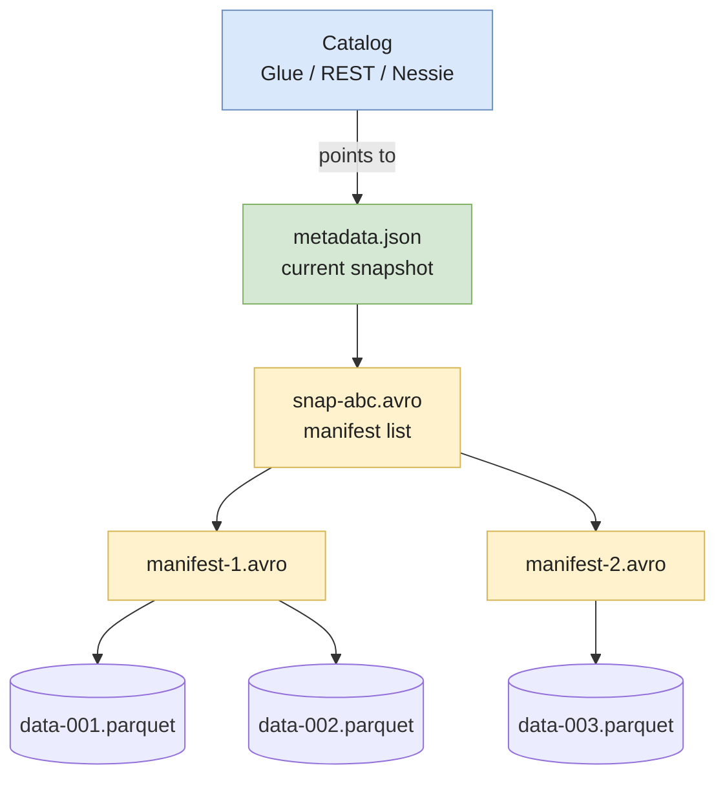

# Apache Iceberg

**Apache Iceberg** is an open table format that turns a pile of Parquet files on object storage into a real, queryable, transactional table. Born at **Netflix in 2018**, donated to the Apache Foundation, it has become the **default lakehouse format in 2026** — adopted by AWS (S3 Tables), Snowflake (open catalog), BigQuery (BigLake), Databricks (UniForm), and Cloudera.

This page covers Iceberg's architecture, the features that made it the standard, and the operational details you need to run it in production.

> Pre-req: read **[Parquet & file formats](../storage/parquet-and-formats)** first. Iceberg is a metadata layer **on top of** Parquet, not a replacement.

---

## Why a table format at all

Storing 10TB of Parquet on S3 is trivial. **Maintaining a table** on those files is not. You want to:

1. **Update 1000 rows** without rewriting the whole table.
2. **Read yesterday's version** to reproduce a bug.
3. **Add a column** without breaking running readers.
4. **Run multiple writers concurrently** without corrupting data.
5. **List active partitions** without `LIST`-walking S3.
6. **Delete a user (GDPR)** without a massive rewrite.

None of those are native to Parquet. Iceberg adds a **metadata layer** that makes them work — and crucially, **engine-agnostic**: Spark, Trino, Flink, Snowflake, BigQuery, Athena, DuckDB, ClickHouse all read the same table.

---

## Architecture — three levels of metadata

```
table_root/
├── data/                          # Parquet files (immutable)
│   └── *.parquet
└── metadata/
    ├── v1.metadata.json           # current snapshot + schemas + partition specs
    ├── v2.metadata.json
    ├── snap-<id>.avro             # manifest list — points to manifests for one snapshot
    └── <manifest>.avro            # data file list with per-file stats
```

Three layers, each one indirection away from the data:

1. **`metadata.json`** — the table-level pointer. Holds the current snapshot ID, schema history, partition spec history, and table properties.
2. **Manifest list** (`snap-*.avro`) — one per snapshot. Lists every manifest belonging to that snapshot, with partition value ranges.
3. **Manifest** (`<manifest>.avro`) — lists data files plus per-file stats (`min`, `max`, `null_counts`, `value_counts`).

A commit = writing a **new `metadata.json`** and atomically swapping the pointer. The swap is what the catalog handles (atomic rename on filesystem, conditional update in DynamoDB/Glue/REST).



---

## The features that made Iceberg the standard

### Hidden partitioning

In Hive-style tables, the partition is encoded **in the path**: `/year=2024/month=01/day=15/`. Readers must filter on the partition column literally, with the right transform. Filter on `event_ts` instead of `event_day`? Full scan.

Iceberg stores the partition in **metadata**, derived from a column via a transform (`day(ts)`, `bucket(16, user_id)`, `truncate(10, country)`). The reader filters on the **source column** and Iceberg figures out the partitions to prune.

```sql
-- Partition spec: day(event_ts)
SELECT * FROM events WHERE event_ts >= '2024-01-15';
-- Iceberg prunes to the right day partitions automatically.
```

This unlocks **partition evolution**: change the partition spec without rewriting old data. Old files keep their old spec; new files use the new one. Both readable in the same query.

### Full schema evolution

Every column has a stable **column ID**, not just a name. That means:

* **Add column** — safe. Old files get `null` for the new column.
* **Drop column** — safe. Old files keep the data; readers ignore it.
* **Rename column** — safe. The ID stays; only the name in metadata changes.
* **Reorder** — safe. Position is metadata-only.
* **Type promotion** — `int → long`, `float → double`, `decimal(P, S) → decimal(P', S)` with `P' >= P`.

No file rewrite for any of those. Compare to formats that key on column name — a rename triggers a rewrite or, worse, silently breaks.

### Snapshots and time travel

Every commit creates a new **snapshot**. The full history is queryable:

```sql
-- Read the table as of yesterday
SELECT * FROM analytics.events
FOR TIMESTAMP AS OF TIMESTAMP '2024-01-15 00:00:00';

-- Read by snapshot ID
SELECT * FROM analytics.events VERSION AS OF 7843294857293875;

-- Diff two snapshots
SELECT * FROM analytics.events.changes(
  start_snapshot_id => 1, end_snapshot_id => 5
);
```

Time travel is bounded by your **expiration policy**: snapshots older than `history.expire.max-snapshot-age-ms` (default 5 days) become eligible for deletion via `expire_snapshots`.

### Row-level operations (V2 spec)

Iceberg V2 supports two delete-file flavors:

* **Position deletes** — "row at file X, position 42 is deleted". Cheap, used for `MERGE INTO` and `DELETE`.
* **Equality deletes** — "rows where `user_id = 12345` are deleted". Used by streaming connectors (Flink) where row position is unknown at write time.

Reader engines apply delete files at scan time. Compaction periodically rewrites files to drop the deletes physically.

---

## Catalogs — the part that trips people up

Iceberg needs a **catalog** to track which `metadata.json` is the current one. The catalog is what makes commits **atomic across engines**. Choices in 2026:

| Catalog | Hosted by | Best for |
|---|---|---|
| **AWS Glue** | AWS | AWS-native stacks, Athena/EMR/Redshift |
| **REST catalog** | Anyone | Multi-cloud, vendor-neutral; reference impl + Tabular/Polaris |
| **Snowflake Open Catalog** (Polaris) | Snowflake / Apache | Multi-engine with RBAC |
| **Nessie** | Project Nessie | Git-like branching/tagging on tables |
| **JDBC** | Postgres/MySQL | Self-hosted, simple |
| **Hadoop** (filesystem only) | — | **Avoid for production** — no atomic commit across writers |

> Multi-table transactions exist only with catalogs that support them (REST, Nessie). With Glue/JDBC, each commit is per-table.

---

## Implementation

### PyIceberg — read & write without Spark

```python
from pyiceberg.catalog import load_catalog
import pyarrow as pa

catalog = load_catalog("default", **{
    "type": "glue",
    "warehouse": "s3://my-lakehouse/",
    "region": "eu-west-1",
})

# Create
schema = pa.schema([
    ("user_id", pa.int64()),
    ("event_ts", pa.timestamp("us")),
    ("amount", pa.float64()),
])
catalog.create_table("analytics.events", schema=schema)

# Append
table = catalog.load_table("analytics.events")
df = pa.table({
    "user_id": [1, 2],
    "event_ts": [pd.Timestamp.utcnow()] * 2,
    "amount": [10.0, 20.0],
})
table.append(df)

# Read with predicate pushdown to manifests
arr = table.scan(
    row_filter="event_ts >= '2024-01-01' AND amount > 5",
    selected_fields=("user_id", "amount"),
).to_arrow()
```

### Spark SQL — typical production usage

```sql
-- Create with partition spec
CREATE TABLE analytics.events (
  user_id BIGINT,
  event_ts TIMESTAMP,
  country STRING,
  amount DOUBLE
) USING iceberg
PARTITIONED BY (days(event_ts), bucket(16, user_id))
TBLPROPERTIES (
  'write.format.default' = 'parquet',
  'write.target-file-size-bytes' = '536870912'  -- 512 MB
);

-- MERGE — efficient row-level update
MERGE INTO analytics.events t
USING staging.events s
ON t.user_id = s.user_id AND t.event_ts = s.event_ts
WHEN MATCHED THEN UPDATE SET amount = s.amount
WHEN NOT MATCHED THEN INSERT *;

-- Maintenance
CALL system.expire_snapshots('analytics.events', TIMESTAMP '2024-01-01');
CALL system.rewrite_data_files('analytics.events');
CALL system.rewrite_manifests('analytics.events');
```

---

## Trade-offs

### When Iceberg wins

✅ **Multi-engine query**. You want Spark for ETL, Trino for BI, Snowflake for one-off, BigQuery for shared analytics — all on the same table.
✅ **Long-lived tables with evolving schema**. Years-old data with column renames, type changes, partition spec changes.
✅ **Vendor neutrality**. The format is fully open; no single vendor dictates the roadmap.
✅ **Hidden partitioning saves you from yourself**. Junior engineers can write `WHERE event_ts BETWEEN ...` and partition pruning still works.

### When Iceberg is weaker

❌ **All-Databricks shop**. Delta is more battle-tested there with deeper engine integration (Photon, Liquid Clustering). Iceberg-on-Databricks via UniForm works but adds indirection.
❌ **High-frequency upserts at low latency**. Hudi's Merge-on-Read with native indexes still wins for streaming CDC at thousands of upserts/s with sub-minute SLAs.
❌ **Tiny tables**. Three metadata indirections per read are wasted overhead on a 10MB table — keep small tables in plain Parquet or a real database.

---

## Common pitfalls

* **Hadoop catalog in production.** It uses filesystem rename for commits, which is **not atomic on S3**. Two writers can corrupt the table. Use Glue, REST, or Nessie.
* **Forgetting `expire_snapshots`.** Snapshots accumulate forever. After a year of hourly commits, manifest listing slows queries to a crawl. Schedule expiration weekly.
* **Forgetting `rewrite_manifests`.** Even after expiration, old manifests with deleted data files linger. Compact them, or planning becomes expensive.
* **Tiny files from streaming writers.** Flink committing every minute creates thousands of small Parquet files. Schedule `rewrite_data_files` to compact to ~512 MB.
* **Wrong partition transform.** `bucket(N, col)` with too few buckets creates skew; too many creates small files. Start with `bucket(16, user_id)` for even-distribution columns; tune from there.
* **GDPR delete via `expire_snapshots` only.** Expiring a snapshot doesn't delete the underlying data files immediately — it just makes them eligible for `remove_orphan_files`. Run that too.
* **V1 vs V2 mismatch.** A reader engine on Iceberg V1 silently misses V2 row-level deletes — readers see zombie rows. Pin the spec version and verify every engine supports it.
* **Catalog confusion across environments.** Same table name, different catalogs (Glue dev / Glue prod / REST staging) — silent data forks. Use distinct table names per env or a single catalog.

---

## Interview questions

### What is Iceberg's "hidden partitioning" and why does it matter?

**Junior answer.** Iceberg stores partitions in metadata, not in the file path. Readers filter on the source column and Iceberg picks the right partitions automatically.

**Mid-level answer.** In Hive, partitions live in the path (`/year=2024/month=01/`) and the reader must filter on those exact columns with the right transform. Iceberg derives partitions from a column via a transform (`day(event_ts)`, `bucket(16, user_id)`) recorded in metadata. Filter on `event_ts` and Iceberg prunes correctly. This also enables **partition evolution** — change the spec without rewriting old data.

**Senior answer.** The big leverage is decoupling the **physical layout** from the **query interface**. With Hive, every dashboard query has to know the partition column and transform. Change the partition (e.g. from daily to hourly), and you've broken every query. Iceberg lets you evolve the layout to match the workload — start daily, switch to hourly when traffic grows, or add a `bucket(user_id)` to support point lookups — without invalidating any reader. The metadata cost is one new partition spec entry; old files keep their old spec, readers handle both. The trade-off: you depend on the engine implementing partition pruning correctly. Athena, Spark, Trino all do; some niche engines lag.

**Common mistakes.**
* Saying "Iceberg has no partitions" — it absolutely does, they just live in metadata.
* Confusing hidden partitioning with bucketing in Hive (different mechanism).

**Follow-ups.**
* What happens to queries during a partition spec change?
* How does partition pruning interact with the manifest stats?

---

### How does Iceberg achieve atomic commits on object storage?

**Junior answer.** It writes a new `metadata.json` and updates the catalog to point to it.

**Mid-level answer.** A commit produces a new `metadata.json` file with a new snapshot ID. The **catalog** (Glue, REST, Nessie) does an atomic compare-and-swap on the table's pointer — "if current version is N, set to N+1". If two writers race, one succeeds and the other retries. The data files themselves are **immutable**, so the only contention is on the pointer.

**Senior answer.** The atomicity guarantee depends entirely on the catalog. Hadoop catalog relies on filesystem rename, which is **not atomic on S3** (eventual consistency on `LIST`, no compare-and-swap on rename) — two writers can both succeed and corrupt the table. Glue uses DynamoDB conditional writes; REST catalog uses whatever its backend provides; Nessie uses its own commit log. Choosing the catalog *is* the durability decision. Beyond per-table atomicity, multi-table transactions (e.g. write to `events` and `events_aggregates` as one unit) only exist with catalogs that explicitly support them — Nessie via branches, REST via the multi-table commit endpoint. With Glue, you commit each table independently and accept that a partial failure is observable.

**Common mistakes.**
* Saying "S3 rename is atomic" — it's not on most S3 implementations and the operational guarantee depends on the catalog.
* Forgetting that the catalog is part of the durability story.

**Follow-ups.**
* What's the failure mode if the catalog updates but the metadata.json upload fails halfway?
* How do you handle two engines writing to the same table from different regions?

---

### A 50TB Iceberg table has accumulated 200k snapshots. What happens, and how do you fix it?

**Junior answer.** Too many snapshots is bad. You should run `expire_snapshots` to clean them up.

**Mid-level answer.** Each snapshot has a manifest list and references manifests. With 200k snapshots, `metadata.json` and manifest listing are huge — query planning slows because the engine reads thousands of manifests to figure out which files matter. Fix: `expire_snapshots` to drop old ones, then `rewrite_manifests` to compact what remains, then `remove_orphan_files` to delete the no-longer-referenced data files.

**Senior answer.** The symptoms are **planning latency on every query** — even a simple `SELECT 1` pays the cost because the engine reads `metadata.json` and walks manifests to prune. At 200k snapshots, planning can take 30+ seconds before any data is read. The fix has three steps in order: (1) **`expire_snapshots`** with a sensible retention (e.g. 7 days for analytics, 30 days for tables backing audit), (2) **`rewrite_manifests`** to compact small manifests into a few large ones — this is what actually speeds up planning, (3) **`remove_orphan_files`** with a long-enough older-than threshold to avoid deleting files still referenced by in-flight reads. Operationally, this should be a scheduled job (Airflow, dbt-on-Iceberg, or Iceberg's own maintenance procedures) running weekly. Going forward, the underlying problem is usually **too many writers** — a streaming job committing every minute generates 1440 snapshots/day. Either batch commits (commit every 5 min instead of every minute) or accept it and over-provision the maintenance jobs.

**Common mistakes.**
* Running only `expire_snapshots` without `rewrite_manifests` — the manifest count stays high.
* Setting an aggressive `older_than` on `remove_orphan_files` and breaking time-travel.

**Follow-ups.**
* What if a streaming job needs a 1-hour reprocessing window — how do you reconcile that with weekly snapshot expiration?
* How would you detect this problem in monitoring before users notice?

---

## Further reading

* **Spec** — [Apache Iceberg Spec V2](https://iceberg.apache.org/spec/) (the source of truth).
* **PyIceberg** — [py.iceberg.apache.org](https://py.iceberg.apache.org/) for Python-native usage.
* **Catalogs** — [Catalog reference](https://iceberg.apache.org/concepts/catalog/) including REST API.
* **Netflix origin paper** — [Iceberg: a fast table format for S3](https://www.youtube.com/watch?v=mf8Hb0coI6s) (Ryan Blue talk).
* Related pages:
  * [Parquet & file formats](../storage/parquet-and-formats) — the layer underneath.
  * [Delta Lake](./delta-lake) — the main alternative.
  * [Apache Hudi](./hudi) — when streaming upserts dominate.
  * [Iceberg vs Delta vs Hudi](./table-formats-comparison) — how to choose.
  * [SCD](../data-modeling/scd) — Type-2 SCD becomes trivial with Iceberg's `MERGE`.
