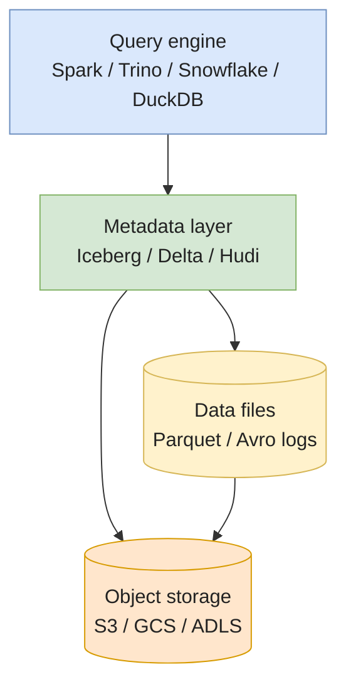
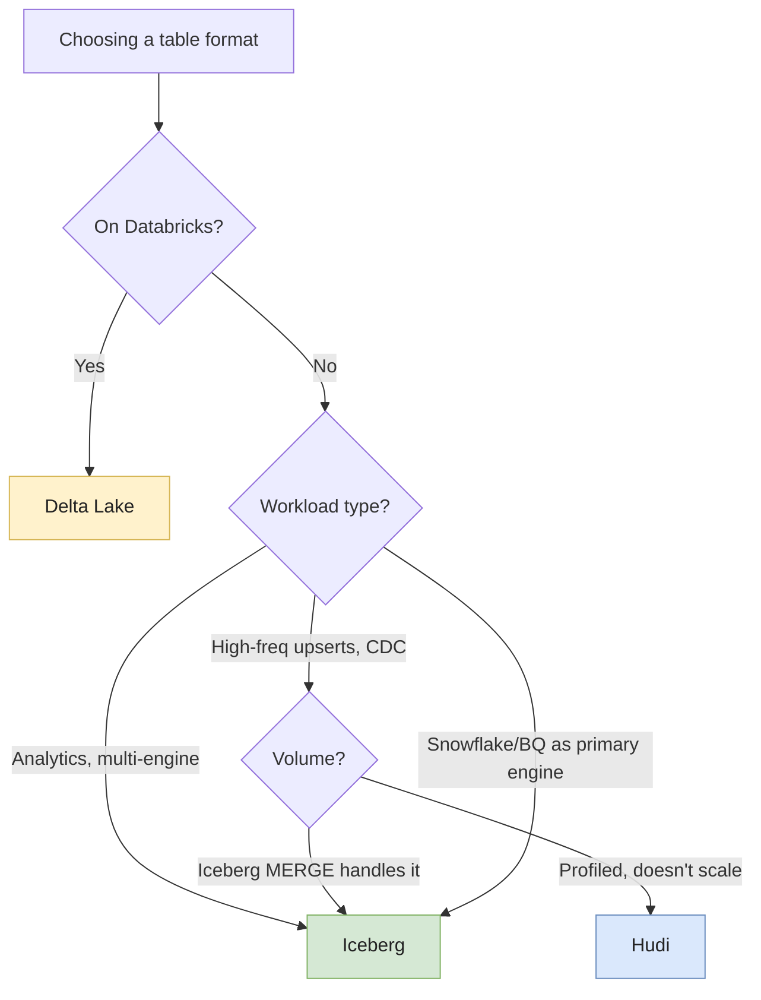

# Iceberg vs Delta vs Hudi

The three open table formats — **Apache Iceberg**, **Delta Lake**, **Apache Hudi** — solve the same core problem: turn Parquet files on object storage into a real, transactional, schema-aware table. They diverge in **architecture**, **ecosystem**, and **what they optimize for**.

This page is the **decision page**. Deep dives live in [Iceberg](./iceberg), [Delta Lake](./delta-lake), and [Hudi](./hudi); read those when you've picked one. Read this when you haven't.

---

## The problem they all solve

Imagine a 10TB Parquet table on S3. You want to:

1. Update 1000 rows without rewriting everything.
2. Read yesterday's version to debug.
3. Add a column without breaking readers.
4. Run multiple writers concurrently without corruption.
5. List active partitions without `LIST`-walking S3.
6. GDPR-delete a user without a massive rewrite.

None of those work on plain Parquet. All three formats add a **metadata layer** on top of Parquet that makes them work — they differ in **how**.

---

## Mental model — separation of layers

All three sit between the engine and the data files. The differences are in **what the metadata layer does** and **what it optimizes for**.

---

## Origins shape the design

| Format | Origin | Designed for |
|---|---|---|
| **Iceberg** | Netflix, 2018 | Multi-engine analytics on huge tables, full schema/partition evolution |
| **Delta Lake** | Databricks, 2019 | Spark-first ACID with the simplest possible mental model |
| **Hudi** | Uber, 2017 | Streaming ingestion with high-frequency upserts and incremental reads |

These aren't accidents. Read the design and the target workload jumps out:

* Iceberg's **manifest tree** scales planning to thousands of partitions and supports any engine reading the metadata directly.
* Delta's **append-only JSON log** is dead simple to debug and aligns with Spark's commit semantics.
* Hudi's **file groups + indexes + timeline** target the upsert + incremental-query path Uber needed for replicating their Postgres fleet.

If the workload doesn't match the origin, the format probably isn't the right fit.

---

## Synthetic comparison

| Criterion | Iceberg | Delta Lake | Hudi |
|---|---|---|---|
| **Origin** | Netflix | Databricks | Uber |
| **Governance** | Apache (open) | Linux Foundation (Databricks-driven) | Apache (open) |
| **Metadata model** | Manifest tree (Avro) | JSON transaction log + checkpoints | Timeline + file groups + indexes |
| **Schema evolution** | ✅ Full (add/drop/rename/reorder/promote) | ✅ Good | ⚠️ Limited |
| **Partition evolution** | ✅ Hidden + can change spec | ❌ Path-based, no evolution | ❌ Limited |
| **Time travel** | ✅ | ✅ | ✅ |
| **Row-level updates/deletes** | ✅ V2 (position + equality deletes) | ✅ Deletion vectors | ✅✅ Native via indexes |
| **Streaming ingest** | ✅ | ✅ | ✅✅ Designed for it |
| **Incremental queries** | ✅ via snapshot diff | ✅ via change data feed | ✅✅ First-class |
| **Engine ecosystem** | ✅✅✅ Spark, Trino, Flink, Snowflake, BigQuery, Athena, ClickHouse, DuckDB | ✅✅ Spark, Trino, Flink, BigQuery (UniForm) | ✅ Spark, Flink, Trino partial |
| **Standalone Python** | PyIceberg ✅ | delta-rs ✅✅ | hudi-python ⚠️ |
| **Best on Databricks** | Workable via UniForm | ✅✅✅ Native | ⚠️ Possible, not optimized |
| **Vendor lock-in** | Low | Medium (Databricks-friendly features) | Low |
| **Operational complexity** | Medium | Low–Medium | High (compaction, indexes, timeline) |

---

## How to choose

### Default choices in 2026

* **Greenfield, no stack lock-in, want portability** → **Iceberg**. Largest ecosystem, most neutral governance, best multi-engine support.
* **All-in on Databricks** → **Delta Lake**. Photon, Liquid Clustering, Unity Catalog, Delta Sharing — all assume Delta. Going against the grain costs more than it saves.
* **CDC / streaming with proven high upsert volume** → **Hudi**, but only after you've profiled Iceberg's `MERGE` and confirmed it doesn't scale. The Hudi operational tax is real.

### Anti-patterns

* **Choosing based on community star count or hype.** All three are mature. Operational fit beats brand.
* **Choosing Hudi because "it's for streaming"** without measuring that Iceberg V2 row-level deletes can't handle your CDC volume.
* **Choosing Iceberg on Databricks "for portability"** without reading what UniForm does and doesn't cover. You'll lose Photon performance and gain operational indirection.
* **Mixing formats in one table.** UniForm enables read-time interop, not multi-writer interop. One table, one format-of-record.

---

## Hybrid scenarios

### UniForm — Delta tables readable as Iceberg (and vice-versa)

Delta 3.x can write **Iceberg metadata alongside** the Delta log. Iceberg readers see a normal Iceberg table; Delta readers see Delta. This reduces lock-in: Databricks teams keep Photon while Trino / Athena / Snowflake can query the same files as Iceberg.

Caveats:
* Some advanced features don't translate (e.g. some V2 row-level delete semantics).
* The Iceberg side is **read-only or write-via-Delta**, not a full peer.
* Version drift between formats — verify your Iceberg readers handle the spec version Delta is emitting.

### Migrating between formats

| From → To | Story |
|---|---|
| **Delta → Iceberg** | Conversion via Iceberg's `add_files` procedure or open-source converters; can be done **without rewriting data**. Practical for tables under a few PB. |
| **Iceberg → Delta** | Less common; possible by reading the Iceberg snapshot and rewriting via Delta. Pay the rewrite cost. |
| **Hudi → Iceberg/Delta** | Harder — Hudi's file groups + log files don't map cleanly. Usually a full rewrite. |

In practice, format migrations are rare and usually triggered by an org-wide stack consolidation (e.g. moving all teams to Databricks, or adopting Snowflake's open catalog). They're not weekend projects.

---

## Common pitfalls (regardless of format)

* **Too many small commits.** Every commit creates metadata. 100k commits → planning explodes. Batch writes; checkpoint or compact metadata regularly.
* **No `VACUUM` / `expire_snapshots` / clean policy.** Old files accumulate forever. Storage cost grows linearly; eventually metadata reads slow down. Schedule retention.
* **Row-by-row `MERGE` from naive orchestrators.** Each statement creates a commit. Thousands of tiny commits per hour. Batch upstream.
* **Bad initial partitioning.** Iceberg can evolve; Delta and Hudi mostly can't. A wrong partition column is a rewrite (or a lifetime of pain).
* **Catalog confusion.** Same table name across Glue/REST/Unity → silent forks. Use distinct catalogs per environment, and one source of truth per table.
* **GDPR via `DELETE` only.** All three support `DELETE`, but the **physical files** stay around until vacuum/expiration. Don't claim compliance until the historical files are gone.
* **Mismatched spec versions.** Iceberg V1 reader on a V2 table silently misses row-level deletes. Pin spec versions in CI; verify every reader engine supports them.

---

## Interview questions

### Why isn't plain Parquet on S3 enough for a production data lake?

**Junior answer.** Because you can't easily update or delete data, and there's no transaction support.

**Mid-level answer.** Parquet is an immutable file format. You can write files, but you can't safely update rows, you can't run two writers concurrently without risking corruption, and you can't query "the table as of yesterday". You also have no atomic commit — if a job writes 1000 files and crashes after 800, the table is in an inconsistent state. Table formats (Iceberg, Delta, Hudi) add a metadata layer that gives you transactions, time travel, schema evolution, and concurrent writes.

**Senior answer.** The Parquet limitation is a symptom of object storage's design: S3 has no `RENAME` (it's `COPY` + `DELETE`), no atomic multi-object commit, <T term="eventual-consistency">eventual consistency</T> on `LIST` (historically), and no notion of a "current state" for a directory. So even if Parquet itself supported updates, you couldn't expose a consistent view across files. Table formats solve this by **moving the source of truth from the filesystem to a metadata pointer** (a single `metadata.json` for Iceberg, the `_delta_log` head for Delta, the timeline for Hudi). The pointer flip is the atomic commit. Everything else — schema evolution, time travel, concurrent writes — falls out of having that pointer. Without it, "production data lake" is just "directory of files we hope nobody touches at the wrong time".

**Common mistakes.**
* "Parquet doesn't support updates" — true, but the deeper problem is no atomic multi-file commit.
* Forgetting that S3's eventual consistency historically broke many naive approaches.

**Follow-ups.**
* How does Iceberg achieve atomic commit on S3 specifically?
* What's the cheapest way to get a "table-like" interface without a real table format?

---

### A team is on AWS, no Databricks, mixing Athena, Spark on EMR, and Snowflake's open catalog. Which format do you pick and why?

**Junior answer.** Iceberg, because it works with all of them.

**Mid-level answer.** Iceberg. AWS Glue is a first-class Iceberg catalog, Athena and EMR Spark have native Iceberg support, and Snowflake's open catalog (Polaris) is built around Iceberg via the REST catalog API. Delta on AWS is workable but you lose Databricks-specific features (Photon, Liquid Clustering) and the Snowflake side becomes awkward. Hudi would only make sense if there's a measured high-frequency upsert workload — for general analytics, the operational complexity isn't worth it.

**Senior answer.** Iceberg with **REST catalog** (or Polaris) is the right choice, and the reason isn't "it's open" — it's that this stack has **three independent engines that all need to write the same table** at some point. Iceberg's catalog atomicity model (compare-and-swap on a metadata pointer) makes that safe; Delta requires either Databricks orchestration or a coordinator service. The operational story is also cleaner: one Glue catalog (or one Polaris instance) that all three engines authenticate against, RBAC at the catalog level, no per-engine quirks. The risk to flag: **Snowflake's Iceberg support is read-fast, write-slower** as of 2026 — for write-heavy workloads, plan to do writes via Spark or Flink and let Snowflake be the read engine. The other risk: **catalog choice is a one-way decision**. Glue + Iceberg works fine; switching from Glue to Polaris later means re-registering every table. Pick deliberately upfront. Hudi I'd reject for this stack because Athena's Hudi support lags and Snowflake's is via external table only — you'd be writing for one engine and downgrading the others.

**Common mistakes.**
* Choosing Delta because the team is "more familiar with it" — familiarity doesn't survive multi-engine writes.
* Underestimating catalog choice; the catalog is half the operational story.

**Follow-ups.**
* What if the team adds Databricks 6 months later — do you migrate to Delta or stay on Iceberg via UniForm?
* How would you partition this table to optimize for both Athena scans and Spark `MERGE`?

---

### When would you tell a team to **not** use a table format and stay on plain Parquet?

**Junior answer.** When the table is small.

**Mid-level answer.** When the table is small (under ~10GB), append-only, read by one tool, and short-lived. The table format adds operational overhead — catalog setup, vacuum/compaction jobs, metadata cost on every read. For a transient staging table or a one-off export, plain Parquet (or just CSV) is simpler. The threshold isn't size alone — it's whether you'll ever need updates, time travel, concurrent writers, or schema evolution.

**Senior answer.** The honest senior answer: **a table format is overkill more often than people admit**. The questions I'd ask before adopting one: (1) Will this table outlive the team? (2) Will multiple jobs / engines write to it? (3) Will rows ever change after first write? (4) Is the size > 100GB? If two or more answers are no, plain Parquet partitioned by date is fine — and noticeably faster, with no metadata-layer cost. The trap I see: teams adopting Iceberg for **every** table because "we're a lakehouse now" — including transient staging tables that get rewritten every run. That's pure operational tax with zero benefit. The real lakehouse pattern is: **table formats for tables you care about long-term, plain Parquet (or external tables, or a real database) for everything else**. The other case I'd push back on a table format: when the team has no one with operational experience running `expire_snapshots` / `VACUUM` / compaction. An untended Iceberg or Delta table degrades silently — better to use a simpler tool than to pretend you have one you can't operate.

**Common mistakes.**
* "Always use a table format" — costs you operational complexity for no benefit on transient tables.
* Forgetting that table formats need ongoing maintenance, not just creation.

**Follow-ups.**
* How would you structure the lakehouse so that "use Iceberg" vs "use plain Parquet" is a clear decision per layer?
* What's the migration cost from plain Parquet to Iceberg later, if you decide you need it?

---

## Further reading

* [Apache Iceberg](./iceberg) — full deep-dive on Iceberg architecture, catalogs, and operations.
* [Delta Lake](./delta-lake) — full deep-dive on Delta's transaction log, concurrency, and ecosystem.
* [Apache Hudi](./hudi) — full deep-dive on CoW/MoR, indexes, and timeline.
* [Parquet & file formats](../storage/parquet-and-formats) — the layer underneath all three.
* External:
  * [Onehouse: format comparison report](https://www.onehouse.ai/blog/apache-hudi-vs-delta-lake-vs-apache-iceberg-lakehouse-feature-comparisons) — vendor-flavored but technically detailed.
  * [Iceberg vs Delta vs Hudi (Databricks)](https://www.databricks.com/blog/2024/06/04/open-source-table-formats.html) — Databricks's view; calibrate accordingly.
  * [Subsurface talks](https://www.dremio.com/subsurface/) — neutral conference content from Dremio.
