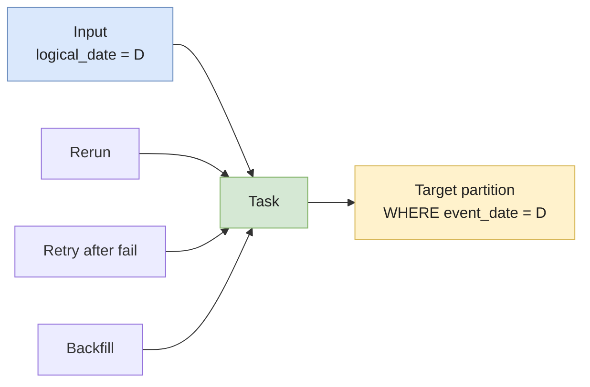

# Idempotency & Backfills

A pipeline is **idempotent** if running it twice with the same input produces the same output. Sounds obvious. It's not — and the day you discover yours isn't, it's already too late.

A **backfill** is the act of running the pipeline against historical dates — to fix a bug, add a new metric, recover from a failure, or onboard a new dataset. Backfills are the stress test for idempotency: any non-idempotent step gets multiplied across hundreds of dates and becomes a multi-day cleanup.

These two concepts are joined at the hip. **You cannot safely backfill a non-idempotent pipeline.** And the design choices that make a pipeline idempotent are exactly the choices that make it cheap to operate, debug, and recover.

> Cross-references: this page is the long-form companion to several patterns mentioned in [dbt advanced — incremental models](../data-pipeline/dbt/advanced), [CDC](../data-pipeline/cdc), [SCD](../data-modeling/scd), and the senior interview answers in [Data Engineer interview — Q3](../interview/data-engineer).

---

## Why it matters

Real scenarios where idempotency saves the day:

- A transient failure at 03:14 — the orchestrator retries the task. Without idempotency, the partial output from the first run + the full output from the retry = double-counting.
- A bug in the transform layer corrupted 3 months of `fct_orders`. You need to rerun those 90 logical dates. With idempotency, it's a one-line `dbt build --select fct_orders --vars '{...}'` per date. Without it, it's a manual SQL surgery per partition.
- The product team adds a new metric. You backfill 2 years of history into the existing fact table. Without idempotency, you discover at month 18 that the same row exists 3 times in your `fct_orders` table.
- The source DB had its clock wrong for a week. You re-extract that week and re-apply transforms. With idempotency, this is routine.

Treat idempotency not as "nice to have" but as the **primary contract of every batch job in the warehouse**.

---

## Definition — what "idempotent" actually means here

In math: `f(f(x)) = f(x)`. In data engineering, it's narrower:

> Running the same task with the **same logical date / partition / batch identifier** N times leaves the target table in the **same final state**.

Three things matter:

1. **Same input** — you're rerunning the same date, not "today's data."
2. **Same final state** — duplicates, missing rows, drifted aggregates all violate this.
3. **N times** — once, twice, ten times. A pipeline that's "almost idempotent" is not idempotent.

Note what's **not** required: the pipeline doesn't have to be a no-op on retry. It can rewrite the partition every time. What matters is the **observable output**.

---

## Mental model — the contract per task



The task takes a **logical date** as input and writes to a **bounded slice** of the target (a partition, a key range, a tagged row set). All three rerun reasons hit the same code path; idempotency is what makes them safe.

---

## The four idempotency patterns

### 1. Partition overwrite — the workhorse

You delete the target partition, then write it back. Single transaction or as close as you can get.

```sql
-- Snowflake / BigQuery / Postgres flavor
BEGIN;
DELETE FROM fct_orders WHERE event_date = '2024-03-15';
INSERT INTO fct_orders
SELECT ... FROM stg_orders WHERE event_date = '2024-03-15';
COMMIT;
```

- ✅ Trivially idempotent — the final state is whatever the `SELECT` produces.
- ✅ Schema-evolution friendly.
- ✅ Easy to reason about during incidents.
- ❌ Source must be **deterministic for that date** — late-arriving data is the catch (see below).
- ❌ Costs grow with partition size.

**Use it when:** the partition is a clean atomic unit (event_date, ingestion_date) and the data for that partition is "settled" by run time. This is the dbt incremental + `partition_by` pattern, the Iceberg `INSERT OVERWRITE`, the Spark `mode("overwrite")` + dynamic partition.

### 2. MERGE / UPSERT on a primary key

You key on a stable identifier (`order_id`, `(account_id, event_ts)`) and update-or-insert.

```sql
MERGE INTO fct_orders AS tgt
USING staging_orders AS src
  ON tgt.order_id = src.order_id
WHEN MATCHED THEN
  UPDATE SET amount = src.amount, status = src.status, updated_at = src.updated_at
WHEN NOT MATCHED THEN
  INSERT (order_id, amount, status, updated_at) VALUES (src.order_id, src.amount, src.status, src.updated_at);
```

- ✅ Handles late-arriving updates naturally (a new version of the same `order_id` overwrites the old one).
- ✅ The natural fit for CDC sinks — see [CDC](../data-pipeline/cdc).
- ❌ Requires a real primary key — composite is fine, but **null values break it silently**.
- ❌ Doesn't capture **deletes** unless the source emits them.
- ❌ Without partition pruning (`incremental_predicates` in dbt, partition-aware MERGE), the engine scans the full target table.

**Use it when:** you have stable PKs and want to capture late updates, not just appends.

### 3. Insert-with-dedupe (append + window)

You append new rows blindly, then dedupe at read time or in a downstream model.

```sql
-- Dedupe in a view / final select
SELECT * FROM (
  SELECT *,
         ROW_NUMBER() OVER (
           PARTITION BY order_id
           ORDER BY ingested_at DESC
         ) AS rn
  FROM raw_orders
) WHERE rn = 1;
```

- ✅ Cheapest write path — pure append.
- ✅ Robust to retries: the duplicates are "absorbed" by the dedupe.
- ❌ The raw table grows without bound.
- ❌ Read-time cost — the window function runs on every query unless materialized.
- ❌ "Idempotent" only end-to-end, not at every layer.

**Use it when:** the raw layer is cheap (S3 / Iceberg) and you want fast, retry-safe ingestion. Dedupe in a `staging` layer, not in your marts.

### 4. Deterministic transforms (the prerequisite for all three)

None of the above work if the **transform itself is non-deterministic**. The killers:

| Source of non-determinism            | Fix                                                              |
| ------------------------------------ | ---------------------------------------------------------------- |
| `now()`, `current_timestamp`         | Pass `logical_date` / `data_interval_start` as a parameter       |
| `random()`, sampling without seed    | Set a seed; or do sampling outside the deterministic core        |
| Calls to external APIs               | Snapshot the API response upstream; transform reads the snapshot |
| Read of "latest" from another table  | Use the version-as-of-D, not the live table                      |
| Floating-point aggregations on huge sets | Be aware of float associativity quirks; use `DECIMAL` for money |

The rule: **the SQL or code that produces the output for date D must be expressible purely as a function of inputs known at date D.**

---

## Backfills — running history through the same pipe

A backfill is "rerun the pipeline for a range of past logical dates." Three flavors:

### Targeted backfill — a known affected window

You know what broke and when. You rerun those exact dates.

```bash
# Airflow CLI — historical
airflow dags backfill -s 2024-03-10 -e 2024-03-15 fct_orders_dag

# dbt with --vars (idiomatic)
for d in 2024-03-{10..15}; do
  dbt build --select fct_orders --vars "{run_date: '$d'}"
done

# dbt microbatch (≥ 1.9)
dbt run --select fct_orders \
  --event-time-start "2024-03-10" \
  --event-time-end   "2024-03-16"
```

This is the easy case. The pipeline is already idempotent, you just call it with the right dates.

### Full historical backfill — bootstrapping a new model

You added a new metric. You want 2 years of history. Strategies:

- **One job per date in parallel.** Cheap and embarrassingly parallel, but expensive on the warehouse — N concurrent merges fight for the same target table.
- **Chunked sequential.** Run in batches of 7 / 30 days. Better warehouse cost, longer wall clock.
- **Single full overwrite.** `INSERT OVERWRITE` the whole target table from scratch. Cleanest if the model is small enough; impossible at TB scale.

**Plan for at least 2x the wall-clock time you estimate** — the first attempt always hits a corner case (late-arriving data, missing source partition, type drift).

### Replay from immutable raw — the disaster-recovery story

The transform layer is corrupt. You need to rebuild from the raw layer.

This only works if:

1. **The raw layer is immutable and partitioned by ingestion date.** S3 + Iceberg + a "raw" zone you never edit.
2. **The transforms are deterministic.** See pattern 4 above.
3. **The source data is still there.** Retention on Kafka, on the source DB log, on S3 — set it long enough that you can replay your worst incident.

If those three hold, "fix the bug, rerun the pipeline for the affected window" is a one-pager runbook. If they don't, you're doing manual SQL on a Friday night.

---

## Concrete pattern — Airflow DAG with idempotent task

```python
from airflow import DAG
from airflow.decorators import task
from datetime import datetime

with DAG(
    dag_id="fct_orders",
    start_date=datetime(2024, 1, 1),
    schedule="@daily",
    catchup=True,        # explicit — backfill on first deploy
    max_active_runs=4,   # bound concurrency
) as dag:

    @task
    def build(data_interval_start, data_interval_end):
        # ✅ Use the data interval, NOT now()
        d = data_interval_start.strftime("%Y-%m-%d")
        sql = f"""
        BEGIN;
        DELETE FROM fct_orders WHERE event_date = '{d}';
        INSERT INTO fct_orders
        SELECT ... FROM stg_orders WHERE event_date = '{d}';
        COMMIT;
        """
        run_query(sql)

    build()
```

The two non-negotiables:

- The task receives `data_interval_start` from Airflow. **Never** call `datetime.utcnow()`.
- The SQL is partition-scoped (`WHERE event_date = '{d}'`) on both the delete and the insert.

`catchup=True` means a fresh deploy will backfill from `start_date` to today, run by run — only safe because the task is idempotent.

---

## Concrete pattern — dbt incremental with backfill safety

```sql
-- models/marts/fct_orders.sql
{{ config(
    materialized='incremental',
    unique_key='order_id',
    incremental_strategy='merge',
    partition_by={'field': 'event_date', 'data_type': 'date'},
    incremental_predicates=["DBT_INTERNAL_DEST.event_date >= dateadd(day, -7, current_date)"]
) }}

select
    order_id,
    customer_id,
    cast(amount as decimal(10, 2)) as amount,
    event_date,
    updated_at
from {{ ref('stg_orders') }}


  where updated_at > (select coalesce(max(updated_at), '1970-01-01') from {{ this }})

```

The mechanics:

- `unique_key` → `MERGE` matches existing rows by `order_id`.
- `incremental_predicates` → the MERGE only scans the last 7 days of the **target**, not the full table. Cuts cost by orders of magnitude on big tables.
- The `is_incremental()` block bounds the **source** read.
- A backfill = `dbt build --full-refresh` (rebuilds from scratch) **or** running with a wider `--vars` window.

> Even with `unique_key`, a first-time `--full-refresh` does **not** dedupe — the merge logic only kicks in on incremental runs. Always include explicit dedupe in the source `SELECT` if your raw layer can have duplicates.

---

## Pros / Cons of an idempotent pipeline

| ✅ Pros                                              | ❌ Cons                                              |
| --------------------------------------------------- | --------------------------------------------------- |
| Failed runs are recoverable with a single retry      | Higher write cost (delete + insert vs. plain append) |
| Backfills become a runbook, not an incident          | Needs partition-aware target tables                  |
| Late-arriving data has a clear policy                | Forces discipline upstream (no `now()`, no calls to live state) |
| The whole transform layer can be rebuilt from raw    | Full-table MERGE without pruning is expensive       |
| On-call story is dramatically shorter                | Initial design is 20% slower than the "quick" version |

---

## Common pitfalls

- **`current_timestamp` / `now()` in the transform.** First-class idempotency killer. The same input on date D produces a different row on every run.
- **`MERGE` without partition pruning.** A 1B-row fact table merged daily without `incremental_predicates` scans the full table — your warehouse bill triples.
- **`MERGE` on a column with NULLs.** NULLs don't equal NULLs, so the match silently fails and you get duplicates.
- **`DELETE WHERE event_date = D` + `INSERT` outside a transaction.** A failure between the two leaves the partition empty. Always wrap (or use atomic `INSERT OVERWRITE`).
- **`dbt run --full-refresh` on a model with `unique_key` but no source dedupe.** The first run loads raw duplicates as-is, then the next incremental run merges around them. Permanent duplicates.
- **Re-running an SCD Type-2 snapshot for a historical date.** Snapshots are append-only and time-stamped — re-running with today's source data corrupts the history. See [SCD](../data-modeling/scd).
- **Backfilling against a live source.** The source has changed since the original run; the backfill produces a different "history." Use an immutable raw layer.
- **Catchup on first deploy without bounding `max_active_runs`.** Airflow launches 365 parallel daily runs, all hitting the same target. Wreck.
- **Aggregations that read "the latest" of another table.** Today's reaggregation of yesterday is wrong because today's "latest" is not yesterday's "latest." Resolve dimensions/lookups as-of `data_interval_start`.
- **Treating the orchestrator's retry as the idempotency mechanism.** Retries make it worse if the task isn't idempotent. The task is the source of truth.

---

## Interview Questions

### Question 1 — "Define idempotency in a data pipeline. How do you make a daily fact-table job idempotent?"

#### Answer — Junior

> Idempotency means running the same job twice produces the same result. For a daily fact table, I'd partition by date and, for each run, **delete the partition first, then insert** — wrapped in a transaction.
>
> ```sql
> DELETE FROM fct_orders WHERE event_date = '{run_date}';
> INSERT INTO fct_orders SELECT ... WHERE event_date = '{run_date}';
> ```
>
> So if the job retries or someone backfills the same date, the table ends up with one clean copy.

#### Answer — Mid-level

> The contract is: rerunning the task for the **same logical date** any number of times leaves the target table in the same final state.
>
> The mechanics depend on the warehouse:
> - **Partitioned target** + `INSERT OVERWRITE PARTITION` (Spark / Iceberg / Hive). One atomic operation.
> - **Non-partitioned** but keyed → `MERGE` on the primary key with `incremental_predicates` to prune the target scan.
> - **Append-only raw** + a downstream dedupe view.
>
> Beyond the write pattern, three things have to be true:
> - The transform is **deterministic** — no `now()`, no random, no reads of "latest" from another evolving table.
> - The orchestrator passes the **logical date** as a parameter — Airflow's `data_interval_start`, dbt's `--vars`, etc.
> - The source data for that date is **stable** — either truly settled, or you accept a small reprocessing window for late arrivals (e.g., reprocess the last 3 days every run).
>
> The validation I always do: kill the job mid-run, re-run it, then run it twice more. The target row count and a few sample aggregates should be byte-identical.

#### Answer — Senior

> Honestly, idempotency at the task level is the **easy part**. The interesting question is "what's the unit of idempotency for the **pipeline**, end-to-end?"
>
> Three layers to think about:
>
> 1. **Per-task idempotency** — the partition-overwrite or MERGE pattern. This is necessary, not sufficient.
> 2. **Per-DAG idempotency** — when one task in the DAG fails, can we rerun *just that task and downstream* without re-extracting from source? This requires an immutable raw zone and a clean staging boundary.
> 3. **Per-pipeline idempotency** — can we replay the whole pipeline from raw on a new logical date range? This is the disaster-recovery story. Requires deterministic transforms across the whole DAG, retention on the raw layer, and the discipline to never read the live source from a transform model.
>
> The thing that bites at scale is **cross-table consistency during a backfill**. You backfill `fct_orders` for January. Today you also have a refresh of `dim_customer` running. The fact joins to a dimension that doesn't yet have January's customer states. Either the dimension is Type-2 (so each event resolves the correct version-of-truth — see [SCD](../data-modeling/scd)) or you're going to get silent inconsistencies. Real-world idempotency means "the whole graph rebuilds to a consistent state," not "each table rebuilds in isolation."
>
> The tooling story I push for: **dbt's `partition_by` + `incremental_predicates`** for the per-table mechanics, **Airflow with `data_interval_start` everywhere and `catchup=True`** for the orchestrator contract, and an **Iceberg/Delta raw zone** so we can rebuild the whole transform layer from raw without ever calling the source DB. Once those are in place, backfills become a calendar choice, not an incident.

#### Common pitfalls

- Treating retries as a substitute for idempotency — they aren't.
- Calling `now()` inside a transform that the orchestrator already parameterizes.
- `DELETE` + `INSERT` outside a transaction — a failure between the two leaves an empty partition.
- Forgetting that `MERGE` with NULL keys silently produces duplicates.

#### Follow-up questions

- How would you test that a pipeline is idempotent in CI?
- Your fact table has 1B rows. The naive `MERGE` is too expensive. How do you prune the merge target?
- Your source DB has hard deletes. How do you propagate them idempotently?

---

### Question 2 — "Walk me through a backfill of a 2-year history into a new fact table. What can go wrong?"

#### Answer — Junior

> I'd write the model as an incremental dbt model with `unique_key`, then run a `--full-refresh` once to populate from scratch. After that, daily runs only process new data.
>
> Things that can go wrong:
> - The full-refresh times out on 2 years of data.
> - The transform reads `current_date` somewhere, so historical rows get the wrong values.
> - Duplicates if the raw layer has any.

#### Answer — Mid-level

> The plan in three phases:
>
> 1. **Validate the transform on a small window first.** Run for one week of history, eyeball the output, run aggregate checks vs. a known reference (the existing report, the source DB itself). Don't backfill 2 years until one week is bulletproof.
> 2. **Choose the chunk size.** A single 2-year `--full-refresh` is rarely the right answer at >100M rows — long-running, hard to monitor, expensive to retry. I'd chunk by month: 24 sequential runs, each idempotent. Wall clock longer, recovery much easier. If chunks are independent (no cross-month dependencies), parallelize with `max_active_runs`.
> 3. **Run it off-peak.** Backfills compete with daily jobs and BI users for warehouse compute. Schedule for a weekend / nights, alert on cost.
>
> What goes wrong:
> - **Late-arriving data not in the historical raw.** If a January order was updated in March, and your raw layer captures that update with the March ingestion date, your January backfill misses it. Solution: read raw by **event date**, not ingestion date, and accept a reprocessing window.
> - **Schema drift.** A column that exists today didn't exist 2 years ago. Either backfill that column as NULL or recompute it from the raw fields if possible.
> - **Dimensions are not Type-2.** The fact joins on `dim_customer.region`, but `region` is currently the customer's region today, not 2 years ago. The historical aggregates are wrong. Either Type-2 the dimension (see [SCD](../data-modeling/scd)) or be explicit that the report is "as-of-now" not "as-of-then."
> - **Cost surprises.** A naive 2-year `MERGE` without partition pruning can scan trillions of rows. Always `incremental_predicates` or partition-overwrite.

#### Answer — Senior

> The technical mechanics — chunking, partition-overwrite, incremental_predicates — those are commodity engineering. The hard part is the **organizational and semantic conversation** that has to happen before a single line of SQL.
>
> Three questions I always force the team to answer first:
>
> 1. **What is the source of truth for the historical period?** The transactional DB? Kafka retention? An old data lake snapshot? Each has a different "version" of history, and the team usually doesn't realize how different until the numbers don't match.
> 2. **Are dimensions resolved as-of the event time or as-of-now?** This is the single biggest source of "the historical numbers don't match the original report." Most teams default to as-of-now without making it an explicit decision, and it bites at the first executive review of the backfill.
> 3. **Who consumes this table, and what do they expect from a backfill?** The finance team wants byte-identical numbers to the regulatory filings of 2 years ago. The product team wants the new metric computed on the old events with today's logic. **These are incompatible requirements.** The senior engineer's job is to make the team pick one.
>
> Operationally I plan for the surprises:
> - **At least 2x the wall-clock estimate.** Backfills always hit edge cases — a missing source partition, a type drift, a CDC slot that was paused for 3 days in 2023.
> - **A dry run that produces sample diffs vs. existing data**, not just "it ran successfully." A successful backfill that produces wrong numbers is worse than a failed one.
> - **Clear stop conditions.** Cost ceiling, time ceiling, output sanity check (row count within X% of expectation). Halt and review, don't blow through.
> - **A reversible plan.** If the backfill is wrong, can we roll back to the prior state? With Iceberg/Delta time travel, yes; with a manual `INSERT OVERWRITE` on Snowflake, you'd better have a snapshot. See [Iceberg vs Delta vs Hudi](../lakehouse/table-formats-comparison).
>
> The deeper lesson I write into the post-mortem each time: **a backfill is a re-litigation of every decision the team has made about the data**. Type-1 vs Type-2, late-arriving handling, deterministic transforms — none of those are testable on a green-field daily pipeline. The backfill is where they all get cashed in.

#### Common pitfalls

- Treating `--full-refresh` as a backfill strategy on a 1B-row table.
- Not realizing a transform reads the *current* state of a dimension instead of the as-of state.
- Backfilling without dedupe in the source `SELECT`, trusting `unique_key` to handle it.
- Running backfill at peak hours and discovering the cost only at month-end.

#### Follow-up questions

- The backfill output doesn't match the original report by 0.3%. How do you decide if that's acceptable?
- A column was renamed 6 months ago. How do you backfill across the rename?
- Mid-backfill, you find a bug. The first 8 months are wrong. What's the recovery plan?

---

### Question 3 — "Your pipeline retries a failed task and you discover the daily revenue is now 2x the source. What happened, and how do you fix it permanently?"

#### Answer — Junior

> The first run wrote partial data, then the retry wrote the full data on top, so we have duplicates.
>
> Fix the immediate mess: delete the affected partition and rerun.
>
> Permanent fix: the task should `DELETE` the partition before inserting, so retries are safe.

#### Answer — Mid-level

> The diagnosis depends on the write pattern:
>
> - **Pure append** + retry → duplicates of whatever the first run wrote before failing. Confirmed by `SELECT COUNT(*), COUNT(DISTINCT pk)`.
> - **MERGE without unique_key** → MERGE failed in some way and the orchestrator retry treated it as fresh data.
> - **Two concurrent runs** of the same logical date — race condition, both writing to the same partition.
>
> Immediate recovery:
> 1. Identify the affected partition / time window.
> 2. `DELETE` it cleanly.
> 3. Rerun the task once, monitor the count.
> 4. Cross-check vs. source.
>
> Permanent fix:
> 1. Convert the write pattern to `DELETE + INSERT` in a transaction, or `INSERT OVERWRITE`, or `MERGE` with a real `unique_key`.
> 2. In the orchestrator: set `max_active_runs=1` for that DAG to prevent concurrent runs.
> 3. Add a post-task dbt test: `unique` on the natural key, `not_null` on the count of expected records.
> 4. In CI: a "rerun simulation" test — run the task twice in a row in staging, assert the output is identical.

#### Answer — Senior

> The incident itself isn't the interesting part. The interesting part is what it tells you about the **organization's relationship with idempotency**.
>
> If a single retry double-counted revenue, then almost certainly:
> - **No one tested the rerun path.** Idempotency was a documented intent, not a verified behavior.
> - **The post-task validation is missing or shallow.** A dbt `unique` test on the PK would have caught this within minutes; an aggregate parity check vs. source would have caught it in CI.
> - **The on-call runbook didn't say "stop everything until a duplicate audit is complete."** It said "rerun and move on" — which is how 1 affected day becomes 5 because every retry compounded.
>
> The technical fixes are commodity:
> - Convert to partition overwrite or MERGE with proper key.
> - `max_active_runs=1`.
> - Post-write integrity test.
>
> The organizational fix is harder and more important:
> - **A pipeline contract**: every task declares its idempotency mechanism. No "we'll think about it later." Reviewable in PRs.
> - **CI test for idempotency**: every change runs a "build, then build again, assert identical" test in staging. This is cheap and the only reliable safety net.
> - **A "dirty data" alert**: post-write, compare distinct PK count to row count. Alert immediately if they diverge.
> - **A blameless retro on the incident** that asks "why did this not get caught in design review?" — not "who pushed the bad code." The pattern repeats; the policy is what fixes it.
>
> The bigger lesson I write into team docs: **idempotency is a property of the system, not the code**. You can write idempotent code that gets deployed alongside a non-idempotent orchestrator config and a missing test, and you have a non-idempotent system. The discipline lives across the stack or it doesn't live at all.

#### Common pitfalls

- "Just rerun the failed task" without checking what it already wrote.
- Adding a `unique_key` to dbt and assuming dedupe is now solved (it isn't on `--full-refresh`).
- Multiple concurrent DAG runs stepping on each other (no `max_active_runs`).
- Retrying a task that wrote to a non-transactional sink (HTTP, cache).

#### Follow-up questions

- How would you write a CI test that catches a non-idempotent change before merge?
- The non-idempotent task wrote to a downstream Kafka topic. How do you fix that consumer-side?
- Does idempotency have a meaningful definition for streaming pipelines? Why or why not?

---

## Further reading

- **dbt** — [incremental models](https://docs.getdbt.com/docs/build/incremental-models), [microbatch incremental](https://docs.getdbt.com/docs/build/incremental-microbatch).
- **Airflow** — [DAG runs and data intervals](https://airflow.apache.org/docs/apache-airflow/stable/core-concepts/dag-run.html), [scheduling](https://airflow.apache.org/docs/apache-airflow/stable/authoring-and-scheduling/index.html).
- **Maxime Beauchemin**, *Functional Data Engineering* — the canonical essay on deterministic, idempotent, replayable pipelines.
- Pages liées :
  - [dbt advanced — incremental models](../data-pipeline/dbt/advanced) — the warehouse-side mechanics.
  - [CDC](../data-pipeline/cdc) — the upstream source-of-truth and replay layer.
  - [SCD](../data-modeling/scd) — Type-2 dimensions are the joint partner of idempotent fact tables.
  - [Iceberg vs Delta vs Hudi](../lakehouse/table-formats-comparison) — table formats that make partition overwrite and time travel native.
  - [Data Engineer interview — Q3](../interview/data-engineer) — the "design a daily pipeline" answer leans heavily on these patterns.
