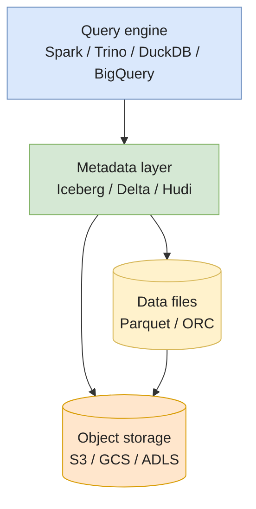
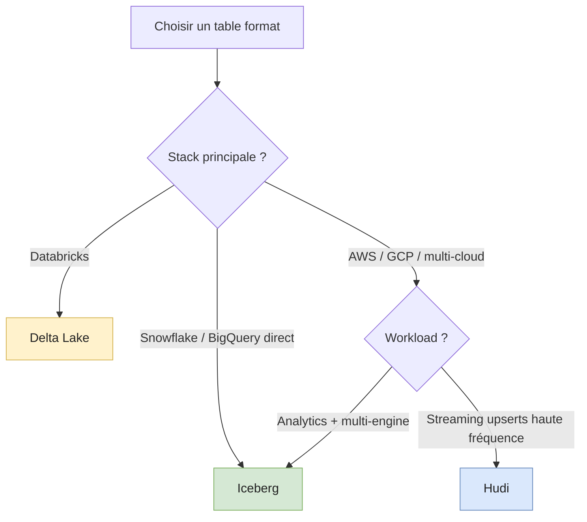

# Iceberg vs Delta vs Hudi

Stocker du **Parquet sur S3** est trivial. **Maintenir une table** sur du Parquet à grande échelle ne l'est pas : transactions ACID, time travel, schema evolution, mises à jour en place. C'est ce que résolvent les **table formats**.

Cette page couvre les trois implémentations majeures — **Apache Iceberg**, **Delta Lake**, **Apache Hudi** — et comment choisir.

> Pré-requis : avoir lu **[Parquet & file formats](./parquet-and-formats)**. Les table formats sont une couche **au-dessus** de Parquet, pas un remplacement.

---

## Le problème — Parquet brut ne suffit pas

Imagine une table de 10TB en Parquet sur S3. Tu veux :

1. **Updater 1000 rows** sans réécrire toute la table.
2. **Lire la version d'hier** pour reproduire un bug.
3. **Ajouter une colonne** sans casser les readers.
4. **Plusieurs writers concurrents** sans corrompre les données.
5. **Listing rapide** des partitions actives sans scanner S3.
6. **Supprimer un user** (GDPR) sans rewrite massif.

Aucun de ces points n'est natif à Parquet. Il faut une **couche de métadonnées** au-dessus.

---

## Mental model — séparation des couches



Les trois formats jouent le même rôle dans ce stack — **gérer le métadata** — mais avec des architectures différentes.

---

## Apache Iceberg

Né chez **Netflix** (2018), donné à l'Apache Foundation. Standard de fait du lakehouse en 2026 (adopté par AWS, Snowflake, BigQuery, Databricks, Cloudera).

### Architecture

```
table_root/
├── data/                          # Parquet files (immutables)
│   └── *.parquet
└── metadata/
    ├── v1.metadata.json           # snapshot courant + schéma + partition spec
    ├── v2.metadata.json
    ├── snap-<id>.avro             # liste des manifest files d'un snapshot
    └── <manifest>.avro            # liste des data files + stats par fichier
```

Trois niveaux :

1. **`metadata.json`** — pointe vers le snapshot courant + l'historique des schémas.
2. **Manifest list** (`snap-*.avro`) — un par snapshot, pointe vers tous les manifests.
3. **Manifest** (`<manifest>.avro`) — liste les data files et leurs stats (min/max/null counts).

Une commit = une nouvelle `metadata.json`. **Atomique** au niveau filesystem (rename d'un fichier).

### Forces distinctives

- **Hidden partitioning** — la partition est gérée dans les métadonnées, pas dans le path. `WHERE event_date = '2024-01-01'` fonctionne même si la partition est `event_hour`. Le repartitionnement est gratuit.
- **Schema evolution complète** — ajout, drop, rename, reorder, type promotion, sans rewrite. Chaque colonne a un ID stable.
- **Hidden partition evolution** — change la partition spec sans rewrite (les vieux fichiers gardent leur ancienne spec).
- **Multi-engine first-class** — Spark, Trino, Flink, Snowflake, Athena, BigQuery (lien externe via Iceberg REST catalog).

### Code — PyIceberg (lecture/écriture sans Spark)

```python
from pyiceberg.catalog import load_catalog
import pyarrow as pa

catalog = load_catalog("default", **{
    "uri": "https://glue.eu-west-1.amazonaws.com",
    "warehouse": "s3://my-lakehouse/",
})

table = catalog.load_table("analytics.events")

# Lecture avec predicate pushdown jusqu'au manifest
df = table.scan(
    row_filter="event_date >= '2024-01-01' AND country = 'FR'",
    selected_fields=("user_id", "amount"),
).to_arrow()

# Écriture (append)
new_data = pa.table({"user_id": [1, 2], "amount": [10.0, 20.0]})
table.append(new_data)
```

---

## Delta Lake

Né chez **Databricks** (2019), donné à la Linux Foundation. **Standard sur Databricks**, croissant dans l'écosystème open via `delta-rs` et `delta-spark`.

### Architecture

```
table_root/
├── *.parquet                       # data files (peuvent être au même niveau)
└── _delta_log/
    ├── 00000000000000000000.json   # commit 0 — schéma + ajouts initiaux
    ├── 00000000000000000001.json   # commit 1 — ajouts/suppressions
    ├── 00000000000000000002.json
    └── 00000000000000000010.checkpoint.parquet  # snapshot agrégé tous les 10 commits
```

Au cœur : un **transaction log JSON append-only**. Chaque commit est une ligne JSON décrivant des actions (`add`, `remove`, `metaData`, `protocol`).

Pour reconstruire l'état à un instant T, le moteur lit le dernier checkpoint puis applique les commits suivants.

### Forces distinctives

- **Le plus simple à comprendre** — un dossier `_delta_log/` lisible à la main.
- **Ecosystème Databricks parfaitement intégré** — Photon, Unity Catalog, Spark, Liquid Clustering.
- **Delta Sharing** — protocole de partage de tables entre orgs sans copie.
- **`delta-rs`** — implémentation Rust standalone, sans Spark, très rapide. Excellente pour pipelines Python/Polars.

### Code — `delta-rs` (Python)

```python
from deltalake import DeltaTable, write_deltalake
import pyarrow as pa

# Écriture
df = pa.table({"user_id": [1, 2, 3], "amount": [10.0, 20.0, 30.0]})
write_deltalake("s3://my-lakehouse/events", df, mode="append")

# Lecture avec time travel
dt = DeltaTable("s3://my-lakehouse/events")
df_now      = dt.to_pandas()
df_yesterday = dt.load_as_version(42).to_pandas()        # par version
df_at_ts     = dt.load_with_datetime("2024-01-15T00:00:00Z").to_pandas()

# Optimize + vacuum
dt.optimize.compact()
dt.vacuum(retention_hours=168)
```

---

## Apache Hudi

Né chez **Uber** (2017). Plus orienté **streaming et upserts haute fréquence**. Moins universellement adopté que les deux autres mais toujours pertinent pour des cas spécifiques.

### Deux modes de table

| Mode                              | Que fait Hudi                                                  | Quand                                                       |
| --------------------------------- | -------------------------------------------------------------- | ----------------------------------------------------------- |
| **Copy-on-Write** (CoW)           | Réécrit les Parquet files modifiés                             | Read-heavy. Reads ultra-rapides. Writes plus chers.         |
| **Merge-on-Read** (MoR)           | Écrit les updates dans des log files (Avro), merge à la lecture | Write-heavy. Writes rapides. Reads paient la fusion.        |

C'est l'unique des trois à exposer ce dual mode comme fonctionnalité de premier ordre — utile pour les pipelines à très haute fréquence d'updates (positions GPS, états IoT).

### Forces distinctives

- **Indexes natifs** (Bloom, HBase, record-level) → upserts ciblés sans full scan.
- **Incremental queries** — récupère "ce qui a changé depuis le commit X" très efficacement.
- **CDC out-of-the-box** côté table.

### Faiblesses

- Écosystème plus restreint (Spark + Flink ; support Trino/Athena moins mature qu'Iceberg).
- Mental model plus complexe (timeline, instants, file groups, file slices).
- Maintenance opérationnelle plus lourde (compaction, cleaning).

---

## Comparaison synthétique

| Critère                       | Iceberg                       | Delta                                | Hudi                              |
| ----------------------------- | ----------------------------- | ------------------------------------ | --------------------------------- |
| **Origine**                   | Netflix                       | Databricks                           | Uber                              |
| **Gouvernance**               | Apache (open)                 | Linux Foundation (Databricks-driven) | Apache (open)                     |
| **Métadonnées**               | Manifest files (Avro)         | JSON transaction log                 | Timeline + indexes                |
| **Schema evolution**          | ✅ Complète                   | ✅ Bonne                             | ⚠️ Limitée                        |
| **Hidden partitioning**       | ✅ Oui                        | ❌ Non                               | ❌ Non                            |
| **Time travel**               | ✅                            | ✅                                   | ✅                                |
| **Upserts/Deletes**           | ✅ Merge-on-read v2           | ✅                                   | ✅✅ Optimisé (indexes)           |
| **Streaming ingest**          | ✅                            | ✅                                   | ✅✅ Conçu pour                   |
| **Ecosystem queries**         | ✅✅✅ (Spark, Trino, BQ, SF)  | ✅✅ (Spark, Trino, BQ via UniForm)  | ✅ (Spark, Flink, Trino partiel)  |
| **Standalone Python**         | PyIceberg ✅                  | delta-rs ✅✅                        | hudi-python ⚠️                    |
| **Lock-in**                   | Faible                        | Moyen (Databricks-friendly)          | Moyen                             |
| **Maturité opérationnelle**   | Élevée                        | Très élevée (sur Databricks)         | Élevée mais plus complexe         |

---

## Comment choisir



### Choix par défaut en 2026

- **Pas de stack imposée + portabilité** → **Iceberg**. Ecosystème le plus riche, gouvernance la plus neutre.
- **Stack Databricks-first** → **Delta Lake**. Aucune raison de complexifier.
- **Pipelines streaming avec gros volume d'upserts (CDC, IoT)** → **Hudi**. Sa raison d'être.

### Cas hybrides

- **Delta UniForm** permet de lire une table Delta comme si c'était de l'Iceberg (et vice-versa via Iceberg-compat de Delta 3.x). Réduit le lock-in.
- **Migration Delta → Iceberg** est désormais relativement simple (outil de conversion sans rewrite).

---

## Pitfalls communs aux trois

- **Trop de petits commits.** Chaque commit crée un fichier de métadata. 100k commits → listing impossible. Compacter / checkpointer régulièrement.
- **Pas de vacuum/expire.** Les fichiers historiques s'accumulent. Coût de stockage qui monte, lectures de manifest qui ralentissent. Politique de rétention nécessaire.
- **`MERGE` row-by-row** depuis un orchestrateur naïf → des milliers de petits commits. Batcher.
- **Mauvais choix de partition initiale.** Iceberg gère la partition evolution, les autres non — repartitionner Delta/Hudi = rewrite complet.
- **Catalog mal configuré.** Iceberg peut tourner avec un fichier `version-hint.txt`, Glue catalog, REST catalog, Nessie, Polaris… le choix impacte les transactions multi-table et la concurrence.
- **GDPR sans tooling.** Tous les trois supportent les `DELETE`, mais le **vacuum** doit garantir que les fichiers historiques sont aussi purgés (sinon un time travel ressuscite les rows).

---

## Pitfalls spécifiques

**Iceberg :**
- La spec V2 (row-level deletes) n'est pas encore supportée partout — vérifier que tous tes engines lisent V2.
- Les manifests grossissent vite si beaucoup de petits fichiers — compaction `RewriteManifests`.

**Delta :**
- Lock-in modéré : certaines features (Liquid Clustering, Photon) sont **Databricks-only**.
- `delta-rs` est en avance sur certaines opérations mais en retard sur d'autres (DELETE complet par ex). Toujours checker la version.

**Hudi :**
- Configuration énorme — il y a 200+ properties, et le défaut n'est souvent pas le bon.
- Le **timeline service** doit tourner pour la performance ; sans lui, les lectures dégradent.

---

## Follow-up questions (entraînement interview)

- Pourquoi Parquet brut sur S3 ne suffit pas pour une table de production ? Donne 3 raisons concrètes.
- Quelle est la différence entre Iceberg's *hidden partitioning* et le partitioning Hive classique ? Pourquoi ça change tout ?
- Tu dois faire une suppression GDPR sur une table Delta. Décris la procédure end-to-end pour garantir que la donnée est *vraiment* supprimée.
- Une table Iceberg accumule 50k snapshots. Quels sont les symptômes ? Comment y remédier ?
- Quand choisirais-tu **CoW vs MoR** dans Hudi ? Donne deux workloads où chaque mode l'emporte.
- Comment gérerais-tu une migration **Delta → Iceberg** sans downtime ?

---

## Further reading

- **Iceberg** — [spec officielle](https://iceberg.apache.org/spec/), [PyIceberg](https://py.iceberg.apache.org/).
- **Delta** — [protocole](https://github.com/delta-io/delta/blob/master/PROTOCOL.md), [delta-rs](https://delta-io.github.io/delta-rs/).
- **Hudi** — [doc officielle](https://hudi.apache.org/docs/overview), [Storage Internals](https://hudi.apache.org/docs/file_layouts).
- Pages liées :
  - [Parquet & formats](./parquet-and-formats) — la couche en dessous.
  - [SCD](../data-modeling/scd) — Type-2 SCD est trivial avec un table format (vs gymnastique sans).
  - [dbt advanced](../data-pipeline/dbt/advanced) — dbt-iceberg / dbt-databricks utilisent ces formats sous le capot.
