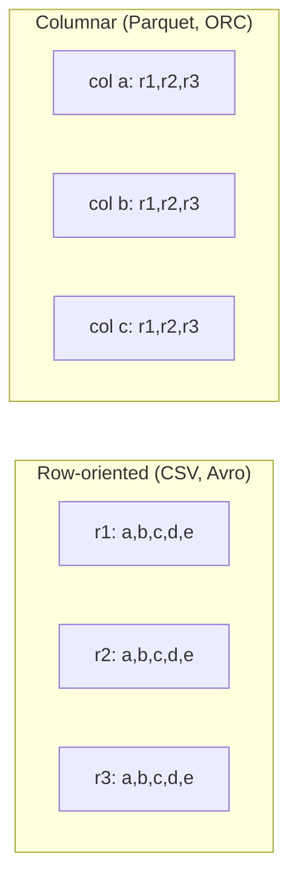
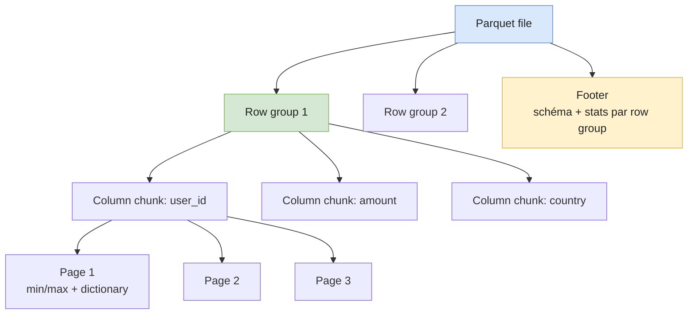

# Parquet & file formats

Le **format de fichier** est l'une des décisions les plus impactantes d'une plateforme data. Il détermine combien on scanne, combien on paie, et à quelle vitesse les requêtes répondent.

Cette page couvre :

- Row-oriented vs columnar — pourquoi ça change tout
- L'anatomie d'un fichier Parquet
- Predicate pushdown et stats
- Compression — choisir entre vitesse et taille
- Quand utiliser **Parquet**, **ORC**, ou **Avro**

---

## Row-oriented vs columnar

Imagine une table de 100M ventes avec 30 colonnes. Une requête analytique typique :

```sql
SELECT region, SUM(amount)
FROM sales
WHERE event_date >= '2024-01-01'
GROUP BY region;
```

Elle ne lit que **3 colonnes sur 30**.

| Format       | Disposition sur disque                        | Lecture de la query    |
| ------------ | --------------------------------------------- | ---------------------- |
| Row-oriented | `[r1c1, r1c2, …, r1c30, r2c1, …]`            | Lit **100% des bytes** |
| Columnar     | `[c1: r1, r2, …, rN] [c2: …] [c30: …]`        | Lit **~10% des bytes** |



Conséquences pratiques :

- **Compression** : une colonne contient des valeurs homogènes (toutes des dates, toutes des codes pays). La compression devient bien plus efficace.
- **I/O** : le moteur saute les colonnes inutiles (column projection).
- **Coût cloud** : BigQuery, Athena, S3 Select facturent au **byte scanné**. Columnar = facture divisée.

> ⚠️ Le columnar est **catastrophique** pour les workloads OLTP (lire un row complet, l'updater). C'est un format **OLAP**.

---

## Anatomie d'un fichier Parquet

Un fichier Parquet n'est pas un blob plat — il a une structure en poupées russes.



| Niveau           | Contenu                                                                 |
| ---------------- | ----------------------------------------------------------------------- |
| **File**         | 1 ou plusieurs row groups + un footer.                                  |
| **Row group**    | Un bloc horizontal de N rows (typiquement 128MB-512MB).                 |
| **Column chunk** | Toutes les valeurs d'**une colonne** dans **un row group**.             |
| **Page**         | Sub-unité d'une colonne (1MB par défaut). Compressée et encodée.        |
| **Footer**       | Schéma, statistiques min/max par page et par row group, offsets.        |

**Pourquoi cette structure ?**

- Le moteur lit le **footer** d'abord (petit, en fin de fichier).
- Grâce aux stats min/max, il sait quels row groups contiennent potentiellement les rows recherchés → il **skippe** les autres.
- Pour chaque row group survivant, il ne charge que les **column chunks** projetés.

C'est le fondement du **<T term="predicate-pushdown">predicate pushdown</T>** et de la **column projection**.

---

## Predicate pushdown

> "Pushdown" = pousser le filtre **le plus bas possible** dans la stack — au niveau du fichier, avant la query engine.

Trois mécanismes successifs filtrent les données dans Parquet :

### 1. Min/max statistics

Chaque page et chaque row group portent un `min` et un `max` par colonne. Pour `WHERE amount > 1000` :

- Row group avec `max(amount) = 850` → **skippé**.
- Row group avec `min(amount) = 1200` → **lu en entier**.
- Row group avec `min=10, max=5000` → lu, filtre appliqué.

### 2. Dictionary encoding

Quand une colonne a peu de valeurs distinctes (`country`, `status`), Parquet encode chaque valeur comme un index dans un dictionnaire local. Pour `WHERE country = 'XX'` :

- Si `'XX'` n'est **pas dans le dictionnaire** → row group skippé sans lire les données.

### 3. Bloom filters (optionnels)

Pour `WHERE user_id = '7f3c…'` (haute cardinalité, min/max inutiles) :

- Si activé, un bloom filter par row group dit "cette valeur est *probablement* présente, ou certainement absente".
- Skippe les row groups où la valeur est absente. Pas activé par défaut — coûte du stockage.

### Ce que ça coûte si tu casses ça

Un fichier Parquet **sans stats** (mal écrit, ou sans `WriteStatistics`) → tout est lu, full scan. À l'écriture, vérifier que ton writer remplit les stats.

---

## Compression

Parquet compresse **au niveau page**. Choix typiques :

| Codec          | Ratio       | Vitesse compress | Vitesse décompress | Quand                                      |
| -------------- | ----------- | ---------------- | ------------------ | ------------------------------------------ |
| `snappy`       | ~2-3×       | Très rapide      | Très rapide        | Défaut historique. CPU-light.              |
| `zstd`         | ~3-5×       | Rapide           | Rapide             | **Défaut moderne**. Meilleur ratio/vitesse. |
| `gzip`         | ~3-4×       | Lent             | Moyen              | Compat legacy, archive.                    |
| `lz4`          | ~2×         | Le plus rapide   | Le plus rapide     | I/O-bound où la déco est le bottleneck.    |
| `brotli`       | ~4-5×       | Lent             | Moyen              | Stockage froid, lectures rares.            |
| `uncompressed` | 1×          | —                | —                  | Tests / debug.                             |

> Recommandation 2026 : **zstd niveau 3** par défaut. Meilleur compromis sur quasi tous les workloads. Snappy reste un bon choix sur du chaud lourd en CPU.

---

## Schema evolution

Parquet supporte trois opérations sans réécrire les fichiers existants :

- **Ajout de colonne** — les anciens fichiers retournent `NULL` pour la nouvelle colonne. ✅
- **Renommage / suppression de colonne** — selon la couche au-dessus (Iceberg, Delta) gère ou pas. Parquet seul ne le sait pas.
- **Changement de type** — risqué. Numérique → numérique compatible OK ; le reste casse.

C'est précisément pourquoi des **table formats** comme Iceberg / Delta sont apparus au-dessus de Parquet : pour gérer le schéma au niveau **table**, pas fichier. (→ page dédiée à venir.)

---

## Parquet vs ORC vs Avro

| Format     | Type             | Forces                                                | Quand                                                        |
| ---------- | ---------------- | ----------------------------------------------------- | ------------------------------------------------------------ |
| **Parquet**| Columnar         | Standard de fait du data lake, supporté partout       | **Défaut** pour analytics, lakes, lakehouses                 |
| **ORC**    | Columnar         | Compression légèrement meilleure, optimisé Hive       | Écosystème Hive / Hortonworks legacy                         |
| **Avro**   | Row-oriented     | Schéma riche embarqué, parfait pour le streaming      | Sérialisation Kafka, append-only logs, ingestion             |

En pratique :

- **Streaming → Avro** dans Kafka, **conversion → Parquet** au moment de la persistance.
- **Lake / warehouse → Parquet**.
- **ORC** : seulement si l'écosystème existant l'impose.

---

## Code — lire / écrire en Python

```python
import pyarrow as pa
import pyarrow.parquet as pq

# Écriture avec compression zstd, row groups de 128MB
table = pa.table({
    "user_id":    [1, 2, 3, 4],
    "amount":     [10.5, 20.0, 99.99, 5.0],
    "country":    ["FR", "DE", "FR", "ES"],
    "event_date": ["2024-01-01"] * 4,
})

pq.write_table(
    table,
    "events.parquet",
    compression="zstd",
    compression_level=3,
    row_group_size=1_000_000,        # rows par row group
    use_dictionary=True,
    write_statistics=True,
)

# Lecture avec predicate pushdown — pyarrow lit le footer d'abord
filtered = pq.read_table(
    "events.parquet",
    columns=["user_id", "amount"],   # column projection
    filters=[("country", "=", "FR")] # predicate pushdown
)
```

À noter : `filters=` est traduit par PyArrow en filtres au niveau row group (et page si possible). `columns=` saute les column chunks non demandés.

---

## Pitfalls

- **Small files problem.** Des milliers de fichiers Parquet de 1MB tuent la performance — le métadata overhead (listing S3, ouverture, parsing footer) domine. Cible : **128MB - 1GB** par fichier. Compacter régulièrement.
- **Trop gros row groups** sur un dataset query par filtre haute-cardinalité → pas de pruning utile. **Trop petits** → metadata explosion. Sweet spot : **128MB-256MB**.
- **Stats désactivées** ou non écrites → predicate pushdown impossible, full scan partout. Vérifier `parquet-tools meta`.
- **Mauvais ordre des colonnes** : une colonne souvent filtrée gagne à avoir les rows triés par elle (`ORDER BY` au write) — les min/max deviennent serrés et pruner mieux.
- **`SELECT *`** dans une UI ad-hoc sur du Parquet bien partitionné lit tout. Le coût économique du columnar ne vient pas du format, il vient du **fait de ne pas tout lire**.
- **Compression incohérente** entre fichiers d'une même table → pas grave, mais complique l'estimation de coût/temps.
- **Conversion CSV → Parquet sans typer les colonnes** → tout en `string`, plus aucun bénéfice. Toujours définir le schéma à l'écriture.

---

## Follow-up questions (entraînement interview)

- Pourquoi un columnar est mauvais pour un workload OLTP ?
- Comment Parquet skippe-t-il un row group sans le lire ?
- Tu observes qu'une query Athena lit 50GB alors qu'elle devrait en lire 2GB. Diagnostic possible ?
- Quand préférerais-tu Avro à Parquet ?
- Pourquoi un fichier Parquet de 5MB est presque aussi cher à lire qu'un de 500MB sur S3 ?

---

## Further reading

- [Parquet specification](https://parquet.apache.org/docs/file-format/) — la source.
- [Apache Arrow](https://arrow.apache.org/) — modèle mémoire columnar partagé entre frameworks.
- Pages liées :
  - [Iceberg vs Delta vs Hudi](../lakehouse/table-formats-comparison) — table formats au-dessus de Parquet.
  - [Apache Iceberg](../lakehouse/iceberg), [Delta Lake](../lakehouse/delta-lake), [Apache Hudi](../lakehouse/hudi) — deep dives par format.
  - [Kafka](../data-pipeline/kafka) — où Avro est roi.
